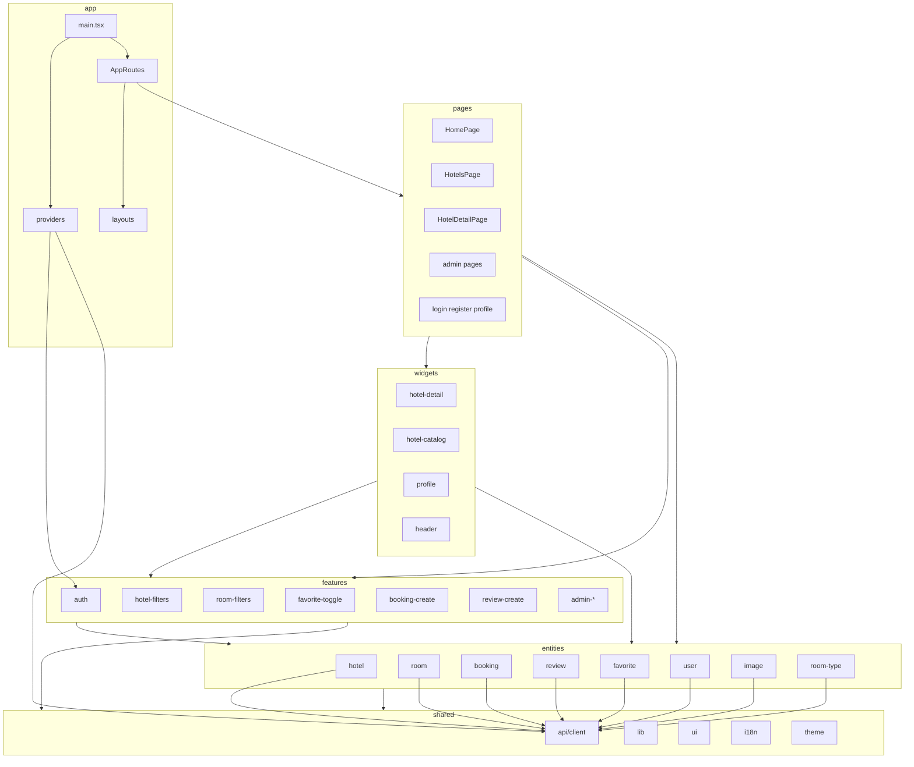
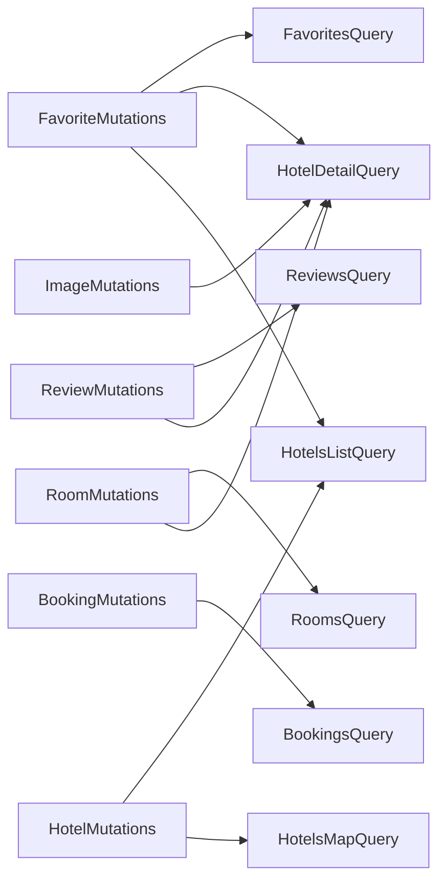

# План FSD-архитектуры — Hotel Booking Frontend

**Текущее состояние (на диске):** только legacy-раскладка — `api/`, `hooks/`, `components/`, `context/`, плоские `pages/`, частичный `widgets/hotel-detail/`. Каталогов `app/`, `entities/`, `features/`, `shared/` ещё нет. `main.tsx` по-прежнему подключает `context/`, `i18n/`, `theme/` по старым путям.

---

## 1. Инвентаризация

### Домены (entities)

| Entity | Источник API | Типы | UI сейчас |
| --- | --- | --- | --- |
| **user** | `api/auth.ts`, `api/users.ts` | `types/auth.ts`, `types/user.ts` | — (сессия в `AuthContext`) |
| **hotel** | `api/hotels.ts` | `types/hotel.ts`, `types/hotelMap.ts` | `HotelCard`, `HotelGallery`, `HotelMiniMap`, `HotelsMapView`, `HotelCatalogState`, `HotelReviews` (не на своём месте) |
| **room** | `api/rooms.ts` | `types/room.ts` | `RoomList` |
| **room-type** | `api/roomTypes.ts` | `types/roomType.ts` | `RoomTypeForm` (admin feature) |
| **booking** | `api/bookings.ts` | `types/booking.ts` | — |
| **review** | `api/reviews.ts` | `types/review.ts` | часть `HotelReviews` |
| **favorite** | `api/favorites.ts` | — (использует тип `Hotel`) | `FavoriteButton` (feature) |
| **image** | `api/images.ts` | inline в `images.ts` | `HotelImageUpload` (feature) |

### Features (пользовательские сценарии)

| Feature | Текущее расположение | Ответственность |
| --- | --- | --- |
| **auth** | `context/AuthContext.tsx` | login/register/logout/hydrate session |
| **favorite-toggle** | `components/hotels/FavoriteButton.tsx` | add/remove favorite + редирект на auth |
| **hotel-filters** | `components/hotels/HotelFilters.tsx` | форма фильтров каталога |
| **room-filters** | `components/hotels/RoomFilters.tsx` | фильтры доступности номеров |
| **language-switch** | `components/LanguageSwitcher.tsx` | переключатель RU/EN |
| **admin-hotel** | `components/admin/hotels/HotelForm.tsx`, `HotelImageUpload.tsx` | CRUD-форма отеля + загрузка фото |
| **admin-room** | `components/admin/rooms/RoomForm.tsx` | CRUD-форма номера |
| **admin-room-type** | `components/admin/room-types/RoomTypeForm.tsx` | CRUD-форма типа номера |
| **review-create** | внутри `HotelReviews.tsx` | форма создания/удаления отзыва (вынести) |
| **booking-create** | логика в `BookingNewPage.tsx` | валидация дат, превью цены, submit |
| **hotel-search** | дублируется в `HomePage`, `HotelsPage`, `HotelsMapPage` | debounce-фильтр по городу |

### Переиспользуемый UI (`shared/ui`)

- Admin chrome: `AdminErrorAlert`, `AdminFormActions`, `AdminFormError`, `AdminFormSection`, `AdminPageHeader`
- Состояния каталога: `HotelCatalogState` (loading/error/empty/grid shell)
- Обёртки MUI — только при реальной необходимости; держать минимально

### Shared utilities (`shared/lib`, `shared/config`, `shared/api`, `shared/auth`)

| Сейчас | Цель |
| --- | --- |
| `utils/bookingDates.ts` | `shared/lib/bookingDates.ts` |
| `utils/bookingStatusTransitions.ts` | `shared/lib/bookingStatusTransitions.ts` |
| `utils/getApiErrorMessage.ts` | `shared/lib/getApiErrorMessage.ts` |
| `utils/mediaUrl.ts` | `shared/lib/mediaUrl.ts` |
| `constants/domainOptions.ts` | `shared/config/domainOptions.ts` |
| `api/client.ts` | `shared/api/client.ts` |
| `auth/tokenStorage.ts` | `shared/auth/tokenStorage.ts` |
| `hooks/useDebouncedValue.ts` | `shared/lib/useDebouncedValue.ts` |
| `theme/theme.ts` | `shared/theme/theme.ts` |
| `i18n/*` | `shared/i18n/*` |
| `test/*` | `shared/test/*` |

### Pages (18 экранов маршрутов)

| Маршрут | Page | Строк |
| --- | --- | --- |
| `/` | `HomePage` | 98 |
| `/hotels` | `HotelsPage` | 98 |
| `/hotels/map` | `HotelsMapPage` | 90 |
| `/hotels/:id` | `HotelDetailPage` | 65 (уже тонкая — использует widgets) |
| `/bookings/new` | `BookingNewPage` | 154 |
| `/favorites` | `FavoritesPage` | 27 |
| `/profile` | `ProfilePage` | 186 |
| `/login` | `LoginPage` | 112 |
| `/register` | `RegisterPage` | 153 |
| `/admin` | `AdminHomePage` | 40 |
| `/admin/users` | `AdminUsersPage` | 115 |
| `/admin/hotels` | `AdminHotelsPage` | 141 |
| `/admin/room-types` | `AdminRoomTypesPage` | 142 |
| `/admin/rooms` | `AdminRoomsPage` | 146 |
| `/admin/bookings` | `AdminBookingsPage` | 134 |
| `/admin/reviews` | `AdminReviewsPage` | 119 |
| `*` | `NotFoundPage` | 18 |
| — | `PlaceholderPage` | 5 (возможно не используется) |

### Widgets (составные UI-блоки)

| Widget | Статус | Содержимое |
| --- | --- | --- |
| `hotel-detail` | **частично** | `HotelDetailHeader`, `Gallery`, `Reviews`, `Rooms`, `QueryState` |
| `hotel-catalog` | пустая папка | вынести из `HotelsPage`/`HomePage` |
| `hotels-map` | пустая папка | вынести из `HotelsMapPage` |
| `header` | пустая папка | вынести navbar из `PublicLayout` |
| `profile` | новый | разбить `ProfilePage` на вкладки account + bookings |

---

## 2. Обнаруженные архитектурные проблемы

### Дублирование логики

- Debounce-фильтр по городу: `HomePage`, `HotelsPage`, `HotelsMapPage`
- Парсинг URL-параметров: `useHotelListSearchParams` (104 строки), `HotelDetailRooms` (`readFilters`, `parsePositive`)
- Обработка 409 «дубликат номера» в admin: `AdminRoomsPage`, `AdminRoomTypesPage`
- `useHotels({ page: 1, size: 100, sort: 'created_at' })` скопирован на 3 admin-страницах
- `buildBookPath` в `RoomList` дублирует сборку URL бронирования

### God-компоненты (>100 строк, смешанные ответственности)

- `RoomForm.tsx` (222), `HotelForm.tsx` (194), `ProfilePage.tsx` (186), `AuthContext.tsx` (183), `BookingNewPage.tsx` (154), `HotelReviews.tsx` (151), `AdminRoomsPage.tsx` (146), `AdminRoomTypesPage.tsx` (142), `AdminHotelsPage.tsx` (141), `AdminBookingsPage.tsx` (134), `RoomList.tsx` (128), `RegisterPage.tsx` (153), `LoginPage.tsx` (112), `HotelFilters.tsx` (102)

### Раздутые хуки

- `useHotelListSearchParams.ts` (104) — парсинг URL + мутация фильтров; место в `features/hotel-filters/model/`

### Смешанные ответственности

- `HotelReviews.tsx` — список entity + feature create/delete + auth gate
- `ProfilePage.tsx` — форма аккаунта + таблица броней + tab routing + доменное правило `canCancel`
- Widget `HotelDetailRooms` — синхронизация URL-фильтров + оркестрация query + композиция UI
- `FavoriteButton` — mutation + редирект на login внутри UI-компонента
- `RoomList` — сборщик URL + проверка доступности + auth redirect в entity UI

### Циклические зависимости (сейчас критичных нет; риски при наивной миграции)

- `useHotelMutations` импортирует `hotelQueryKey` из `useHotel` и `hotelsQueryKey` из `useHotels` — связка hook→hook
- `useFavoriteMutations` импортирует `hotelQueryKey` из `useHotel`
- **Исправление:** централизовать ключи в `entities/*/api/keys.ts`; mutations импортируют только keys, никогда другие hooks

### API-логика не на своём месте

- `AdminReviewsPage.tsx` — прямой `reviewsApi.remove()`, обходя `useReviewMutations`
- `HotelImageUpload.tsx` — прямой `imagesApi.uploadHotelImage()` + ручной `queryClient.invalidateQueries`
- `AuthContext.tsx` — прямой `api/auth` (допустимо для session, не TanStack Query)

### Бизнес-логика внутри UI

- `BookingNewPage` — `parseRoomId`, превью nights/total, валидация дат (max 30 ночей, past check-in)
- `ProfilePage` — доменное правило `canCancel()`
- `HotelMiniMap` — сборка синтетического `HotelMapItem`
- `HotelsMapView` — подгонка bounds, дефолтный центр Москва
- `HotelFilters` — приведение stars string→number
- `LoginPage` — защита `getReturnUrl` от open-redirect
- Admin pages — оркестрация CRUD, маппинг ошибок

---

## 3. Предлагаемая структура папок

```
frontend/src/
├── app/
│   ├── App.tsx
│   ├── main.tsx
│   ├── providers/
│   │   ├── QueryProvider.tsx
│   │   └── NotificationProvider.tsx      # из context/
│   ├── router/
│   │   ├── AppRoutes.tsx
│   │   ├── GuestOnly.tsx
│   │   ├── RequireAuth.tsx
│   │   └── RequireAdmin.tsx
│   └── layouts/
│       ├── PublicLayout.tsx
│       └── AuthLayout.tsx
│
├── pages/
│   ├── home/ui/HomePage.tsx
│   ├── hotels/ui/HotelsPage.tsx
│   ├── hotels-map/ui/HotelsMapPage.tsx
│   ├── hotel-detail/ui/HotelDetailPage.tsx
│   ├── booking-new/ui/BookingNewPage.tsx
│   ├── favorites/ui/FavoritesPage.tsx
│   ├── profile/ui/ProfilePage.tsx
│   ├── login/ui/LoginPage.tsx
│   ├── register/ui/RegisterPage.tsx
│   ├── not-found/ui/NotFoundPage.tsx
│   └── admin/
│       ├── home/ui/AdminHomePage.tsx
│       ├── users/ui/AdminUsersPage.tsx
│       ├── hotels/ui/AdminHotelsPage.tsx
│       ├── room-types/ui/AdminRoomTypesPage.tsx
│       ├── rooms/ui/AdminRoomsPage.tsx
│       ├── bookings/ui/AdminBookingsPage.tsx
│       └── reviews/ui/AdminReviewsPage.tsx
│
├── widgets/
│   ├── header/ui/AppHeader.tsx             # из PublicLayout
│   ├── hotel-catalog/ui/HotelCatalog.tsx   # сетка + оболочка фильтров
│   ├── hotels-map/ui/HotelsMapSection.tsx
│   ├── hotel-detail/ui/...                 # существующие 6 файлов
│   └── profile/ui/
│       ├── ProfileAccountTab.tsx
│       └── ProfileBookingsTab.tsx
│
├── features/
│   ├── auth/
│   │   ├── ui/AuthContext.tsx
│   │   └── model/getReturnUrl.ts
│   ├── favorite-toggle/
│   │   ├── ui/FavoriteButton.tsx
│   │   └── model/useFavoriteToggle.ts
│   ├── hotel-filters/
│   │   ├── ui/HotelFilters.tsx
│   │   └── model/useHotelListSearchParams.ts
│   ├── hotel-search/
│   │   └── model/useDebouncedCityFilter.ts
│   ├── room-filters/
│   │   ├── ui/RoomFilters.tsx
│   │   └── model/useRoomListSearchParams.ts
│   ├── review-create/
│   │   ├── ui/ReviewForm.tsx
│   │   └── model/useReviewForm.ts
│   ├── booking-create/
│   │   ├── model/useBookingForm.ts
│   │   └── lib/validateBookingDates.ts
│   ├── language-switch/ui/LanguageSwitcher.tsx
│   ├── admin-hotel/
│   │   ├── ui/{HotelForm,HotelImageUpload}.tsx
│   │   └── model/mapHotelForm.ts
│   ├── admin-room/
│   │   ├── ui/RoomForm.tsx
│   │   └── model/mapRoomForm.ts
│   └── admin-room-type/
│       ├── ui/RoomTypeForm.tsx
│       └── model/mapRoomTypeForm.ts
│
├── entities/
│   ├── user/
│   │   ├── api/
│   │   │   ├── keys.ts
│   │   │   ├── requests/{login,register,logout,getMe,listUsers,patchMe,patchUser}.ts
│   │   │   ├── queries/{usersQueryOptions}.ts
│   │   │   └── mutations/{patchMeMutationOptions,patchUserMutationOptions}.ts
│   │   └── model/{types,auth-types}.ts
│   ├── hotel/
│   │   ├── api/
│   │   │   ├── keys.ts
│   │   │   ├── requests/{listHotels,getHotel,getHotelsMap,createHotel,updateHotel,deleteHotel}.ts
│   │   │   ├── queries/{hotelsQueryOptions,hotelQueryOptions,hotelsMapQueryOptions}.ts
│   │   │   └── mutations/{createHotel,updateHotel,deleteHotel}MutationOptions.ts
│   │   ├── model/{types,map-types}.ts
│   │   ├── lib/{toMapItem,mapBounds}.ts
│   │   └── ui/{HotelCard,HotelGallery,HotelMiniMap,HotelsMapView,HotelReviewList}.tsx
│   ├── room/
│   │   ├── api/... (listRooms, getRoom, CRUD mutations)
│   │   ├── model/types.ts
│   │   ├── lib/buildBookPath.ts
│   │   └── ui/RoomList.tsx
│   ├── room-type/api/...
│   ├── booking/
│   │   ├── api/... (listBookings, create, cancel, updateStatus)
│   │   ├── model/{types,rules}.ts          # canCancelBooking
│   │   └── lib/validateBookingDates.ts     # или shared/lib, если cross-feature
│   ├── review/
│   │   ├── api/... (listReviews, createReview, deleteReview)
│   │   ├── model/types.ts
│   │   └── ui/ReviewListItem.tsx
│   ├── favorite/
│   │   ├── api/... (listFavorites, addFavorite, removeFavorite + optimistic)
│   │   └── model/types.ts
│   └── image/
│       └── api/... (uploadHotelImage, uploadRoomImage и т.д.)
│
└── shared/
    ├── api/client.ts
    ├── auth/tokenStorage.ts
    ├── config/domainOptions.ts
    ├── i18n/{index,locales/}
    ├── lib/{bookingDates,bookingStatusTransitions,getApiErrorMessage,mediaUrl,useDebouncedValue}.ts
    ├── theme/theme.ts
    ├── ui/{Admin*,HotelCatalogState}.tsx
    └── test/{setup,server,renderWithProviders,hotelFixtures}.ts
```

### Правила импортов FSD (обязательные)

```
app → pages, widgets, features, entities, shared
pages → widgets, features, entities, shared
widgets → features, entities, shared
features → entities, shared
entities → только shared
shared → ничего из верхних слоёв
```

---

## 4. Целевой паттерн TanStack Query

### `keys.ts` на entity (Query Key Factory)

```ts
// entities/hotel/api/keys.ts
export const hotelKeys = {
  all: ["hotels"] as const,
  lists: () => [...hotelKeys.all, "list"] as const,
  list: (params: HotelListParams) => [...hotelKeys.lists(), params] as const,
  details: () => [...hotelKeys.all, "detail"] as const,
  detail: (id: number) => [...hotelKeys.details(), id] as const,
  map: (city?: string) => [...hotelKeys.all, "map", city ?? ""] as const,
};
```

### Один request на файл

```ts
// entities/hotel/api/requests/listHotels.ts
export const listHotels = (params: HotelListParams) => hotelsApi.list(params); // тонкая обёртка над axios
```

### Один query на файл с `queryOptions()`

```ts
// entities/hotel/api/queries/hotelsQueryOptions.ts
export const hotelsQueryOptions = (params: HotelListParams) =>
  queryOptions({
    queryKey: hotelKeys.list(params),
    queryFn: () => listHotels(params),
  });

// entities/hotel/api/queries/useHotels.ts
export const useHotels = (params: HotelListParams) =>
  useQuery(hotelsQueryOptions(params));
```

### Одна mutation на файл с `mutationOptions()`

```ts
// entities/favorite/api/mutations/addFavoriteMutationOptions.ts
export const addFavoriteMutationOptions = (queryClient: QueryClient) =>
  mutationOptions({
    mutationFn: addFavorite,
    onMutate: async (hotelId) => {
      /* optimistic */
    },
    onError: (_err, _id, ctx) => {
      /* rollback */
    },
    onSettled: (_d, _e, hotelId) => {
      void queryClient.invalidateQueries({ queryKey: favoriteKeys.all });
      void queryClient.invalidateQueries({
        queryKey: hotelKeys.detail(hotelId),
      });
    },
  });
```

### Карта инвалидации (только затронутые queries)

| Mutation | Инвалидировать |
| --- | --- |
| `createBooking` / `cancelBooking` / `updateBookingStatus` | только `bookingKeys.lists()` |
| `createHotel` / `deleteHotel` | `hotelKeys.lists()`, `hotelKeys.map()` |
| `updateHotel` | выше + `hotelKeys.detail(id)` |
| `addFavorite` / `removeFavorite` | optimistic + `favoriteKeys.lists()`, `hotelKeys.detail(id)`, `hotelKeys.lists()` |
| `createReview` / `deleteReview` | `reviewKeys.list(hotelId)`, `hotelKeys.detail(hotelId)`, `hotelKeys.lists()` |
| `createRoom` / `updateRoom` / `deleteRoom` | `roomKeys.lists()`, `hotelKeys.detail(hotelId)` если известен |
| `uploadHotelImage` | только `hotelKeys.detail(hotelId)` |
| `patchMe` | без query-инвалидации (оставить `applyUser`); опционально `userKeys.me` позже |
| `patchUser` | `userKeys.lists()` |

### Где уместен `select()`

- `useHotels` — `select: (data) => data.items` для страниц, которым нужны только items
- `useHotel` — `select: (data) => ({ ...data, imageUrls: data.images.map(mediaUrl) })` при необходимости (опционально, без смены UI)
- `useBookings` на profile — `select: (data) => data.items`

### Optimistic updates (где уместно)

- **favorites** add/remove — переключить `is_favorite` в `hotelKeys.detail` и в кэше списка favorites
- **booking cancel** на profile — выставить статус `CANCELLED` в кэше списка до ответа сервера
- **review delete** — оптимистично убрать из кэша `reviewKeys.list`

### Файлы к удалению после миграции

Все `hooks/use*.ts` (18 файлов) — заменяются на `api/queries/` и `api/mutations/` внутри entities.

---

## 5. Вынос логики из компонентов (без смены UI)

| Компонент | Куда вынести | Что переносится |
| --- | --- | --- |
| `BookingNewPage` | `features/booking-create/model/useBookingForm.ts` | `parseRoomId`, правила валидации, `nights`/`totalPreview`, submit handler |
| `ProfilePage` | `widgets/profile/ui/*` + `entities/booking/model/rules.ts` | `canCancel`, tab routing, cancel/save handlers |
| `HotelReviews` | разделить: `entities/hotel/ui/HotelReviewList` + `features/review-create/ui/ReviewForm` | form state, submit/remove handlers |
| `HotelDetailRooms` | `features/room-filters/model/useRoomListSearchParams.ts` | `readFilters`, `parsePositive`, `applyFilters` |
| `FavoriteButton` | `features/favorite-toggle/model/useFavoriteToggle.ts` | mutation + login redirect |
| `RoomList` | `entities/room/lib/buildBookPath.ts` + `features/booking-navigate/model/useBookRoom.ts` | URL builder, auth gate |
| `HotelMiniMap` | `entities/hotel/lib/toMapItem.ts` | сборка map item |
| `HotelsMapView` | `entities/hotel/lib/mapBounds.ts` | подгонка bounds, дефолтный центр |
| `HotelFilters` | `features/hotel-filters/model/parseFilters.ts` | приведение stars |
| `LoginPage` | `features/auth/model/getReturnUrl.ts` | защита redirect |
| `HotelForm` / `RoomForm` | `features/admin-*/model/map*Form.ts` | `toFormValues`, `emptyValues` |
| `AdminReviewsPage` | хук `useDeleteReview` | убрать прямой `reviewsApi.remove` |
| `HotelImageUpload` | `entities/image/api/mutations/uploadHotelImageMutationOptions.ts` | API + инвалидация |
| `HotelDetailPage` | `entities/hotel/api/queries/useHotel.ts` с `meta.notFound` или wrapper-хук | детекция 404 |
| Admin pages | `features/admin-*/model/useAdmin*Page.ts` | CRUD handlers, маппинг 409 |

**Контракт компонента после рефакторинга:** компоненты получают data + callbacks из hooks; `useState` только для чисто визуального состояния (open/closed, draft input до apply).

---

## 6. План миграции (по фазам, с сохранением поведения)

### Фаза 0 — Фундамент (без смены поведения)

1. Добавить `shared/` — перенести `api/client`, `auth/`, `utils/`, `constants/`, `theme/`, `i18n/`, `test/` с re-export shim по старым путям (или обновить все импорты за один проход).
2. Добавить path aliases в `tsconfig`: `@shared/*`, `@entities/*`, `@features/*`, `@widgets/*`, `@pages/*`, `@app/*`.
3. Добавить `app/` — перенести `App.tsx`, `main.tsx`, providers, router, layouts.

### Фаза 1 — Entities + TanStack Query

4. По каждому домену (hotel → room → booking → …): создать `keys.ts`, разбить `api/*.ts` на `requests/`, создать файлы `queryOptions`/`mutationOptions`, тонкие `use*` hooks.
5. Заменить все импорты `hooks/use*` на entity-хуки.
6. Удалить корневые `hooks/` и `api/`.
7. После каждой entity — `vitest` + `tsc --noEmit`.

### Фаза 2 — Features + entity UI

8. Перенести feature-компоненты из `components/` в `features/*/ui/`.
9. Перенести entity UI из `components/hotels/` в `entities/*/ui/`.
10. Перенести admin shared UI в `shared/ui/`.
11. Вынести model hooks/libs по разделу 5.

### Фаза 3 — Widgets + pages

12. Довести импорты `widgets/hotel-detail` (уже начато).
13. Создать `widgets/hotel-catalog`, `hotels-map`, `header`, `profile`.
14. Перестроить `pages/` в `pages/<route>/ui/`; страницы — только тонкая композиция.
15. Удалить пустые `components/`, `context/`, `layouts/`, `routes/`, legacy плоские `pages/*.tsx`.

### Фаза 4 — Валидация

16. Полный `npx vitest run` + `tsc --noEmit` + `eslint`.
17. Ручной smoke: каталог, деталь, бронь, избранное, профиль, admin CRUD.

---

## 7. Файлы к переносу

### В `shared/`

- `api/client.ts`, `api/client.test.ts` → `shared/api/`
- `auth/tokenStorage.ts`, `auth/tokenStorage.test.ts` → `shared/auth/`
- `utils/*` → `shared/lib/`
- `constants/domainOptions.ts` → `shared/config/`
- `theme/theme.ts` → `shared/theme/`
- `i18n/*` → `shared/i18n/`
- `test/*` → `shared/test/`
- `components/admin/shared/Admin*.tsx` → `shared/ui/`
- `components/hotels/HotelCatalogState.tsx` → `shared/ui/`
- `hooks/useDebouncedValue.ts` → `shared/lib/`

### В `entities/*/`

- `api/{hotels,rooms,roomTypes,bookings,reviews,favorites,images,users,auth}.ts` → разбить на `entities/<domain>/api/requests/`
- `types/*.ts` → `entities/<domain>/model/types.ts`
- `components/hotels/{HotelCard,HotelGallery,HotelMiniMap,HotelsMapView}.tsx` → `entities/hotel/ui/`
- `components/hotels/RoomList.tsx` → `entities/room/ui/`
- Все `hooks/use{Hotel,Hotels,HotelsMap,Room,Rooms,Bookings,Reviews,Favorites,RoomTypes,Users}*.ts` → `entities/*/api/queries|mutations/`

### В `features/*/`

- `context/AuthContext.tsx` → `features/auth/ui/`
- `context/NotificationContext.tsx` → `app/providers/`
- `components/LanguageSwitcher.tsx` → `features/language-switch/ui/`
- `components/hotels/{FavoriteButton,HotelFilters,RoomFilters}.tsx` → соответствующие features
- `components/admin/**/*Form.tsx`, `HotelImageUpload.tsx` → соответствующие admin features
- `hooks/useHotelListSearchParams.ts` → `features/hotel-filters/model/`

### В `widgets/`

- Существующие `widgets/hotel-detail/*` — оставить, поправить импорты
- Вынести из `PublicLayout` → `widgets/header/ui/`
- Вынести из `ProfilePage` → `widgets/profile/ui/`

### В `pages/<segment>/ui/`

- Все 18 page-компонентов + соседние тесты

### В `app/`

- `App.tsx`, `main.tsx`, `routes/*`, `layouts/*`

---

## 8. Файлы, которые остаются (концептуально — перенос, не переписывание)

Эти файлы — источник истины; миграция = move + обновление импортов + вынос логики, не переписывание с нуля:

- Все `*.test.tsx` / `*.test.ts` — переезжают вместе с субъектом, меняются только пути импортов
- `vite-env.d.ts` — остаётся в корне `src/`
- `widgets/hotel-detail/index.ts` — barrel export, обновить пути

### Удалить после миграции (без re-export shim в финальном состоянии)

- Целиком legacy-каталоги: `api/`, `hooks/`, `components/`, `context/`, `layouts/`, `routes/`, `types/`, `utils/`, `constants/`, `theme/`, `i18n/`, `auth/`, плоские `pages/*.tsx`
- `pages/PlaceholderPage.tsx`, если подтверждено, что не используется
- Пустые placeholder-папки widgets, если их заменили

---

## 9. Граф зависимостей



### Кросс-инвалидация entities (поток данных, не циклы импортов)



Между entities допустимы только импорты keys (`hotelKeys` из mutations `favorite`) — **никогда** импорты hook→hook.

---

## 10. Снижение рисков

- **Одна entity на PR/коммит** — сначала hotel (больше всего зависимостей), затем room, booking и т.д.
- **Тесты зелёные после каждого переноса** — сначала только обновление импортов, вынос логики — отдельной фазой.
- **Без изменений UI** — хуки возвращают те же значения; компоненты деструктурируют так же.
- **Auth вне TanStack Query** для MVP — сессия в `features/auth`; опционально `userKeys.me` позже.
- **eslint-plugin-boundaries** (опциональный follow-up) — зафиксировать правила импортов FSD в CI.
