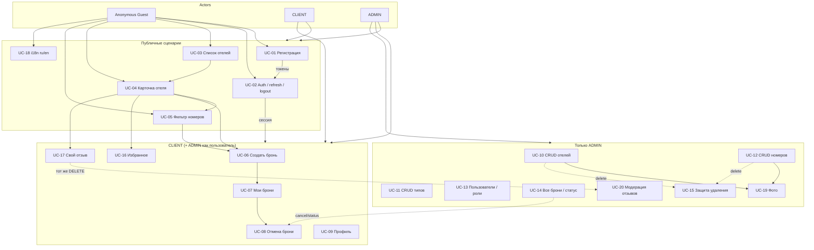

# 2. Actors и use cases

Документ описывает акторов системы Hotel Booking System, границы доступа и детальные сценарии использования (UC-01…UC-20).

Стек: React 19 + TypeScript + Vite (frontend), FastAPI + SQLAlchemy 2 + PostgreSQL (backend).  
Базовый префикс API: `/api/v1`. Авторизация: `Authorization: Bearer <access_token>`.

---

## 2.1. Описание акторов

### Anonymous Guest (неаутентифицированный посетитель)

Гость без валидного access-токена. Может просматривать каталог и проходить регистрацию/вход.

| Аспект | Описание |
|--------|----------|
| **Права** | Просмотр списка и карточек отелей; фильтрация и просмотр номеров; чтение отзывов; регистрация; login; refresh токена; переключение языка UI (`ru` / `en`) |
| **Ограничения** | Нельзя создавать бронирования, управлять избранным, оставлять/редактировать отзывы, менять профиль, вызывать logout, открывать админ-операции |
| **Идентификация** | Отсутствует; запросы без заголовка `Authorization` |
| **Хранение на клиенте** | Язык UI в `localStorage` (`i18n_lang`); токенов нет |

### CLIENT (клиент)

Зарегистрированный пользователь с ролью `CLIENT`. Получает все возможности гостя плюс персональные операции.

| Аспект | Описание |
|--------|----------|
| **Права** | Auth-сессия (access + refresh); создание/просмотр/отмена своих броней; профиль (name, phone); избранное; CRUD **своего** отзыва (один на отель); в списках отелей — флаг `is_favorite` |
| **Ограничения** | Нет CRUD отелей/типов/номеров/фото; нет списка всех пользователей и всех броней; нет смены ролей; нет удаления чужих отзывов; не может удалить отель/номер |
| **Идентификация** | JWT access (HS256, TTL по умолчанию 15 мин) + opaque refresh (hash в БД, TTL по умолчанию 7 дней) |
| **Регистрация** | `POST /auth/register` всегда создаёт пользователя с ролью `CLIENT` |

### ADMIN (администратор)

Пользователь с ролью `ADMIN`. Наследует все сценарии CLIENT и дополнительно управляет каталогом, пользователями, бронями и модерацией.

| Аспект | Описание |
|--------|----------|
| **Права** | CRUD отелей (в т.ч. lat/lng), типов номеров, номеров; загрузка/удаление/сортировка фото; список пользователей и смена роли; список всех броней и смена статуса; удаление любого отзыва; запрет удаления сущностей при активных бронях (UC-15) |
| **Ограничения** | Нельзя снять себе роль ADMIN / удалить единственного админа; удаление отеля/номера при `PENDING`/`CONFIRMED` бронях → `409 Conflict`; загрузка фото только ADMIN (JPEG/PNG/WebP, ≤ 5 MB, ≤ 10 фото на сущность) |
| **Идентификация** | Та же JWT-схема, что у CLIENT; проверка роли на защищённых эндпоинтах → при недостаточных правах `403` |
| **Seed** | `admin@example.com` / `Admin123!` (при первом запуске) |

---

## 2.2. Матрица доступа (актор × возможность)

Легенда: **✓** — разрешено, **—** — запрещено / не применимо, **◐** — частично (только свои данные).

| Возможность | Guest | CLIENT | ADMIN |
|-------------|:-----:|:------:|:-----:|
| Регистрация (UC-01) | ✓ | —¹ | —¹ |
| Login / refresh / logout (UC-02) | ✓² | ✓ | ✓ |
| Список / поиск отелей (UC-03) | ✓ | ✓ | ✓ |
| Карточка отеля (UC-04) | ✓ | ✓ | ✓ |
| Фильтрация номеров (UC-05) | ✓ | ✓ | ✓ |
| Создание бронирования (UC-06) | — | ✓ | ✓ |
| Просмотр своих броней (UC-07) | — | ✓ | ✓ |
| Отмена своей активной брони (UC-08) | — | ◐ | ✓³ |
| Профиль: просмотр / edit name, phone (UC-09) | — | ◐ | ◐ / ✓⁴ |
| Избранное (UC-16) | — | ✓ | ✓ |
| Свой отзыв: create / update / delete (UC-17) | — | ◐ | ◐ |
| Переключение языка UI (UC-18) | ✓ | ✓ | ✓ |
| CRUD отелей (UC-10) | — | — | ✓ |
| CRUD типов номеров (UC-11) | — | — | ✓ |
| CRUD номеров (UC-12) | — | — | ✓ |
| Список пользователей, смена роли (UC-13) | — | — | ✓ |
| Все бронирования, смена статуса (UC-14) | — | — | ✓ |
| Защита удаления при активных бронях (UC-15) | — | — | ✓⁵ |
| Управление фото (UC-19) | — | — | ✓ |
| Удаление любого отзыва (UC-20) | — | — | ✓ |
| Флаг `is_favorite` в ответах отелей | — | ✓ | ✓ |
| `GET /auth/me` | — | ✓ | ✓ |

¹ Уже аутентифицированный пользователь обычно не регистрируется повторно; эндпоинт публичный, повторная регистрация с тем же email → `409`.  
² Login и refresh — публичные; logout требует auth + refresh в теле.  
³ ADMIN может отменить бронь владельца через `PATCH /bookings/{id}/cancel` (owner или ADMIN).  
⁴ Owner правит name/phone; ADMIN может дополнительно менять `role` через `PATCH /users/{id}`.  
⁵ Инвариант сервера: при нарушении → `409`; сценарий относится к поведению ADMIN CRUD.

---

## 2.3. Детальные use cases

Общие предусловия (где применимо):

- Backend доступен; БД инициализирована (миграции + seed при первом запуске).
- Frontend обслуживается (Vite / production build).
- Все пути ниже относительно `/api/v1`.

---

### UC-01 — Регистрация

| Поле | Содержание |
|------|------------|
| **ID** | UC-01 |
| **Актор** | Anonymous Guest |
| **Цель** | Создать учётную запись CLIENT и сразу получить пару токенов для сессии |

**Предусловия**

- Пользователь не аутентифицирован (или готов создать новый аккаунт).
- Email ещё не занят в системе.

**Основной поток**

1. Гость открывает форму регистрации.
2. Вводит `name` (1–100), `email`, `password`; опционально `phone`.
3. Frontend отправляет `POST /auth/register`.
4. Backend валидирует поля, хеширует пароль (bcrypt), создаёт User с `role = CLIENT`.
5. Backend создаёт RefreshToken (hash), возвращает `access_token`, `refresh_token`, `token_type: bearer`.
6. Frontend сохраняет токены (MVP: `localStorage`), переводит UI в состояние «авторизован».

**Альтернативные / ошибочные потоки**

- **A1. Email занят** → `409 Conflict`; форма показывает ошибку.
- **A2. Невалидные данные** (формат email, длина name и т.п.) → `422` / `400`.
- **A3. Сетевая ошибка** → UI показывает общее сообщение, токены не сохраняются.

**Постусловия**

- В БД есть User с ролью CLIENT и активный RefreshToken.
- Пользователь аутентифицирован на клиенте.

**Связанные API**

- `POST /auth/register` (public)

---

### UC-02 — Вход, обновление access, logout

| Поле | Содержание |
|------|------------|
| **ID** | UC-02 |
| **Актор** | Guest (login/refresh), CLIENT / ADMIN (logout и работа в сессии) |
| **Цель** | Установить и поддерживать JWT-сессию; безопасно завершить её |

**Предусловия**

- **Login:** существует пользователь с указанным email и верным паролем.
- **Refresh:** есть неиспользованный, не revoked, не истёкший refresh-токен.
- **Logout:** пользователь аутентифицирован; передан текущий refresh.

**Основной поток — Login**

1. Пользователь вводит email и password.
2. `POST /auth/login` → проверка credentials.
3. Ответ: пара `access_token` + `refresh_token`.
4. Frontend сохраняет токены; Axios подставляет Bearer access.

**Основной поток — Refresh (rotation)**

1. Access истёк или API вернул `401` на защищённый запрос.
2. Axios interceptor один раз вызывает `POST /auth/refresh` с `{ "refresh_token" }`.
3. Backend помечает старый refresh как revoked, выдаёт новую пару.
4. Retry исходного запроса с новым access.

**Основной поток — Logout**

1. Пользователь выбирает «Выйти».
2. `POST /auth/logout` (auth) с `{ "refresh_token" }`.
3. Backend revoke refresh; frontend очищает токены и состояние AuthContext.

**Альтернативные / ошибочные потоки**

- **A1. Неверный пароль / неизвестный email** → `401`.
- **A2. Refresh истёк / revoked / уже использован** → `401`; принудительный logout на клиенте.
- **A3. Повторный 401 после refresh** → logout, редирект на login.
- **A4. Logout без/с битым токеном** → `401`; локальная сессия всё равно очищается.

**Постусловия**

- После login/refresh: валидная пара токенов; старый refresh после rotation недействителен.
- После logout: refresh revoked; клиент без сессии.

**Связанные API**

- `POST /auth/login` (public)
- `POST /auth/refresh` (public)
- `POST /auth/logout` (auth)
- `GET /auth/me` (auth) — проверка текущей сессии

---

### UC-03 — Просмотр списка отелей

| Поле | Содержание |
|------|------------|
| **ID** | UC-03 |
| **Актор** | Guest, CLIENT, ADMIN |
| **Цель** | Найти отели по городу и просмотреть постраничный список |

**Предусловия**

- В каталоге есть отели (или список может быть пустым).

**Основной поток**

1. Пользователь открывает Home / `/hotels`.
2. Задаёт фильтр `city` (и опционально `stars`), параметры пагинации `page`, `size`.
3. Frontend вызывает `GET /hotels` (опционально с Bearer — для `is_favorite`).
4. Backend возвращает `{ items, total, page, size }` с полями: name, city, stars, cover, `avg_rating`, `reviews_count`, при auth — `is_favorite`.
5. UI отображает карточки; пользователь листает страницы.

**Альтернативные / ошибочные потоки**

- **A1. Пустой результат** → empty state.
- **A2. Невалидные query** → `422`.
- **A3. Ошибка сервера** → сообщение об ошибке, повтор запроса.

**Постусловия**

- Данные каталога отображены; состояние системы не изменено (read-only).

**Связанные API**

- `GET /hotels` (public; `city`, `stars`; sort `created_at` / `stars` / `avg_rating`)
- `GET /hotels/map` (public) — для превью карты на Home

---

### UC-04 — Карточка отеля

| Поле | Содержание |
|------|------------|
| **ID** | UC-04 |
| **Актор** | Guest, CLIENT, ADMIN |
| **Цель** | Получить полную информацию об отеле: описание, фото, номера, отзывы, рейтинг, карта |

**Предусловия**

- Отель с указанным `id` существует.

**Основной поток**

1. Пользователь открывает `/hotels/:id` (из списка, избранного или маркера карты).
2. Frontend загружает `GET /hotels/{id}` — описание, stars, address, lat/lng, images, avg_rating, reviews_count.
3. Параллельно: список номеров отеля (`GET /rooms?hotel_id=`), отзывы (`GET /hotels/{id}/reviews`), мини-карта (Leaflet по lat/lng).
4. UI показывает галерею, описание, рейтинг, номера, отзывы, кнопку бронирования / избранного (если auth).

**Альтернативные / ошибочные потоки**

- **A1. Отель не найден** → `404`, страница «не найдено».
- **A2. Нет фото / номеров / отзывов** → соответствующие empty states.
- **A3. Гость нажимает «Забронировать» / «В избранное»** → редирект на login с возвратом.

**Постусловия**

- Пользователь видит карточку; данные не изменены (кроме последующих UC-06/16/17).

**Связанные API**

- `GET /hotels/{id}` (public)
- `GET /rooms?hotel_id={id}` (public)
- `GET /hotels/{id}/reviews` (public)
- `GET /hotels/map` (public) — контекст карты

---

### UC-05 — Фильтрация номеров

| Поле | Содержание |
|------|------------|
| **ID** | UC-05 |
| **Актор** | Guest, CLIENT, ADMIN |
| **Цель** | Найти номера по вместимости, цене и свободным датам |

**Предусловия**

- Каталог номеров доступен.

**Основной поток**

1. Пользователь задаёт фильтры: `capacity`, `price_from` / `price_to`, `date_from` / `date_to` (и опционально `hotel_id`, `city`).
2. Frontend вызывает `GET /rooms` с query-параметрами.
3. Backend возвращает номера со `status = AVAILABLE`, свободные в интервале дат (если даты заданы), с images.
4. UI отображает результаты с ценой за ночь и вместимостью.

**Альтернативные / ошибочные потоки**

- **A1. Нет подходящих номеров** → empty state.
- **A2. Некорректный диапазон дат/цен** → `400` / `422`.
- **A3. date_from/date_to заданы частично** → валидация на клиенте или `422` на сервере.

**Постусловия**

- Пользователь видит отфильтрованный список; система не изменена.

**Связанные API**

- `GET /rooms` (public)
- `GET /rooms/{id}` (public) — детали выбранного номера

---

### UC-06 — Создание бронирования

| Поле | Содержание |
|------|------------|
| **ID** | UC-06 |
| **Актор** | CLIENT, ADMIN |
| **Цель** | Забронировать свободный номер на даты check_in / check_out с расчётом стоимости |

**Предусловия**

- Пользователь аутентифицирован.
- Номер существует, `status = AVAILABLE`.
- `check_in >= today` (UTC); `check_out` exclusive; nights ∈ [1, 30].
- Нет пересечения с бронями того же номера в статусах `PENDING` / `CONFIRMED`.

**Основной поток**

1. Пользователь на `/bookings/new` (или с карточки номера) выбирает `room_id`, `check_in`, `check_out`.
2. UI показывает nights и предварительный `total_price = nights * room.price`.
3. `POST /bookings` в одной транзакции с блокировкой номера (`SELECT … FOR UPDATE` или эквивалент).
4. Backend создаёт Booking со статусом **`CONFIRMED`**, сохраняет `total_price`.
5. UI подтверждает успех, предлагает перейти к списку броней.

**Альтернативные / ошибочные потоки**

- **A1. Не аутентифицирован** → `401`, редирект на login.
- **A2. Номер недоступен / не найден** → `404` / `400`.
- **A3. Пересечение дат** → `409 Conflict`.
- **A4. Нарушение правил дат** (прошлое, nights 0 или > 30) → `400`.
- **A5. Гонка двух запросов** → один успех, второй `409` благодаря блокировке.

**Постусловия**

- Создана бронь `CONFIRMED`, номер занят на интервал для пересечений.

**Связанные API**

- `POST /bookings` (auth)
- `GET /rooms/{id}` (public) — превью цены/вместимости

---

### UC-07 — Просмотр своих бронирований

| Поле | Содержание |
|------|------------|
| **ID** | UC-07 |
| **Актор** | CLIENT, ADMIN (как владелец своих броней) |
| **Цель** | Увидеть список собственных бронирований с фильтром по статусу |

**Предусловия**

- Пользователь аутентифицирован.

**Основной поток**

1. Пользователь открывает профиль / раздел «Мои бронирования» (`/profile` или аналог).
2. Frontend вызывает `GET /bookings` (для CLIENT сервер ограничивает выборку `user_id = current`).
3. Опционально применяется фильтр `status`.
4. UI показывает список (отель/номер, даты, цена, статус); можно открыть `GET /bookings/{id}`.

**Альтернативные / ошибочные потоки**

- **A1. Список пуст** → empty state.
- **A2. 401** → login.
- **A3. Запрос чужой брони по id** → `403` / `404`.

**Постусловия**

- Пользователь видит свои брони; данные не изменены.

**Связанные API**

- `GET /bookings` (auth; CLIENT — только свои)
- `GET /bookings/{id}` (owner или ADMIN)

**Примечание:** ADMIN в админ-панели смотрит **все** брони через тот же `GET /bookings` (см. UC-14); в клиентском UI — свои.

---

### UC-08 — Отмена своей активной брони

| Поле | Содержание |
|------|------------|
| **ID** | UC-08 |
| **Актор** | CLIENT (owner), ADMIN (owner или модерация) |
| **Цель** | Отменить активную бронь (`PENDING` / `CONFIRMED`) → `CANCELLED` |

**Предусловия**

- Пользователь аутентифицирован.
- Бронь существует и принадлежит пользователю (или актор — ADMIN).
- Статус брони — `PENDING` или `CONFIRMED`.

**Основной поток**

1. Пользователь выбирает бронь и действие «Отменить».
2. Подтверждение в UI.
3. `PATCH /bookings/{id}/cancel`.
4. Backend переводит статус в `CANCELLED`.
5. UI обновляет список; интервал дат снова свободен для пересечений.

**Альтернативные / ошибочные потоки**

- **A1. Уже CANCELLED / COMPLETED** → `400`.
- **A2. Чужая бронь у CLIENT** → `403` / `404`.
- **A3. Бронь не найдена** → `404`.

**Постусловия**

- Статус = `CANCELLED`; бронь больше не блокирует даты.

**Связанные API**

- `PATCH /bookings/{id}/cancel` (owner или ADMIN)

---

### UC-09 — Просмотр и редактирование профиля

| Поле | Содержание |
|------|------------|
| **ID** | UC-09 |
| **Актор** | CLIENT, ADMIN |
| **Цель** | Просмотреть и обновить `name`, `phone` своего профиля |

**Предусловия**

- Пользователь аутентифицирован.

**Основной поток**

1. Открытие `/profile`.
2. Загрузка данных: `GET /auth/me` и/или `GET /users/me` / `GET /users/{id}` (owner).
3. Редактирование `name`, `phone` (email и role в MVP клиентом не меняются).
4. `PATCH /users/me` (или `PATCH /users/{id}` для owner).
5. UI показывает успех, обновляет AuthContext / кэш.

**Альтернативные / ошибочные потоки**

- **A1. Невалидные поля** → `422`.
- **A2. 401** → login.
- **A3. Попытка CLIENT сменить role** → поле игнорируется или `403`.

**Постусловия**

- Профиль обновлён; email и password_hash без изменений в этом UC.

**Связанные API**

- `GET /auth/me` (auth)
- `PATCH /users/me` (auth)
- `GET /users/{id}` (ADMIN или owner)
- `PATCH /users/{id}` (owner: name/phone)

---

### UC-10 — CRUD отелей

| Поле | Содержание |
|------|------------|
| **ID** | UC-10 |
| **Актор** | ADMIN |
| **Цель** | Создавать, читать, обновлять и удалять отели, включая координаты для карты |

**Предусловия**

- Актор аутентифицирован с ролью ADMIN.
- Для delete — см. также UC-15.

**Основной поток — Create**

1. Админ заполняет name, city, address, description, stars (1–5), latitude (−90…90), longitude (−180…180).
2. `POST /hotels` → отель создан.
3. Редирект на карточку / список в админке.

**Основной поток — Read / Update**

1. Список: `GET /hotels` (или админ-фильтры UI).
2. Детали: `GET /hotels/{id}`.
3. Изменение полей: `PUT /hotels/{id}`.

**Основной поток — Delete**

1. `DELETE /hotels/{id}`.
2. При отсутствии активных броней — удаление (+ cascade images/файлов).

**Альтернативные / ошибочные потоки**

- **A1. Не ADMIN** → `403`.
- **A2. Валидация lat/lng / stars** → `422`.
- **A3. Активные брони** → `409` (UC-15).
- **A4. Не найден** → `404`.

**Постусловия**

- Каталог отелей соответствует изменениям; карта использует актуальные lat/lng.

**Связанные API**

- `POST /hotels`, `GET /hotels`, `GET /hotels/{id}`, `PUT /hotels/{id}`, `DELETE /hotels/{id}`

---

### UC-11 — CRUD типов номеров

| Поле | Содержание |
|------|------------|
| **ID** | UC-11 |
| **Актор** | ADMIN |
| **Цель** | Управлять справочником RoomType (Standard, Deluxe, Suite, …) |

**Предусловия**

- Актор — ADMIN.
- Имя типа уникально.

**Основной поток**

1. Просмотр: `GET /room-types` (public — доступен и админке).
2. Создание: `POST /room-types` с уникальным `name`.
3. Обновление: `PUT /room-types/{id}`.
4. Удаление: `DELETE /room-types/{id}`, если нет связанных Room.

**Альтернативные / ошибочные потоки**

- **A1. Дубликат name** → `409`.
- **A2. Удаление при наличии комнат** → `400` / `409`.
- **A3. Не ADMIN на mutate** → `403`.

**Постусловия**

- Справочник типов актуален; существующие Room ссылаются на валидные типы.

**Связанные API**

- `GET /room-types` (public)
- `POST /room-types`, `PUT /room-types/{id}`, `DELETE /room-types/{id}` (ADMIN)

---

### UC-12 — CRUD номеров

| Поле | Содержание |
|------|------------|
| **ID** | UC-12 |
| **Актор** | ADMIN |
| **Цель** | Управлять номерами отеля: тип, номер, цена, вместимость, статус |

**Предусловия**

- Актор — ADMIN.
- Hotel и RoomType существуют.
- Пара `(hotel_id, number)` уникальна.
- Для delete — UC-15.

**Основной поток**

1. Create: `POST /rooms` — hotel_id, room_type_id, number, price > 0, capacity ≥ 1, description, status (`AVAILABLE` | `MAINTENANCE`).
2. Read: `GET /rooms`, `GET /rooms/{id}`.
3. Update: `PUT /rooms/{id}` (в т.ч. перевод в `MAINTENANCE`).
4. Delete: `DELETE /rooms/{id}` при отсутствии активных броней.

**Альтернативные / ошибочные потоки**

- **A1. Конфликт уникальности номера** → `409`.
- **A2. Активные брони при delete** → `409` (UC-15).
- **A3. Невалидная цена/capacity** → `422`.
- **A4. 403 / 404** — стандартно.

**Постусловия**

- Номер доступен/недоступен для бронирования согласно `status` и броням.

**Связанные API**

- `POST /rooms`, `GET /rooms`, `GET /rooms/{id}`, `PUT /rooms/{id}`, `DELETE /rooms/{id}`

---

### UC-13 — Список пользователей и смена роли

| Поле | Содержание |
|------|------------|
| **ID** | UC-13 |
| **Актор** | ADMIN |
| **Цель** | Просматривать пользователей и менять роль (`CLIENT` ↔ `ADMIN`) |

**Предусловия**

- Актор — ADMIN.
- Нельзя снять себе роль / оставить систему без единственного админа.

**Основной поток**

1. Админ открывает раздел пользователей.
2. `GET /users` с поиском по email/name, пагинация.
3. Выбор пользователя → `GET /users/{id}`.
4. Смена роли: `PATCH /users/{id}` с полем `role`.
5. UI обновляет список.

**Альтернативные / ошибочные потоки**

- **A1. Попытка снять себе ADMIN** → `400` / `403`.
- **A2. Попытка разжаловать единственного ADMIN** → `400` / `409`.
- **A3. Не ADMIN** → `403`.

**Постусловия**

- Роль пользователя обновлена; инвариант «≥ 1 ADMIN» сохранён.

**Связанные API**

- `GET /users` (ADMIN)
- `GET /users/{id}` (ADMIN или owner)
- `PATCH /users/{id}` (ADMIN: + role)

---

### UC-14 — Список всех бронирований и смена статуса

| Поле | Содержание |
|------|------------|
| **ID** | UC-14 |
| **Актор** | ADMIN |
| **Цель** | Модерировать все бронирования: просмотр и смена `status` |

**Предусловия**

- Актор — ADMIN.
- Бронь существует.

**Основной поток**

1. Админ открывает список броней.
2. `GET /bookings` возвращает все записи (фильтр `status`, пагинация).
3. Детали: `GET /bookings/{id}`.
4. Смена статуса: `PATCH /bookings/{id}` → `PENDING` | `CONFIRMED` | `CANCELLED` | `COMPLETED`.
5. UI отражает новый статус (влияние на пересечения дат — по правилам домена).

**Альтернативные / ошибочные потоки**

- **A1. Невалидный переход статуса** → `400` (если введены доп. ограничения в сервисе).
- **A2. Не ADMIN** → `403`.
- **A3. Не найдено** → `404`.

**Постусловия**

- Статус брони обновлён; `CANCELLED`/`COMPLETED` не блокируют пересечения.

**Связанные API**

- `GET /bookings` (ADMIN — все)
- `GET /bookings/{id}`
- `PATCH /bookings/{id}` (ADMIN)
- `PATCH /bookings/{id}/cancel` (опционально как частный случай)

**Примечание:** `DELETE /bookings/{id}` в MVP не используется.

---

### UC-15 — Запрет удаления отеля/номера при активных бронях

| Поле | Содержание |
|------|------------|
| **ID** | UC-15 |
| **Актор** | ADMIN (инвариант системы при UC-10 / UC-12) |
| **Цель** | Не допустить удаление Hotel/Room, пока есть брони `PENDING` или `CONFIRMED` |

**Предусловия**

- Актор выполняет `DELETE` отеля или номера.
- Существуют связанные брони в статусах `PENDING` / `CONFIRMED`.

**Основной поток (отклонение)**

1. Админ инициирует удаление.
2. Сервис проверяет связанные Booking.
3. При наличии активных → ответ **`409 Conflict`** с понятным `detail`.
4. UI показывает причину; сущность сохраняется.

**Альтернативные / ошибочные потоки**

- **A1. Активных броней нет** → удаление проходит (часть UC-10/UC-12); cascade Image + файлы.
- **A2. Только CANCELLED/COMPLETED** → удаление разрешено.

**Постусловия**

- При конфликте: данные без изменений.
- При успехе: сущность и связанные images удалены.

**Связанные API**

- `DELETE /hotels/{id}` (ADMIN)
- `DELETE /rooms/{id}` (ADMIN)

---

### UC-16 — Избранные отели

| Поле | Содержание |
|------|------------|
| **ID** | UC-16 |
| **Актор** | CLIENT, ADMIN |
| **Цель** | Добавить/убрать отель из избранного и просмотреть список избранного |

**Предусловия**

- Пользователь аутентифицирован.
- Отель существует.
- Уникальность пары `(user_id, hotel_id)`.

**Основной поток — Добавить**

1. На карточке/списке — «В избранное».
2. `POST /favorites/{hotel_id}`.
3. UI переключает флаг `is_favorite`.

**Основной поток — Убрать**

1. «Убрать из избранного».
2. `DELETE /favorites/{hotel_id}`.

**Основной поток — Список**

1. Открытие `/favorites`.
2. `GET /favorites` (пагинация) → список отелей.

**Альтернативные / ошибочные потоки**

- **A1. Повторный POST того же отеля** → `409` (API: POST добавить, DELETE убрать).
- **A2. Гость** → `401`, редирект на login.
- **A3. Отель не найден** → `404`.

**Постусловия**

- Favorite создан или удалён; в `GET /hotels` для auth отражается `is_favorite`.

**Связанные API**

- `GET /favorites` (auth)
- `POST /favorites/{hotel_id}` (auth)
- `DELETE /favorites/{hotel_id}` (auth)

---

### UC-17 — Отзыв об отеле (свой)

| Поле | Содержание |
|------|------------|
| **ID** | UC-17 |
| **Актор** | CLIENT, ADMIN (как авторы) |
| **Цель** | Оставить отзыв (rating 1–5, текст), отредактировать или удалить **свой** отзыв |

**Предусловия**

- Пользователь аутентифицирован.
- Отель существует.
- Для create: ещё нет отзыва на пару `(user_id, hotel_id)`.
- `comment` — 10–2000 символов; `rating` ∈ [1, 5].

**Основной поток — Create**

1. На карточке отеля — форма отзыва.
2. `POST /hotels/{id}/reviews` с `{ rating, comment }`.
3. Пересчёт `avg_rating`, `reviews_count` на отеле.

**Основной поток — Update**

1. Автор открывает свой отзыв.
2. `PATCH /reviews/{id}`.
3. Обновляются rating/comment и `updated_at`; avg пересчитывается.

**Основной поток — Delete (свой)**

1. `DELETE /reviews/{id}` (owner).
2. Отзыв удалён; avg пересчитан.

**Альтернативные / ошибочные потоки**

- **A1. Второй отзыв на тот же отель** → `409`.
- **A2. Чужой отзыв (не ADMIN)** → `403`.
- **A3. Невалидный rating/comment** → `422`.
- **A4. Гость** → `401`.

**Постусловия**

- Не более одного отзыва пользователя на отель; публичный рейтинг актуален.

**Связанные API**

- `GET /hotels/{id}/reviews` (public)
- `POST /hotels/{id}/reviews` (auth)
- `PATCH /reviews/{id}` (owner)
- `DELETE /reviews/{id}` (owner или ADMIN — см. UC-20)

---

### UC-18 — Переключение языка UI

| Поле | Содержание |
|------|------------|
| **ID** | UC-18 |
| **Актор** | Guest, CLIENT, ADMIN |
| **Цель** | Переключить интерфейс между `ru` и `en` с сохранением выбора |

**Предусловия**

- Frontend загружен; i18next инициализирован.
- Словари `locales/ru.json`, `locales/en.json` доступны.

**Основной поток**

1. Пользователь выбирает язык в Navbar (переключатель).
2. i18next меняет `lng` на `ru` или `en`.
3. Значение сохраняется в `localStorage` (`i18n_lang`).
4. Все пользовательские строки UI обновляются без перезагрузки (или с минимальным re-render).
5. При следующем визите язык читается из `localStorage`; default — `ru`.

**Альтернативные / ошибочные потоки**

- **A1. Нет значения в localStorage** → `ru`.
- **A2. Повреждённое/неизвестное значение** → fallback на `ru`.
- **A3. Сообщения API** — маппинг известных `detail` на ключи i18n, иначе показ `detail` как есть.

**Постусловия**

- UI на выбранном языке; выбор персистентен в браузере.
- Серверное состояние не меняется (чисто клиентский UC).

**Связанные API**

- Нет (клиентский сценарий). Косвенно влияет на отображение ответов API.

---

### UC-19 — Управление фото отеля и номера

| Поле | Содержание |
|------|------------|
| **ID** | UC-19 |
| **Актор** | ADMIN |
| **Цель** | Загрузить, удалить и упорядочить фото отеля или номера |

**Предусловия**

- Актор — ADMIN.
- Сущность (Hotel/Room) существует.
- Файл: JPEG / PNG / WebP; размер ≤ 5 MB; на сущность ≤ 10 фото.
- Файлы пишутся в `uploads/hotels/` или `uploads/rooms/`; отдача через `/media/...`.

**Основной поток — Upload**

1. Админ выбирает файл в админке.
2. `POST /hotels/{id}/images` или `POST /rooms/{id}/images` (`multipart/form-data`, optional `sort_order`).
3. Backend сохраняет файл и запись Image; ответ включает `id`, `url`, `sort_order`.

**Основной поток — Sort**

1. Админ меняет порядок.
2. `PATCH /images/{id}` с новым `sort_order`.

**Основной поток — Delete**

1. `DELETE /images/{id}` — удаление записи и файла с диска.

**Альтернативные / ошибочные потоки**

- **A1. Слишком большой файл** → `413`.
- **A2. Неверный MIME** → `415`.
- **A3. Превышен лимит 10 фото** → `400` / `409`.
- **A4. Не ADMIN** → `403`.
- **A5. Удаление Hotel/Room** → cascade Image + файлы (связь с UC-10/12).

**Постусловия**

- В ответах Hotel/Room массив `images: [{ id, url, sort_order }]` актуален.

**Связанные API**

- `POST /hotels/{id}/images` (ADMIN)
- `POST /rooms/{id}/images` (ADMIN)
- `PATCH /images/{id}` (ADMIN)
- `DELETE /images/{id}` (ADMIN)

---

### UC-20 — Удаление любого отзыва (модерация)

| Поле | Содержание |
|------|------------|
| **ID** | UC-20 |
| **Актор** | ADMIN |
| **Цель** | Удалить отзыв любого пользователя в рамках модерации |

**Предусловия**

- Актор — ADMIN.
- Отзыв существует (автор — любой User).

**Основной поток**

1. Админ в карточке отеля / админ-разделе отзывов выбирает отзыв.
2. Подтверждение удаления.
3. `DELETE /reviews/{id}` (разрешено ADMIN независимо от owner).
4. Пересчёт `avg_rating`, `reviews_count`.
5. UI обновляет список отзывов.

**Альтернативные / ошибочные потоки**

- **A1. Не ADMIN и не owner** → `403`.
- **A2. Не найден** → `404`.
- **A3. OWNER удаляет свой** — покрыто UC-17; тот же эндпоинт.

**Постусловия**

- Отзыв удалён; публичный рейтинг отеля обновлён; автор может снова оставить отзыв на этот отель.

**Связанные API**

- `DELETE /reviews/{id}` (owner или ADMIN)
- `GET /hotels/{id}/reviews` (public) — проверка результата

---

## 2.4. Диаграмма связей use cases



Связи «включает / расширяет» (кратко):

| Связь | Смысл |
|-------|--------|
| UC-01 → UC-02 | После регистрации пользователь сразу в сессии |
| UC-03 → UC-04 | Из списка / карты в карточку |
| UC-04 / UC-05 → UC-06 | Выбор отеля/номера и дат перед бронью |
| UC-06 → UC-07 → UC-08 | Жизненный цикл брони клиента |
| UC-10 / UC-12 → UC-15 | Delete защищён инвариантом активных броней |
| UC-10 / UC-12 → UC-19 | Фото привязаны к сущностям каталога |
| UC-17 ↔ UC-20 | Один эндпоинт DELETE; различие — политика прав |

---

## 2.5. Public vs authenticated vs admin boundaries

### Граница Public (без access-токена)

Доступно любому клиенту без `Authorization`:

| Method | Path | UC |
|--------|------|-----|
| POST | `/auth/register` | UC-01 |
| POST | `/auth/login` | UC-02 |
| POST | `/auth/refresh` | UC-02 |
| GET | `/hotels` | UC-03 |
| GET | `/hotels/{id}` | UC-04 |
| GET | `/hotels/map` | UC-04 / карта |
| GET | `/rooms` (+ фильтры) | UC-05 |
| GET | `/rooms/{id}` | UC-05 |
| GET | `/hotels/{id}/reviews` | UC-04, UC-17 (чтение) |
| GET | `/room-types` | UC-11 (чтение справочника) |

Плюс клиентский UC-18 (без API).

**Нельзя без токена:** брони, избранное, мутация отзывов, профиль, logout, любые ADMIN mutate.

### Граница Authenticated (любая роль: CLIENT или ADMIN)

Требуется валидный access JWT; при истечении — refresh (UC-02), иначе `401`.

| Method | Path | UC | Примечание |
|--------|------|-----|------------|
| POST | `/auth/logout` | UC-02 | + refresh в теле |
| GET | `/auth/me` | UC-02, UC-09 | |
| PATCH | `/users/me` | UC-09 | name, phone |
| POST | `/bookings` | UC-06 | |
| GET | `/bookings` | UC-07 | CLIENT видит только свои |
| GET | `/bookings/{id}` | UC-07 | owner |
| PATCH | `/bookings/{id}/cancel` | UC-08 | owner (ADMIN — тоже) |
| GET/POST/DELETE | `/favorites…` | UC-16 | |
| POST | `/hotels/{id}/reviews` | UC-17 | |
| PATCH | `/reviews/{id}` | UC-17 | только owner |
| DELETE | `/reviews/{id}` | UC-17 | owner; ADMIN — UC-20 |

Опциональное поведение: при auth в `GET /hotels` появляется `is_favorite`.

### Граница Admin (роль `ADMIN`)

При роли ≠ ADMIN → `403 Forbidden`.

| Method | Path | UC |
|--------|------|-----|
| POST/PUT/DELETE | `/hotels…` | UC-10, UC-15 |
| POST/PUT/DELETE | `/room-types…` | UC-11 |
| POST/PUT/DELETE | `/rooms…` | UC-12, UC-15 |
| GET | `/users`, PATCH role | UC-13 |
| GET все `/bookings`, PATCH status | UC-14 |
| POST/PATCH/DELETE | images | UC-19 |
| DELETE | `/reviews/{id}` (чужой) | UC-20 |

### Сводка нарушений границ

| Ситуация | Код |
|----------|-----|
| Нет / битый / истёкший access; неудачный refresh | `401` |
| Роль недостаточна (CLIENT → admin API) | `403` |
| Ресурс не найден | `404` |
| Конфликт (email, избранное, пересечение дат, активные брони при delete, второй отзыв) | `409` |
| Файл слишком большой / неверный MIME | `413` / `415` |
| Schema validation | `422` |
| Бизнес-валидация дат/статусов | `400` |

### Наследование прав

```
Anonymous Guest  ⊂  CLIENT  ⊂  ADMIN
     │                 │           │
  public read      + personal   + catalog /
  + register/login   bookings,    users /
                     favorites,   moderation /
                     own review   images
```

ADMIN использует те же клиентские экраны и API для личных операций (бронь, избранное, свой отзыв) и отдельные admin-маршруты UI (`/admin/...`) для UC-10…UC-15, UC-19, UC-20.
