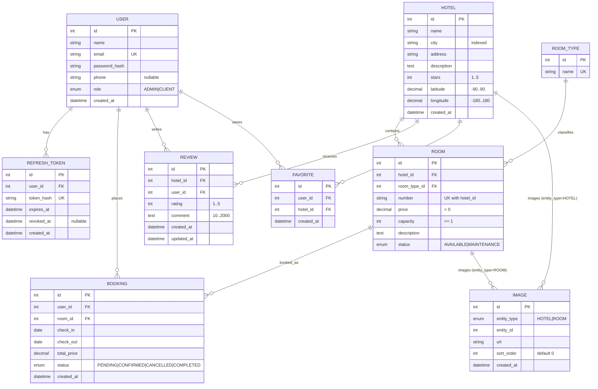

# 3. Доменная модель

Техническая спецификация доменного слоя Hotel Booking System. Источник истины по сущностям и правилам: `DESC.md` §3. Документ предназначен для реализации моделей SQLAlchemy 2.0, миграций Alembic и сервисной логики backend.

---

## 3.1. Обзор домена

Система моделирует поиск отелей и бронирование номеров. Ядро домена — **отель → номера → бронирования**; вокруг него — аутентификация (JWT access + refresh), отзывы с рейтингом, избранное и полиморфные изображения.

### Bounded contexts (логические)

| Контекст | Сущности | Ответственность |
|----------|----------|-----------------|
| Identity & Access | `User`, `RefreshToken` | Регистрация, роли, выдача/ротация/отзыв токенов |
| Catalog | `Hotel`, `RoomType`, `Room`, `Image` | Каталог отелей и номеров, фото, карта (lat/lng) |
| Booking | `Booking` | Создание, пересечение дат, отмена, статусы |
| Engagement | `Review`, `Favorite` | Отзывы/рейтинг, избранное |

### Ключевые решения

- Идентификаторы сущностей: **integer PK** (автоинкремент) — единообразно для всех таблиц; в спецификации для `User.id` допускается UUID/int — для MVP фиксируем **int**.
- Денежные и координатные значения: `Decimal` (не `float`).
- Даты бронирования: тип `date` (без времени); сравнение с «сегодня» — **UTC**.
- `check_out` **exclusive**: ночь выезда не тарифицируется.
- `Image` — полиморфная связь через `(entity_type, entity_id)`, без FK на Hotel/Room (целостность на уровне приложения + cascade при удалении).
- Рейтинг отеля — **вычисляемый**: `AVG(rating)`, `COUNT(*)` по `Review`, не хранится денормализованно в MVP.

---

## 3.2. ER-диаграмма



### Кардинальности (сводка)

| Связь | Кардинальность | On delete (рекомендация) |
|-------|----------------|--------------------------|
| Hotel → Room | 1:N | RESTRICT, если есть активные брони (бизнес-правило 10); иначе CASCADE комнат после проверки |
| RoomType → Room | 1:N | RESTRICT, если есть комнаты |
| User → Booking | 1:N | RESTRICT |
| Room → Booking | 1:N | RESTRICT при PENDING/CONFIRMED |
| User → RefreshToken | 1:N | CASCADE |
| User → Review | 1:N | CASCADE или SET NULL — для MVP: CASCADE / запрет удаления User |
| Hotel → Review | 1:N | CASCADE |
| User → Favorite | 1:N | CASCADE |
| Hotel → Favorite | 1:N | CASCADE |
| Hotel/Room → Image | 1:N (полиморфно) | Cascade на уровне сервиса (записи + файлы) |

---

## 3.3. Сущности

Общие соглашения:

- PK: `id INTEGER GENERATED BY DEFAULT AS IDENTITY` (или `SERIAL` / SQLAlchemy `Identity()`).
- Timestamps: timezone-aware `DateTime(timezone=True)`, хранение в UTC.
- Строки: UTF-8; длины — CHECK / валидация Pydantic + DB constraints где указано.

---

### 3.3.1. User

**Бизнес-смысл:** учётная запись. Роль определяет доступ: `CLIENT` — бронирования, отзывы, избранное; `ADMIN` — CRUD каталога, модерация, управление пользователями.

| Поле | Тип SQLAlchemy / SQL | Constraints | Индексы |
|------|----------------------|-------------|---------|
| `id` | `Integer`, PK | PRIMARY KEY | PK |
| `name` | `String(100)` | NOT NULL, length 1–100 | — |
| `email` | `String(255)` | NOT NULL, UNIQUE, email format (app) | UNIQUE INDEX |
| `password_hash` | `String(255)` | NOT NULL; bcrypt via Passlib | — |
| `phone` | `String(32)`, nullable | optional | — |
| `role` | `Enum(UserRole)` | NOT NULL; `ADMIN` \| `CLIENT` | INDEX (опционально, для админ-фильтров) |
| `created_at` | `DateTime(timezone=True)` | NOT NULL, default `now()` | — |

**Правила:**

- Email уникален глобально.
- Пароль в БД только как hash; plaintext никогда не сохраняется.
- Админ не может снять себе роль / удалить единственного админа (см. §3.5).

---

### 3.3.2. RefreshToken

**Бизнес-смысл:** долгоживущий refresh-токен для ротации access. В БД хранится **hash**, не plaintext.

| Поле | Тип | Constraints | Индексы |
|------|-----|-------------|---------|
| `id` | `Integer`, PK | PRIMARY KEY | PK |
| `user_id` | `Integer`, FK → `users.id` | NOT NULL | INDEX (`user_id`) |
| `token_hash` | `String(255)` | NOT NULL, UNIQUE | UNIQUE INDEX |
| `expires_at` | `DateTime(timezone=True)` | NOT NULL | INDEX (для очистки expired) |
| `revoked_at` | `DateTime(timezone=True)`, nullable | NULL = активен | — |
| `created_at` | `DateTime(timezone=True)` | NOT NULL, default `now()` | — |

**Активный токен:** `revoked_at IS NULL AND expires_at > now()`.

---

### 3.3.3. Hotel

**Бизнес-смысл:** объект размещения. Координаты обязательны для карты. Рейтинг не хранится — агрегируется из `Review`.

| Поле | Тип | Constraints | Индексы |
|------|-----|-------------|---------|
| `id` | `Integer`, PK | PRIMARY KEY | PK |
| `name` | `String(255)` | NOT NULL | — |
| `city` | `String(100)` | NOT NULL | INDEX (`city`) — поиск |
| `address` | `String(500)` | NOT NULL | — |
| `description` | `Text` | nullable или empty string | — |
| `stars` | `Integer` | NOT NULL, CHECK 1–5 | INDEX (фильтр/сортировка) |
| `latitude` | `Numeric(9, 6)` | NOT NULL, CHECK −90…90 | — |
| `longitude` | `Numeric(9, 6)` | NOT NULL, CHECK −180…180 | — |
| `created_at` | `DateTime(timezone=True)` | NOT NULL, default `now()` | INDEX (сортировка) |

**Вычисляемые (не колонки):** `avg_rating`, `reviews_count`, `is_favorite` (для auth), cover image, `min_price` (для карты).

---

### 3.3.4. RoomType

**Бизнес-смысл:** справочник категорий номеров (Standard, Deluxe, Suite, Family, …).

| Поле | Тип | Constraints | Индексы |
|------|-----|-------------|---------|
| `id` | `Integer`, PK | PRIMARY KEY | PK |
| `name` | `String(100)` | NOT NULL, UNIQUE | UNIQUE INDEX |

Удаление запрещено, если существуют связанные `Room`.

---

### 3.3.5. Room

**Бизнес-смысл:** физический номер в отеле с ценой за ночь и вместимостью.

| Поле | Тип | Constraints | Индексы |
|------|-----|-------------|---------|
| `id` | `Integer`, PK | PRIMARY KEY | PK |
| `hotel_id` | `Integer`, FK → `hotels.id` | NOT NULL | INDEX |
| `room_type_id` | `Integer`, FK → `room_types.id` | NOT NULL | INDEX |
| `number` | `String(50)` | NOT NULL; UNIQUE(`hotel_id`, `number`) | UNIQUE INDEX |
| `price` | `Numeric(12, 2)` | NOT NULL, CHECK `> 0` | INDEX (фильтр цены) |
| `capacity` | `Integer` | NOT NULL, CHECK `>= 1` | INDEX (фильтр) |
| `description` | `Text` | nullable | — |
| `status` | `Enum(RoomStatus)` | NOT NULL; `AVAILABLE` \| `MAINTENANCE` | INDEX |

**Смысл статусов:**

- `AVAILABLE` — можно бронировать.
- `MAINTENANCE` — недоступен для новых броней.

---

### 3.3.6. Image

**Бизнес-смысл:** фото отеля или номера. Полиморфная связь без FK.

| Поле | Тип | Constraints | Индексы |
|------|-----|-------------|---------|
| `id` | `Integer`, PK | PRIMARY KEY | PK |
| `entity_type` | `Enum(ImageEntityType)` | NOT NULL; `HOTEL` \| `ROOM` | составной INDEX (`entity_type`, `entity_id`) |
| `entity_id` | `Integer` | NOT NULL | (см. выше) |
| `url` | `String(500)` | NOT NULL; путь/URL | — |
| `sort_order` | `Integer` | NOT NULL, default `0` | — |
| `created_at` | `DateTime(timezone=True)` | NOT NULL, default `now()` | — |

**Файловое хранилище:**

| Параметр | Значение |
|----------|----------|
| Каталоги | `uploads/hotels/`, `uploads/rooms/` |
| Отдача | static mount `/media/...` (backend) или nginx |
| Форматы | JPEG, PNG, WebP |
| Max размер | 5 MB (`MAX_UPLOAD_SIZE_MB`) |
| Max фото на сущность | 10 |

В ответах API: `images: [{ id, url, sort_order }]`.

---

### 3.3.7. Review

**Бизнес-смысл:** отзыв клиента об отеле; один отзыв на пару пользователь–отель.

| Поле | Тип | Constraints | Индексы |
|------|-----|-------------|---------|
| `id` | `Integer`, PK | PRIMARY KEY | PK |
| `hotel_id` | `Integer`, FK → `hotels.id` | NOT NULL | INDEX |
| `user_id` | `Integer`, FK → `users.id` | NOT NULL | INDEX |
| `rating` | `Integer` | NOT NULL, CHECK 1–5 | — |
| `comment` | `Text` | NOT NULL, length 10–2000 | — |
| `created_at` | `DateTime(timezone=True)` | NOT NULL, default `now()` | — |
| `updated_at` | `DateTime(timezone=True)` | NOT NULL, on update | — |

**UNIQUE** `(user_id, hotel_id)`.

---

### 3.3.8. Favorite

**Бизнес-смысл:** избранный отель пользователя.

| Поле | Тип | Constraints | Индексы |
|------|-----|-------------|---------|
| `id` | `Integer`, PK | PRIMARY KEY | PK |
| `user_id` | `Integer`, FK → `users.id` | NOT NULL | INDEX |
| `hotel_id` | `Integer`, FK → `hotels.id` | NOT NULL | INDEX |
| `created_at` | `DateTime(timezone=True)` | NOT NULL, default `now()` | — |

**UNIQUE** `(user_id, hotel_id)`.

---

### 3.3.9. Booking

**Бизнес-смысл:** бронь номера на интервал дат с зафиксированной стоимостью.

| Поле | Тип | Constraints | Индексы |
|------|-----|-------------|---------|
| `id` | `Integer`, PK | PRIMARY KEY | PK |
| `user_id` | `Integer`, FK → `users.id` | NOT NULL | INDEX |
| `room_id` | `Integer`, FK → `rooms.id` | NOT NULL | INDEX |
| `check_in` | `Date` | NOT NULL | составной INDEX (`room_id`, `check_in`, `check_out`, `status`) для overlap-запросов |
| `check_out` | `Date` | NOT NULL; `check_out > check_in` | (см. выше) |
| `total_price` | `Numeric(12, 2)` | NOT NULL, `>= 0` | — |
| `status` | `Enum(BookingStatus)` | NOT NULL | INDEX |
| `created_at` | `DateTime(timezone=True)` | NOT NULL, default `now()` | — |

**Статусы:**

| Статус | Смысл | Блокирует пересечение |
|--------|-------|------------------------|
| `PENDING` | Ожидает (зарезервирован в модели; при создании MVP сразу `CONFIRMED`) | Да |
| `CONFIRMED` | Активная бронь | Да |
| `CANCELLED` | Отменена | Нет |
| `COMPLETED` | Завершена (проживание прошло) | Нет |

При создании бронирования статус = **`CONFIRMED`** (правило B-6).

---

## 3.4. Бизнес-правила

### 3.4.1. Правила бронирования (B-1 … B-11)

#### B-1. Exclusive check-out

`check_out` **не включается** в тарификацию.

```
nights = (check_out - check_in).days
```

День выезда не тарифицируется.

| Пример | check_in | check_out | nights |
|--------|----------|-----------|--------|
| 1 ночь | 2026-07-10 | 2026-07-11 | 1 |
| 5 ночей | 2026-07-10 | 2026-07-15 | 5 |

**Edge case:** `check_in == check_out` → `nights = 0` → отклонить (см. B-2).

---

#### B-2. Диапазон длительности

```
1 <= nights <= 30
```

| Вход | Результат |
|------|-----------|
| nights = 0 | 400 |
| nights = 1 | OK |
| nights = 30 | OK |
| nights = 31 | 400 |

---

#### B-3. check_in не в прошлом

```
check_in >= today_utc
```

`today` — календарная дата в **UTC**.

**Edge cases:**

- Клиент в TZ UTC+3 в 01:00 локального 17.07 может иметь UTC ещё 16.07 — ориентир всегда UTC.
- `check_in == today` — разрешено.

---

#### B-4. Номер доступен

Номер должен существовать (`404`, если нет) и иметь `status = AVAILABLE`.

| status | Создание брони |
|--------|----------------|
| `AVAILABLE` | OK |
| `MAINTENANCE` | 400 |

---

#### B-5. Расчёт стоимости

```
total_price = nights * room.price
```

Фиксируется в момент создания; последующее изменение `room.price` на уже созданную бронь не влияет.

**Edge case:** `price` меняется админом между чтением и commit — в транзакции с `FOR UPDATE` читать актуальную цену (см. §3.8).

---

#### B-6. Статус при создании

При создании: `status = CONFIRMED`.

`PENDING` остаётся в enum для расширений / админских сценариев, но happy-path создания клиентом пишет `CONFIRMED`.

---

#### B-7. Запрет пересечения дат

Пересечение запрещено, если у того же `room_id` есть бронь со статусом **`PENDING` или `CONFIRMED`**:

```sql
existing.check_in < new.check_out
AND new.check_in < existing.check_out
```

**Существующая бронь:** 10.07 – 15.07 (check_in=10, check_out=15).

| Новый интервал | Результат | Почему |
|----------------|-----------|--------|
| 12–18 | Запрещён | Перекрытие mid |
| 09–11 | Запрещён | Перекрытие хвоста |
| 13–14 | Запрещён | Внутри |
| 09–10 | Разрешён | touch на check_in существующей: `09 < 15` и `10 < 10` → false |
| 01–09 | Разрешён | До |
| 15–20 | Разрешён | Back-to-back: `15 < 15` → false |
| 10–15 | Запрещён | Полное совпадение |

**Edge case (back-to-back):** выезд в день чужого заезда разрешён — номер освобождается утром exclusive checkout.

При конфликте → **409 Conflict**.

---

#### B-8. CANCELLED / COMPLETED не блокируют

Брони в статусах `CANCELLED` и `COMPLETED` **игнорируются** при проверке пересечения.

**Пример:** бронь 10–15 отменена → можно создать новую 12–14.

---

#### B-9. Отмена клиентом

Клиент может отменить **свою** бронь в статусе `CONFIRMED` или `PENDING` → `CANCELLED` (`PATCH …/cancel`).

| Условие | Результат |
|---------|-----------|
| Чужая бронь | 403 |
| Уже `CANCELLED` | 400 |
| `COMPLETED` | 400 |
| Своя `CONFIRMED`/`PENDING` | → `CANCELLED` |

---

#### B-10. Удаление Hotel / Room при активных бронях

Если есть брони `PENDING` или `CONFIRMED` на номер (для Room) или на любой номер отеля (для Hotel) → **409 Conflict**, удаление запрещено.

| Сущность | Условие блокировки |
|----------|-------------------|
| Room | EXISTS booking WHERE room_id=X AND status IN (PENDING, CONFIRMED) |
| Hotel | EXISTS booking через rooms отеля с теми же статусами |

После отмены/завершения всех активных — удаление допустимо (с cascade Image и т.д.).

---

#### B-11. Транзакционность создания

Создание бронирования выполняется в **одной транзакции** с `SELECT … FOR UPDATE` на строку номера (см. §3.8).

---

### 3.4.2. Правила auth / refresh (A-1 … A-7)

#### A-1. Пара токенов при login/register

Ответ:

```json
{
  "access_token": "...",
  "refresh_token": "...",
  "token_type": "bearer"
}
```

#### A-2. Access TTL

`ACCESS_TOKEN_EXPIRE_MINUTES` (default **15**). JWT HS256.

#### A-3. Refresh TTL и хранение

`REFRESH_TOKEN_EXPIRE_DAYS` (default **7**). В БД — только **hash** opaque-строки (или JWT).

#### A-4. Rotation на refresh

`POST /auth/refresh`:

1. Найти по hash, проверить не expired / не revoked.
2. Выдать новую пару.
3. Старый refresh → `revoked_at = now()`.

#### A-5. Logout

`POST /auth/logout` — revoke текущего refresh (body/cookie).

#### A-6. Невалидный refresh → 401

Использованный (уже revoked после rotation), expired или неизвестный → **401**.

#### A-7. Frontend storage

- Access: memory или `localStorage`.
- Refresh: `localStorage` (или httpOnly cookie; MVP default: оба в `localStorage`).
- Axios: при 401 access — **один** retry через refresh, затем logout.

**Edge cases:**

- Два параллельных refresh одного токена: первый succeeds + revoke; второй → 401 (A-6).
- Утечка plaintext refresh из localStorage — риск MVP; hash в БД не спасает клиентское хранилище.

---

### 3.4.3. Правила отзывов (R-1 … R-3)

#### R-1. Один отзыв на отель

Только аутентифицированный пользователь; UNIQUE `(user_id, hotel_id)`.

Повторный POST → **409**.

#### R-2. Средний рейтинг

```
avg_rating = AVG(rating)  -- по Review отеля
reviews_count = COUNT(*)
```

Отдавать в `GET /hotels` и `GET /hotels/{id}`.

**Edge case:** 0 отзывов → `avg_rating = null` (или 0 — зафиксировать в API-схеме единообразно; рекомендация: `null` + `reviews_count = 0`).

#### R-3. Права на изменение

| Действие | Автор | ADMIN |
|----------|-------|-------|
| PATCH свой | Да | — |
| DELETE свой | Да | Да (любой) |
| PATCH чужой | Нет | Нет (модерация = DELETE) |

---

### 3.4.4. Правила избранного (F-1 … F-3)

#### F-1. Только auth

Неаутентифицированный → 401.

#### F-2. Toggle API

- `POST` — добавить; повтор того же → **409** (или идемпотентный DELETE — в MVP: **409**).
- `DELETE` — убрать; отсутствие → 404.

#### F-3. Флаг в списке отелей

Для авторизованного в списке/карточке: `is_favorite: bool`.

---

### 3.4.5. Правила фото (P-1 … P-3)

#### P-1. Загрузка только ADMIN

`multipart/form-data`. MIME не из {JPEG, PNG, WebP} → **415**; размер > 5 MB → **413**; уже 10 фото → **400/409**.

#### P-2. Cascade при удалении сущности

При удалении Hotel/Room: удалить записи `Image` с соответствующим `(entity_type, entity_id)` **и** файлы с диска.

#### P-3. В ответах

Hotel/Room включают `images: [{ id, url, sort_order }]`, сортировка по `sort_order`, затем `id`.

---

### 3.4.6. Прочие инварианты (I-1 … I-3)

| ID | Инвариант |
|----|-----------|
| I-1 | Email уникален глобально |
| I-2 | `(hotel_id, number)` уникален |
| I-3 | Админ не может снять себе роль / удалить единственного админа |

**I-3 детали:**

- `PATCH` role: если текущий пользователь — единственный `ADMIN` и меняет себе роль на `CLIENT` → **400/409**.
- Удаление пользователя-админа (если появится endpoint): нельзя удалить последнего ADMIN.

---

## 3.5. Инварианты целостности

### Ссылочная целостность (FK)

| Дочерняя | Родитель | Рекомендуемый ON DELETE |
|----------|----------|-------------------------|
| `refresh_tokens.user_id` | `users` | CASCADE |
| `rooms.hotel_id` | `hotels` | RESTRICT (сначала бизнес-проверка B-10) |
| `rooms.room_type_id` | `room_types` | RESTRICT |
| `bookings.user_id` | `users` | RESTRICT |
| `bookings.room_id` | `rooms` | RESTRICT |
| `reviews.user_id` | `users` | CASCADE или RESTRICT |
| `reviews.hotel_id` | `hotels` | CASCADE |
| `favorites.user_id` | `users` | CASCADE |
| `favorites.hotel_id` | `hotels` | CASCADE |

### Прикладная целостность (нет FK)

| Правило | Описание |
|---------|----------|
| Image → Hotel/Room | `entity_id` должен существовать в таблице, соответствующей `entity_type`; проверка в сервисе |
| Max 10 images | До вставки Image: `COUNT(*) WHERE entity_type=? AND entity_id=? < 10` |
| Overlap booking | B-7 в транзакции |
| Last admin | I-3 |

### CHECK constraints (рекомендуемый минимум)

```sql
-- hotels
CHECK (stars BETWEEN 1 AND 5)
CHECK (latitude BETWEEN -90 AND 90)
CHECK (longitude BETWEEN -180 AND 180)

-- rooms
CHECK (price > 0)
CHECK (capacity >= 1)

-- reviews
CHECK (rating BETWEEN 1 AND 5)
CHECK (char_length(comment) BETWEEN 10 AND 2000)

-- bookings
CHECK (check_out > check_in)
CHECK (total_price >= 0)

-- users
CHECK (char_length(name) BETWEEN 1 AND 100)
```

### Уникальные ключи

| Таблица | Constraint |
|--------|------------|
| `users` | `UNIQUE(email)` |
| `refresh_tokens` | `UNIQUE(token_hash)` |
| `room_types` | `UNIQUE(name)` |
| `rooms` | `UNIQUE(hotel_id, number)` |
| `reviews` | `UNIQUE(user_id, hotel_id)` |
| `favorites` | `UNIQUE(user_id, hotel_id)` |

---

## 3.6. Рекомендации по SQLAlchemy-моделям / enum

### Расположение

```
backend/app/models/
  __init__.py          # re-export всех моделей
  base.py              # DeclarativeBase
  enums.py             # StrEnum
  user.py
  refresh_token.py
  hotel.py
  room_type.py
  room.py
  image.py
  review.py
  favorite.py
  booking.py
```

### Enum (Python 3.12 + SQLAlchemy 2)

Использовать `enum.StrEnum` и `sqlalchemy.Enum(..., values_callable=lambda x: [e.value for e in x], native_enum=True)` (или `native_enum=False` + VARCHAR для более простых миграций Alembic — выбрать один стиль на проект).

```python
from enum import StrEnum


class UserRole(StrEnum):
    ADMIN = "ADMIN"
    CLIENT = "CLIENT"


class RoomStatus(StrEnum):
    AVAILABLE = "AVAILABLE"
    MAINTENANCE = "MAINTENANCE"


class BookingStatus(StrEnum):
    PENDING = "PENDING"
    CONFIRMED = "CONFIRMED"
    CANCELLED = "CANCELLED"
    COMPLETED = "COMPLETED"


class ImageEntityType(StrEnum):
    HOTEL = "HOTEL"
    ROOM = "ROOM"
```

### Паттерны моделей

- `Mapped[]` + `mapped_column()` (SQLAlchemy 2 style).
- Relationships: `relationship(...)` с `back_populates`; для Booking/Room — lazy `"selectin"` или явный join в репозитории.
- `Image`: **без** relationship на Hotel/Room через FK; опционально hybrid-свойства / отдельные query helpers `list_images(entity_type, entity_id)`.
- Decimal: `Mapped[Decimal]` + `Numeric(12, 2)` / `Numeric(9, 6)`.
- Не использовать `float` для денег и координат.

### Пример скелета Booking + Room lock

```python
class Room(Base):
    __tablename__ = "rooms"
    __table_args__ = (
        UniqueConstraint("hotel_id", "number", name="uq_rooms_hotel_number"),
        CheckConstraint("price > 0", name="ck_rooms_price_positive"),
        CheckConstraint("capacity >= 1", name="ck_rooms_capacity"),
    )
    # ...


class Booking(Base):
    __tablename__ = "bookings"
    __table_args__ = (
        CheckConstraint("check_out > check_in", name="ck_bookings_dates"),
        Index(
            "ix_bookings_room_dates_status",
            "room_id",
            "check_in",
            "check_out",
            "status",
        ),
    )
    # ...
```

### Pydantic vs ORM

- ORM-модели не отдавать напрямую в API.
- Схемы Pydantic v2 в `app/schemas/`; вычисляемые поля (`avg_rating`, `is_favorite`) — в response DTO / service layer.

---

## 3.7. Seed data спецификация

Выполняется при первом запуске (скрипт `seed` / startup hook, идемпотентно: skip если admin уже есть).

### Пользователи

| role | email | password (plaintext только в seed) | name |
|------|-------|--------------------------------------|------|
| ADMIN | `admin@example.com` | `Admin123!` | Admin |
| CLIENT | `client@example.com` | `Client123!` | Client |

Пароли хешировать bcrypt (Passlib) перед insert.

### RoomType

≥ **1** запись, например:

| name |
|------|
| Standard |
| Deluxe |
| Suite |

(минимум одна; рекомендуется ≥ 2 для демо фильтров)

### Hotels

≥ **2** отеля с валидными lat/lng:

| name (пример) | city | lat | lng | stars |
|---------------|------|-----|-----|-------|
| Hotel Moscow Center | Москва | 55.7558 | 37.6173 | 4 |
| Hotel Nevsky | Санкт-Петербург | 59.9311 | 30.3609 | 5 |

`address`, `description` — произвольные валидные строки.

### Rooms

≥ **3** номера суммарно, привязанные к seed-отелям, `status=AVAILABLE`, `price > 0`, `capacity >= 1`, уникальные `(hotel_id, number)`.

Пример распределения: 2 номера в Москве, 1 в СПб.

### Images

≥ **1** seed-фото на каждый отель:

- Файлы в `uploads/hotels/` **или** placeholder URL из static.
- `entity_type=HOTEL`, `sort_order=0`.

### Reviews

≥ **1** отзыв от CLIENT на один из отелей:

- `rating` 1–5, `comment` 10–2000 символов.
- `(user_id, hotel_id)` уникален.

### Идемпотентность

```
IF EXISTS (SELECT 1 FROM users WHERE email = 'admin@example.com') THEN skip seed
ELSE insert all seed data in one transaction
```

---

## 3.8. Транзакционные требования (booking FOR UPDATE)

### Цель

Исключить double-booking при конкурентных `POST /bookings` на один `room_id` и пересекающиеся даты.

### Алгоритм создания бронирования (один DB transaction)

```
BEGIN;

-- 1. Блокировка строки номера (сериализация писателей по room)
SELECT * FROM rooms WHERE id = :room_id FOR UPDATE;

-- 2. Проверки B-2…B-4 на заблокированной строке
--    status == AVAILABLE, price актуален

-- 3. Проверка пересечения B-7
SELECT 1 FROM bookings
 WHERE room_id = :room_id
   AND status IN ('PENDING', 'CONFIRMED')
   AND check_in < :new_check_out
   AND :new_check_in < check_out
 LIMIT 1;

-- если найдено → ROLLBACK / 409

-- 4. INSERT booking (status=CONFIRMED, total_price = nights * price)

COMMIT;
```

### SQLAlchemy 2

```python
async def create_booking(session: AsyncSession, ...) -> Booking:
    room = await session.scalar(
        select(Room).where(Room.id == room_id).with_for_update()
    )
    if room is None:
        raise NotFound(...)
    if room.status != RoomStatus.AVAILABLE:
        raise BusinessError(...)

    # validate dates (B-1..B-3), compute nights & total_price (B-5)

    overlap = await session.scalar(
        select(Booking.id).where(
            Booking.room_id == room_id,
            Booking.status.in_([BookingStatus.PENDING, BookingStatus.CONFIRMED]),
            Booking.check_in < check_out,
            check_in < Booking.check_out,
        ).limit(1)
    )
    if overlap is not None:
        raise Conflict(...)

    booking = Booking(...)
    session.add(booking)
    await session.commit()
    return booking
```

### Уровень изоляции

- Default PostgreSQL `READ COMMITTED` + `FOR UPDATE` достаточен: второй транзакции ждать unlock первой, затем увидеть вставленную бронь.
- Не полагаться на application-level lock без БД.
- Альтернатива/дополнение: exclusion constraint на daterange (GiST) для PENDING/CONFIRMED — **опционально**, не требуется MVP, если соблюдён FOR UPDATE.

### Что блокировать

| Объект | FOR UPDATE | Зачем |
|--------|------------|-------|
| `rooms` row | **Обязательно** | Сериализация броней одного номера |
| overlapping bookings | Не обязательно отдельно | Достаточно lock на room + overlap SELECT |
| `hotels` | Нет | Не участвует в race брони |

### Таймауты и ошибки

- Долгая блокировка: настроить `lock_timeout` / statement timeout; клиенту — 409 или 503 по политике API.
- После rollback сессию не переиспользовать с грязным состоянием (новая unit of work).

### Связанные операции

| Операция | Транзакция |
|----------|------------|
| Cancel booking | UPDATE status; lock room опционален (отмена расширяет доступность) |
| Admin status change | Аналогично; при переводе в CONFIRMED — повторить overlap-check + FOR UPDATE |
| Delete room/hotel | Проверка B-10 в транзакции; при успехе cascade images+files |
| Refresh rotation | Транзакция: revoke old + insert new hash |

---

## 3.9. Сводка индексов (рекомендуемая)

| Таблица | Индекс | Назначение |
|--------|--------|------------|
| `users` | UNIQUE(`email`) | I-1, login |
| `refresh_tokens` | UNIQUE(`token_hash`), INDEX(`user_id`), INDEX(`expires_at`) | lookup / cleanup |
| `hotels` | INDEX(`city`), INDEX(`stars`), INDEX(`created_at`) | поиск/сортировка |
| `rooms` | UNIQUE(`hotel_id`,`number`), INDEX(`hotel_id`), INDEX(`price`), INDEX(`capacity`), INDEX(`status`) | фильтры UC-05 |
| `images` | INDEX(`entity_type`,`entity_id`) | список фото |
| `reviews` | UNIQUE(`user_id`,`hotel_id`), INDEX(`hotel_id`) | R-1, avg |
| `favorites` | UNIQUE(`user_id`,`hotel_id`), INDEX(`user_id`) | список избранного |
| `bookings` | INDEX(`user_id`), INDEX(`room_id`,`check_in`,`check_out`,`status`) | overlap, «мои брони» |

---

*Конец раздела 3. Доменная модель.*
