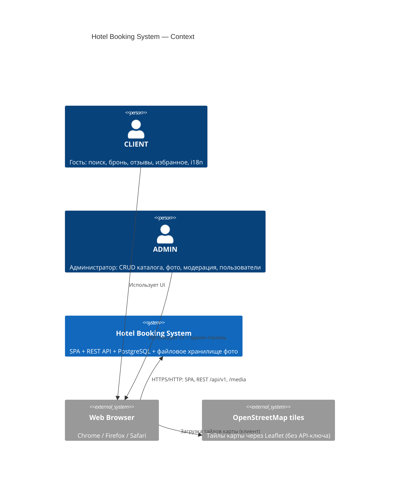
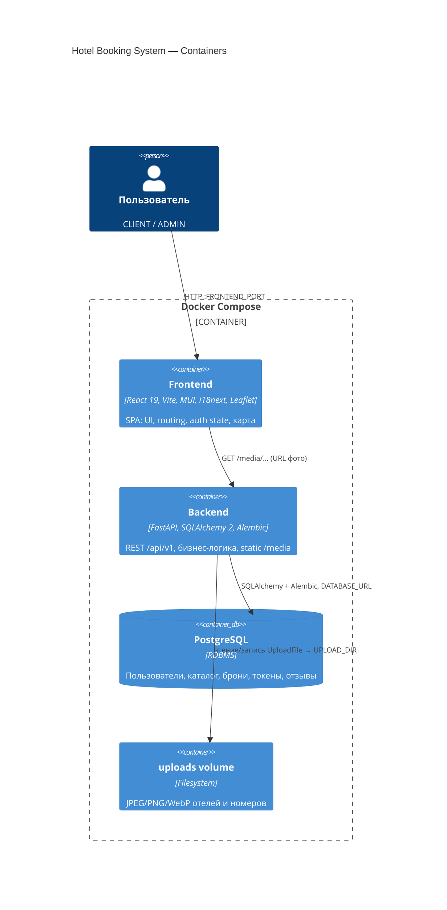
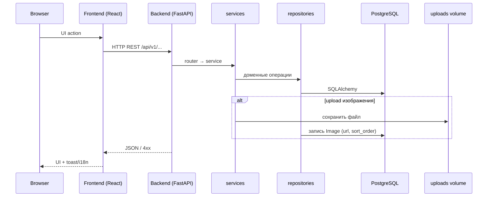
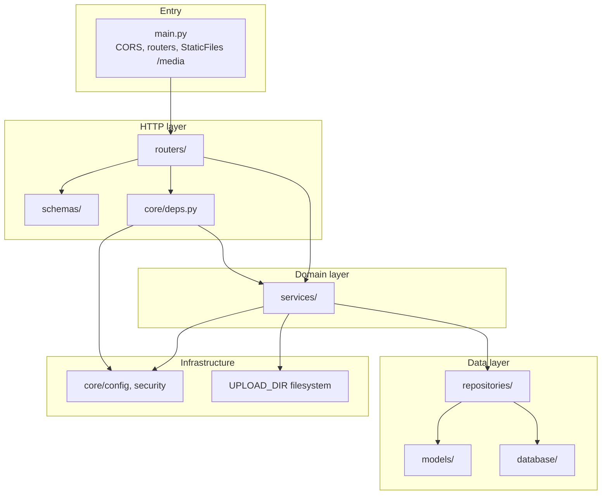
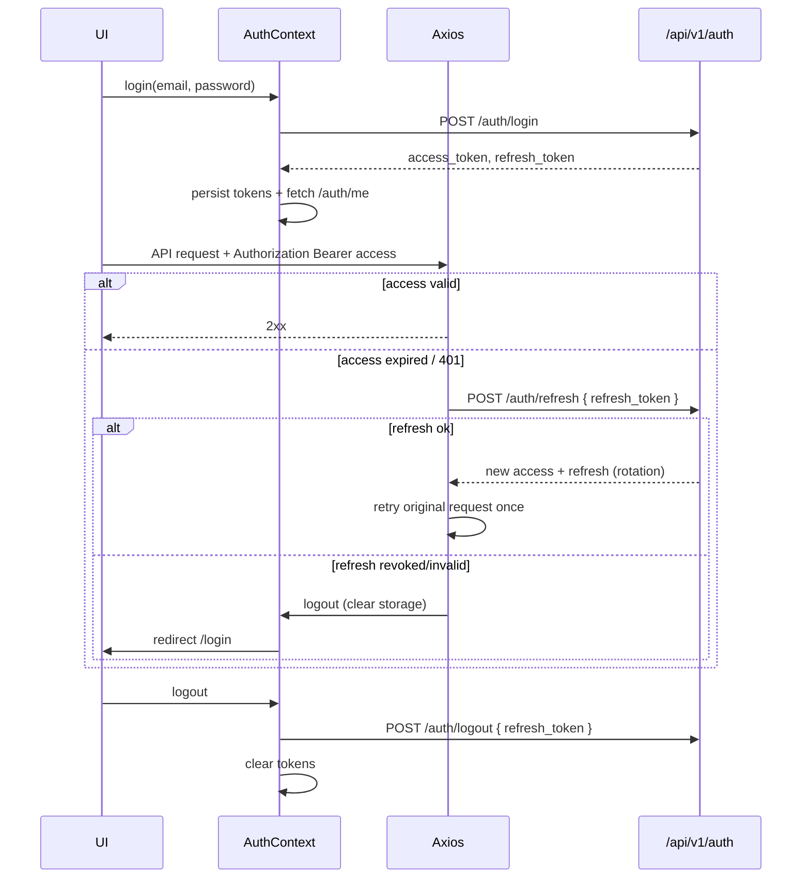

# 5. Архитектура и стек

Документ фиксирует целевую архитектуру Hotel Booking System (MVP): границы систем, слои, стек, структуру каталогов, конфигурацию и правила расширения. Реализация должна соответствовать описанным инвариантам зависимостей.

---

## 5.1. C4-подобный обзор

### 5.1.1. Context (система в окружении)

Система — веб-приложение поиска отелей и бронирования номеров. Внешние акторы взаимодействуют только через браузер; внешние SaaS-сервисы карт/геокодинга **не** используются (Leaflet OSM-тайлы на клиенте, координаты задаёт администратор).



**Границы контекста**

| Внутри системы                                                          | Вне системы (out of scope / внешнее)    |
| ----------------------------------------------------------------------- | --------------------------------------- |
| Auth (access + refresh), каталог, брони, отзывы, избранное, upload фото | Email, платежи, push, геокодинг адресов |
| Отдача `/media` с диска `uploads/`                                      | CDN / S3 (не в MVP)                     |
| i18n UI (ru/en)                                                         | Перевод контента БД                     |

### 5.1.2. Container (контейнеры развёртывания)



**Поток запроса (типовой)**



**Инварианты контейнеров**

1. Frontend **не** имеет прямого доступа к PostgreSQL и к volume `uploads`.
2. Все мутации домена идут через Backend REST.
3. URL фото в JSON указывают на `/media/...`. В dev Vite и в Compose nginx проксируют `/media` на backend; helper `mediaUrl()` на фронте собирает абсолютный URL при необходимости.
4. Миграции схемы — только Alembic на старте/в CI, не «ручной» SQL из приложения вне repositories.

---

## 5.2. Слои backend и правила зависимостей

### 5.2.1. Слои

```
┌─────────────────────────────────────────────┐
│  routers          HTTP, auth deps, статус-коды │
├─────────────────────────────────────────────┤
│  schemas          Pydantic v2 (request/response)│
├─────────────────────────────────────────────┤
│  services         бизнес-правила, транзакции   │
├─────────────────────────────────────────────┤
│  repositories     SQLAlchemy queries only      │
├─────────────────────────────────────────────┤
│  models           ORM-сущности                 │
├─────────────────────────────────────────────┤
│  database / core  engine, session, config, JWT │
└─────────────────────────────────────────────┘
```



### 5.2.2. Правила зависимостей (обязательные)

| Слой           | Может зависеть от                                                        | Нельзя                                                                                                          |
| -------------- | ------------------------------------------------------------------------ | --------------------------------------------------------------------------------------------------------------- |
| `routers`      | `schemas`, `services`, `core.deps`                                       | SQLAlchemy session/queries напрямую; бизнес-правила (overlap, роли, расчёт цены)                                |
| `schemas`      | Pydantic, стандартная библиотека, enum’ы                                 | models ORM, repositories, services                                                                              |
| `services`     | `repositories`, `schemas` (DTO), `core` (security/config), FS для upload | импорт `APIRouter` / `Request` / HTTPException как единственный способ валидации без доменных ошибок; сырой SQL |
| `repositories` | `models`, `database` session                                             | FastAPI, Pydantic business orchestration, вызовы других HTTP                                                    |
| `models`       | SQLAlchemy, типы БД                                                      | FastAPI, services                                                                                               |
| `core`         | settings, JWT, password hashing                                          | repositories / routers (кроме deps, которые склеивают слои)                                                     |

**Ключевые инварианты**

1. **Бизнес-логика только в `services`** — overlap броней, расчёт `total_price` / nights, правила удаления 409, уникальность отзыва, ротация/revoke refresh, лимиты фото (MIME, размер, max 10).
2. **SQL только в `repositories`** — фильтры, пагинация, `SELECT … FOR UPDATE`, агрегаты `avg_rating` / `reviews_count`.
3. **Routers тонкие**: парсинг path/query/body → вызов service → маппинг результата/исключения в HTTP-код.
4. **Транзакции** управляются на уровне service (или unit-of-work в database-слое, вызываемом из service), не из router.
5. Frontend **никогда** не ходит в БД.

### 5.2.3. Соответствие доменных модулей слоям

| Домен          | router                  | service                                              | repository                  |
| -------------- | ----------------------- | ---------------------------------------------------- | --------------------------- |
| Auth / refresh | `routers/auth.py`       | login, register, refresh rotation, logout, me        | User, RefreshToken          |
| Users          | `routers/users.py`      | профиль, смена роли, защита «последний админ»        | User                        |
| Hotels         | `routers/hotels.py`     | CRUD, map-payload, запрет delete при активных бронях | Hotel + агрегаты            |
| Room types     | `routers/room_types.py` | CRUD, delete если нет комнат                         | RoomType                    |
| Rooms          | `routers/rooms.py`      | CRUD, фильтры доступности                            | Room + Booking availability |
| Images         | `routers/images.py`     | validate MIME/size, save file, cascade delete files  | Image                       |
| Reviews        | `routers/reviews.py`    | один отзыв на отель, avg                             | Review                      |
| Favorites      | `routers/favorites.py`  | add 409 / remove                                     | Favorite                    |
| Bookings       | `routers/bookings.py`   | create+lock, cancel, admin status                    | Booking + Room lock         |

---

## 5.3. Frontend architecture

Стек: **React 19**, **TypeScript**, **Vite**, **React Router**, **Axios**, **MUI**, **React Hook Form**, **TanStack Query**, **i18next + react-i18next**, **react-leaflet** (Leaflet, без API-ключа), **Vitest**, **RTL**, **MSW**.

### 5.3.1. Routing

- Маршруты объявляются в `app/router/AppRoutes.tsx` (guards рядом: `RequireAuth`, `RequireAdmin`, `GuestOnly`).
- Layouts: `app/layouts` — публичный (`PublicLayout` + header widget / i18n switch), auth-required, admin-only.
- Guards: проверка наличия сессии и `role === ADMIN` для `/admin/*`.
- Публичные: `/`, `/hotels`, `/hotels/map`, `/hotels/:id`, `/login`, `/register`.
- Auth: `/bookings/new`, `/favorites`, `/profile`.
- Admin: `/admin`, `/admin/users|hotels|room-types|rooms|bookings|reviews`.
- Fallback `*` → 404.
- Экраны: `pages/<route>/ui/*Page.tsx` (напр. `pages/hotel-detail/ui/HotelDetailPage.tsx`).

```mermaid
flowchart LR
    URL[Location] --> Router[React Router]
    Router --> Public[Public layout]
    Router --> AuthGuard{access token / session?}
    AuthGuard -->|no| Login[/login]
    AuthGuard -->|yes| AuthPages[profile / favorites / booking]
    AuthGuard -->|yes| RoleGuard{role ADMIN?}
    RoleGuard -->|no| Forbidden[403 / redirect]
    RoleGuard -->|yes| Admin[/admin/*]
```

### 5.3.2. State management

| Состояние    | Где хранится                                                                 | Назначение                                        |
| ------------ | ---------------------------------------------------------------------------- | ------------------------------------------------- |
| Auth session | `features/auth/ui/AuthContext` (+ tokens в `shared/auth/tokenStorage`)       | user, login/logout, hydrate on boot               |
| Server cache | TanStack Query (`entities/*/api/queries|mutations`)                          | списки отелей, детали, брони, отзывы, избранное   |
| Form state   | React Hook Form (часто в `features/*/ui` или page)                           | login/register, booking dates, admin CRUD, review |
| UI ephemeral | локальный state компонента                                                   | модалки, выбранный маркер, toasts                 |
| Language     | `shared/i18n` + `localStorage` key `i18n_lang`                               | ru/en                                             |

**Правило:** серверные данные не дублировать в Context «на всякий случай»; Context — для auth и кросс-дерева UI-сессии.

### 5.3.3. Data fetching

```
pages / widgets / features
        │
        ▼
   entities/*/api/queries|mutations  — TanStack Query
        │
        ▼
   entities/*/api/requests  — доменные HTTP-вызовы
        │
        ▼
   shared/api/client (Axios + interceptors)
        │
        ▼
   Backend /api/v1
```

**Импорты только вниз:** `app` → `pages` → `widgets` → `features` → `entities` → `shared`.

- HTTP-транспорт — `shared/api/client`; доменные вызовы — `entities/*/api/requests` (компоненты **не** импортируют axios напрямую).
- Query/mutation keys, инвалидация кэша — рядом с entity API (`entities/*/api/keys.ts`, `queries/`, `mutations/`).
- Пагинация: `page`, `size` из query-параметров API.
- Ошибки: разбор `detail` (строка или validation array) → toast + i18n mapping (`shared/lib/getApiErrorMessage`).

### 5.3.4. Auth flow



**Детали MVP**

- Access TTL: `ACCESS_TOKEN_EXPIRE_MINUTES` (default 15).
- Refresh TTL: `REFRESH_TOKEN_EXPIRE_DAYS` (default 7).
- Axios request interceptor: подставляет Bearer access.
- Response interceptor: на 401 — **один** refresh+retry; параллельные 401 — очередь/mutex, чтобы не ротировать refresh многократно.
- После logout / failed refresh — очистка storage и редирект на `/login`.

### 5.3.5. i18n

- Инициализация: `shared/i18n/index.ts`.
- Словари: `shared/i18n/locales/ru.json`, `en.json`.
- Все пользовательские строки UI — ключи словарей (Navbar, формы, ошибки валидации RHF, empty states, admin).
- Язык по умолчанию: `ru`; иначе значение из `localStorage` (`i18n_lang`).
- Переключатель **RU | EN** (`features/language-switch`) в header на всех layout-экранах.
- Сообщения API: известные `detail` → ключи i18n; неизвестные — показывать `detail` как есть.

### 5.3.6. Map (react-leaflet)

- Данные маркеров: `GET /hotels/map` → `id`, `name`, `lat`, `lng`, `stars`, `min_price`, `avg_rating`; фильтр `city`.
- Страница `/hotels/map` — крупная карта с маркерами; клик → `/hotels/:id`.
- На карточке отеля — мини-карта точки (`latitude`/`longitude`).
- Home может содержать превью карты или ссылку на `/hotels/map`.
- Тайлы OSM через Leaflet **без** серверного API-ключа; backend не проксирует тайлы.
- В тестах Leaflet мокается при необходимости (JSDOM).

---

## 5.4. Структура каталогов

### 5.4.1. Корень репозитория

```
hotel-booking-system/
  frontend/                 # SPA (Vite)
  backend/                  # FastAPI application
  uploads/                  # gitignore; Docker volume для фото
  docker-compose.yml        # frontend, backend, PostgreSQL, volume
  .env.example              # шаблон переменных окружения
  README.md                 # запуск, seed, i18n, upload
  .github/workflows/ci.yml  # lint, tests, build, images
```

| Путь                       | Назначение                                                                                 |
| -------------------------- | ------------------------------------------------------------------------------------------ |
| `frontend/`                | Исходники и Dockerfile клиентского приложения                                              |
| `backend/`                 | API, миграции Alembic, тесты pytest                                                        |
| `uploads/`                 | Персистентные файлы изображений (`hotels/`, `rooms/`); не коммитить бинарники пользователя |
| `docker-compose.yml`       | Оркестрация сервисов локального/стендового стенда                                          |
| `.env.example`             | Документированный контракт конфигурации без секретов                                       |
| `README.md`                | Онбординг: Compose, seed, как заливать фото                                                |
| `.github/workflows/ci.yml` | Quality gates на push/PR в main                                                            |

### 5.4.2. Frontend `frontend/src/` (FSD)

Импорты **только вниз:** `app` → `pages` → `widgets` → `features` → `entities` → `shared`.

```
src/
  app/              # bootstrap: main, App, providers, layouts, router
    layouts/        # PublicLayout, AuthLayout
    providers/      # QueryProvider, NotificationProvider
    router/         # AppRoutes, RequireAuth, RequireAdmin, GuestOnly
  pages/            # экраны маршрутов: <route>/ui/*Page.tsx
    home|hotels|hotels-map|hotel-detail|booking-new|favorites|…
    login|register|profile|not-found|admin/{home,users,hotels,…}
  widgets/          # составные блоки: header, hotel-catalog, hotel-detail, hotels-map, profile
  features/         # сценарии: auth, favorite-toggle, hotel-filters, booking-create, admin-*, …
  entities/         # домены: hotel, room, room-type, booking, review, favorite, user, image
    <entity>/
      api/          # keys, requests/, queries/, mutations/
      model/        # типы, правила
      ui/           # презентация сущности (опционально)
      lib/          # чистые хелперы сущности (опционально)
  shared/           # api/client, lib, ui, i18n, theme, auth, config, test
  App.test.tsx
  vite-env.d.ts
```

Aliases (tsconfig): `@app/*`, `@pages/*`, `@widgets/*`, `@features/*`, `@entities/*`, `@shared/*`.

| Каталог / файл | Назначение |
| -------------- | ---------- |
| `app/` | Точка входа, провайдеры, layouts, маршрутная таблица и guards |
| `pages/<route>/ui/` | Тонкие экраны: композиция widgets/features без axios |
| `widgets/` | Крупные UI-блоки экрана (каталог, деталь отеля, карта, профиль, header) |
| `features/` | Пользовательские сценарии (auth session, фильтры, toggle избранного, admin-формы) |
| `entities/*/api/` | HTTP requests + TanStack Query/Mutation по домену |
| `shared/api/client` | Единый Axios instance + refresh interceptors |
| `shared/lib` | Чистые хелперы (`mediaUrl`, booking dates, API error message, …) |
| `shared/i18n` | i18next + словари ru/en |
| `shared/auth` | `tokenStorage` |
| `shared/ui` | Переиспользуемые примитивы UI без доменной логики |

Плоских каталогов `src/api/`, `src/hooks/`, `src/components/`, `src/context/` как primary layout **нет** — новый код класть в слои FSD выше.

### 5.4.3. Backend `backend/app/`

```
app/
  routers/       # HTTP endpoints
  models/        # SQLAlchemy ORM
  schemas/       # Pydantic v2 DTO
  services/      # Бизнес-логика
  repositories/  # Доступ к данным
  core/          # config, security, deps
  database/      # engine, session, base
  main.py        # app factory, CORS, StaticFiles /media
```

| Каталог / файл  | Назначение                                                                                     |
| --------------- | ---------------------------------------------------------------------------------------------- |
| `routers/`      | `auth`, `users`, `hotels`, `room_types`, `rooms`, `bookings`, `reviews`, `favorites`, `images` |
| `models/`       | User, RefreshToken, Hotel, RoomType, Room, Image, Review, Favorite, Booking                    |
| `schemas/`      | Request/response модели, пагинация `items/total/page/size`                                     |
| `services/`     | Правила домена и оркестрация транзакций/файлов                                                 |
| `repositories/` | Запросы и персистентность                                                                      |
| `core/config`   | Settings из env (Pydantic Settings)                                                            |
| `core/security` | JWT HS256, hash пароля (Passlib bcrypt), hash refresh                                          |
| `core/deps`     | `get_db`, `get_current_user`, `require_admin`                                                  |
| `database/`     | Engine, SessionLocal, Base, возможно init                                                      |
| `main.py`       | Подключение роутеров `/api/v1`, mount `StaticFiles` → `UPLOAD_DIR` на `/media`                 |

Рядом с `app/` ожидаются: `alembic/`, `tests/`, `requirements`/`pyproject`, `Dockerfile`.

---

## 5.5. Конфигурация и env

Источник правды для локального и Compose-запуска — переменные из `.env.example` (реальный `.env` в git не коммитится).

| Переменная                    | Назначение                  | Пример / default           |
| ----------------------------- | --------------------------- | -------------------------- |
| `POSTGRES_USER`               | Пользователь PostgreSQL     | —                          |
| `POSTGRES_PASSWORD`           | Пароль PostgreSQL           | —                          |
| `POSTGRES_DB`                 | Имя БД                      | —                          |
| `DATABASE_URL`                | SQLAlchemy URL              | `postgresql+psycopg://...` |
| `SECRET_KEY`                  | Подпись JWT (HS256)         | секрет, не в git           |
| `ACCESS_TOKEN_EXPIRE_MINUTES` | TTL access                  | `15`                       |
| `REFRESH_TOKEN_EXPIRE_DAYS`   | TTL refresh                 | `7`                        |
| `CORS_ORIGINS`                | Разрешённые origin фронта   | `http://localhost:5173`    |
| `UPLOAD_DIR`                  | Абсолютный путь volume фото | `/app/uploads`             |
| `MAX_UPLOAD_SIZE_MB`          | Лимит размера файла         | `5`                        |
| `BACKEND_PORT`                | Порт API в Compose/хосте    | `8000`                     |
| `FRONTEND_PORT`               | Порт Vite/nginx фронта      | `5173`                     |

**Правила конфигурации**

1. Backend читает настройки через `core/config` (типизировано); роутеры не парсят `os.environ` напрямую.
2. Frontend в dev получает `VITE_*` base URL API (если понадобится) отдельно; CORS должен включать origin фронта.
3. Compose пробрасывает те же имена переменных в сервисы; volume монтируется в `UPLOAD_DIR`.
4. Seed и миграции используют `DATABASE_URL`; смена секретов инвалидирует access JWT (refresh остаётся в БД до expiry/revoke).

---

## 5.6. Static / media serving

### 5.6.1. Хранение

```
uploads/
  hotels/     # файлы фото отелей
  rooms/      # файлы фото номеров
```

- Запись: ADMIN `multipart/form-data` → service валидирует MIME (`JPEG`, `PNG`, `WebP`), размер ≤ `MAX_UPLOAD_SIZE_MB`, количество ≤ 10 на сущность → сохраняет файл → repository создаёт `Image` с `url`, `sort_order`.
- Удаление сущности: cascade записей Image **и** файлов с диска.
- `uploads/` в `.gitignore`; в Compose — named/bind volume.

### 5.6.2. Отдача

```mermaid
flowchart LR
    Admin[ADMIN upload] --> API[POST /hotels|rooms/.../images]
    API --> Disk[UPLOAD_DIR/hotels|rooms]
    API --> DB[(Image.url)]
    Client[Browser] --> JSON[JSON images[].url]
    JSON --> Media["GET /media/..."]
    Media --> Disk
```

- В `main.py`: `app.mount("/media", StaticFiles(directory=UPLOAD_DIR), ...)`.
- В ответах API поле `url` указывает на путь, доступный фронту (например `/media/hotels/<file>` или абсолютный URL backend).
- Альтернатива в Compose: nginx отдаёт `/media` — допустимо, если контракт URL стабилен; для MVP достаточно StaticFiles на FastAPI.
- Frontend отображает `` / галерею; не хранит бинарники в своём bundle (кроме placeholder в `assets/`).

### 5.6.3. Ошибки upload

| Условие                 | HTTP  |
| ----------------------- | ----- |
| Файл слишком большой    | `413` |
| Неверный MIME           | `415` |
| Бизнес/лимит количества | `400` |
| Schema multipart        | `422` |

---

## 5.7. Границы ответственности модулей

### 5.7.1. Backend

| Модуль          | Отвечает за                                    | Не отвечает за                                  |
| --------------- | ---------------------------------------------- | ----------------------------------------------- |
| `routers`       | Маршруты, статусы, Depends                     | SQL, расчёт цены, overlap                       |
| `schemas`       | Валидация формы запроса/ответа                 | Доступ к БД                                     |
| `services`      | Use-case’ы, транзакции, файлы, доменные ошибки | Разметка HTTP кроме маппинга исключений наверху |
| `repositories`  | CRUD/query/lock                                | Правила «можно ли удалить отель»                |
| `models`        | Схема таблиц и связи                           | API-контракт                                    |
| `core.security` | JWT, bcrypt, hash refresh                      | Бизнес бронирования                             |
| `core.deps`     | Текущий пользователь / роль                    | Фильтры отелей                                  |
| `database`      | Engine/session lifecycle                       | Доменные инварианты                             |
| `main`          | Wiring app, CORS, `/media`, router include     | Бизнес-логика                                   |

### 5.7.2. Frontend

| Модуль | Отвечает за | Не отвечает за |
| ------ | ----------- | -------------- |
| `shared/api/client` | Axios instance, interceptors | JSX, доменные URL по сущностям |
| `entities/*/api` | Requests + Query/Mutation keys/инвалидация | Сборка экрана, axios setup |
| `features/auth` | Сессия (`AuthContext`) | Списки отелей |
| `features/*` | Пользовательские сценарии (фильтры, toggle, admin-формы) | Сырой SQL / секреты |
| `pages/` | Сборка экрана маршрута | Прямой axios / секреты |
| `widgets/` | Составной UI блока экрана | Политики ролей сервера (только отображение/disable) |
| `app/router` | URL ↔ page + guards | Fetch данных |
| `shared/i18n` | Локализация UI | Контент описаний отелей в БД |
| Map UI (`entities/hotel`, `widgets/hotels-map`) | Маркеры, навигация на деталь | Геокодинг адресов |

### 5.7.3. Сквозные границы

- **Авторизация на сервере обязательна**; UI guards — UX, не security boundary.
- **Расчёт стоимости и overlap** — только backend; фронт может показывать preview nights×price, но источником истины остаётся API.
- **i18n** покрывает UI; `detail` API может быть на одном языке до появления отдельного error-code контракта.

---

## 5.8. Рекомендации по расширению без нарушения слоёв

1. **Новый endpoint**  
   `schema` → `repository` method → `service` use-case → тонкий `router`. Не добавлять SQL в router «на один раз».

2. **Новое поле сущности**  
   Alembic-миграция → `model` → `schema` → service/repository → api-клиент и UI. Не писать ad-hoc `ALTER` в runtime-коде.

3. **Новая бизнес-проверка**  
   Только в `services` (или shared domain function, вызываемой из service). Repository возвращает данные/блокировки, не принимает решение «409 vs 400».

4. **Фоновые задачи / email (post-MVP)**  
   Вызывать из service через порт (интерфейс), адаптер в `core` или `infrastructure/`. Router не ставит задачи напрямую в брокер.

5. **S3 вместо локального volume**  
   Заменить реализацию storage за интерфейсом, используемым image-service; URL в `Image` остаются контрактом API. Routers/repositories без знания SDK облака.

6. **Новая роль / permission**  
   Проверка в `core.deps` + service; не размазывать `if role` по repositories.

7. **Усложнение фронта**  
   Новые серверные фичи — `entities/<domain>/api` (requests + query/mutation) и при необходимости `features/<scenario>`; общий Axios/`shared/api/client` не копировать. Глобальный store (Redux и т.п.) не вводить, пока не исчерпан AuthContext + Query. Импорты только вниз по FSD.

8. **BFF / агрегирующие эндпоинты**  
   Допустимы как methods в service, собирающие несколько repository-вызовов; не переносить join-логику на фронт несколькими обязательными водопадными запросами без необходимости.

9. **Тесты как стражи архитектуры**  
   Backend: unit на services с fake repositories; API-тесты через httpx на routers. Frontend: MSW на `api/`-контракт; не мокать внутренности service-слоя с клиента.

10. **Запрещённые shortcut’ы**
    - `from app.models import …` внутри router для update полей
    - `session.execute` в service
    - axios в `pages/` / `widgets/` / `features/*/ui` (только через `entities` / `shared/api`)
    - импорт «вверх» по FSD (`entities` → `features`, `shared` → `entities`, …)
    - чтение `SECRET_KEY` / `DATABASE_URL` на фронте

---

## 5.9. Сводная схема стека

| Слой              | Технологии                                                           |
| ----------------- | -------------------------------------------------------------------- |
| UI                | React 19, TypeScript, Vite, MUI, RHF, React Router                   |
| Клиентские данные | TanStack Query, Axios, AuthContext                                   |
| i18n / карта      | i18next, react-leaflet                                               |
| API               | FastAPI, Pydantic v2, PyJWT/jose, Passlib                            |
| Доступ к данным   | SQLAlchemy 2, Alembic, PostgreSQL                                    |
| Медиа             | UploadFile → `UPLOAD_DIR`, StaticFiles `/media`                      |
| Качество          | Vitest, RTL, MSW; pytest, httpx; CI GitHub Actions                   |
| Runtime           | Docker Compose (`frontend`, `backend`, `postgres`, volume `uploads`) |

Эти границы — контракт для реализации разделов API, UI и CI: любое отклонение должно быть осознанным изменением спецификации, а не локальным исключением в коде.
`)
