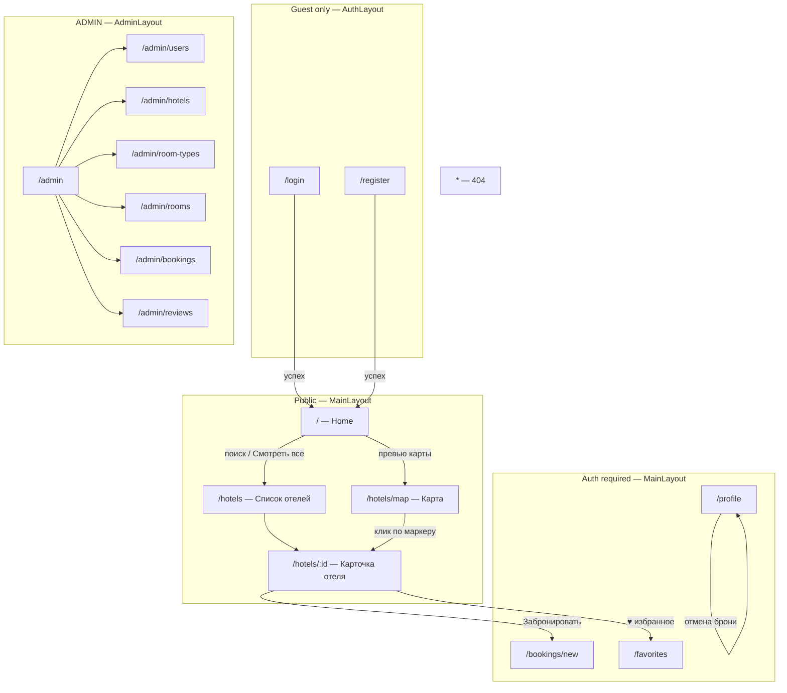
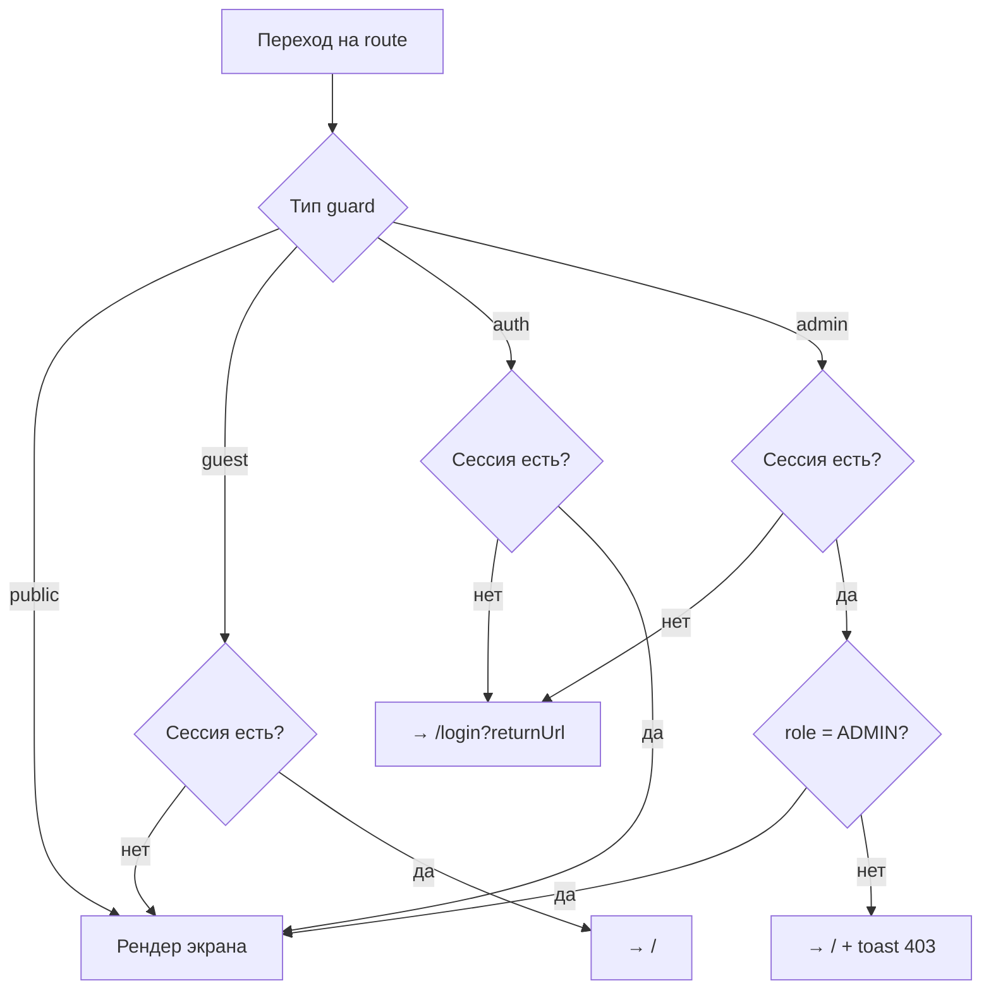
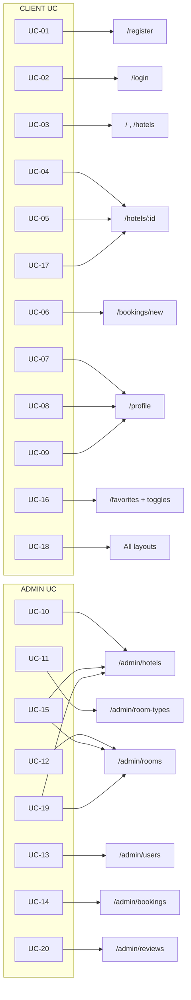

# 6. UI: маршруты и экраны

Техническая спецификация клиентского UI Hotel Booking System: информационная архитектура, маршруты, экраны, guards, layouts, UX-паттерны и связь с use cases (раздел 2).

**Стек UI:** React 19 + TypeScript, Material UI (MUI), React Router, i18next / react-i18next, react-leaflet (Leaflet), React Hook Form, TanStack Query, Axios.

**Общие UX-требования:** SPA; клиентская валидация форм; toast/alert; поддержка Chrome, Firefox, Safari; на всех layout-экранах переключатель **RU | EN**.

---

## 6.1. Информационная архитектура

### 6.1.1. Зоны приложения

| Зона | Audience | Layout | Назначение |
|------|----------|--------|------------|
| Public catalog | guest / auth / admin | `MainLayout` | Поиск и просмотр отелей, карта, карточка отеля |
| Guest auth | только неавторизованные | `AuthLayout` | Login / Register |
| Client area | `CLIENT` / `ADMIN` | `MainLayout` | Бронирование, избранное, профиль |
| Admin panel | только `ADMIN` | `AdminLayout` | CRUD и модерация |
| System | любой | минимальный | 404 |

### 6.1.2. Navigation map



### 6.1.3. Сводная таблица маршрутов

| Path | Guard | Экран | Layout |
|------|-------|-------|--------|
| `/` | `public` | Home | `MainLayout` |
| `/hotels` | `public` | Список отелей | `MainLayout` |
| `/hotels/map` | `public` | Карта отелей | `MainLayout` |
| `/hotels/:id` | `public` | Карточка отеля | `MainLayout` |
| `/bookings/new` | `auth` | Новое бронирование | `MainLayout` |
| `/favorites` | `auth` | Избранное | `MainLayout` |
| `/profile` | `auth` | Профиль + мои бронирования | `MainLayout` |
| `/login` | `guest` | Вход | `AuthLayout` |
| `/register` | `guest` | Регистрация | `AuthLayout` |
| `/admin` | `admin` | Хаб админки | `AdminLayout` |
| `/admin/users` | `admin` | Пользователи | `AdminLayout` |
| `/admin/hotels` | `admin` | CRUD отелей | `AdminLayout` |
| `/admin/room-types` | `admin` | CRUD типов номеров | `AdminLayout` |
| `/admin/rooms` | `admin` | CRUD номеров | `AdminLayout` |
| `/admin/bookings` | `admin` | Бронирования | `AdminLayout` |
| `/admin/reviews` | `admin` | Модерация отзывов | `AdminLayout` |
| `*` | — | 404 Not Found | `MainLayout` (без активного nav) |

Query-параметры (контракт UI ↔ URL):

| Маршрут | Query | Назначение |
|---------|-------|------------|
| `/`, `/hotels` | `city`, `stars`, `page`, `size`, `sort` | фильтры и пагинация списка |
| `/hotels/map` | `city` | фильтр маркеров |
| `/bookings/new` | `room_id`, `hotel_id` | контекст бронирования с карточки отеля |
| `/hotels/:id` | `capacity`, `price_from`, `price_to`, `date_from`, `date_to` | фильтры номеров на карточке |

---

## 6.2. Route guards

Реализация: React Router wrappers / loader-guards поверх `AuthContext` (токены + `user.role` из `GET /auth/me`).

### 6.2.1. Типы доступа

| Guard | Условие входа | При нарушении |
|-------|---------------|---------------|
| `public` | всегда | — |
| `guest` | нет валидной auth-сессии | redirect → `/` (или `returnUrl` если был) |
| `auth` | есть access (или успешный silent refresh) | redirect → `/login?returnUrl=<encoded path>` |
| `admin` | `auth` **и** `role === ADMIN` | без роли: redirect → `/`; без сессии: как `auth` |
| `*` (404) | любой path вне таблицы | рендер `NotFoundPage` |

### 6.2.2. Поведение при истечении сессии

1. Axios interceptor: `401` на защищённом запросе → один `POST /auth/refresh` → retry.
2. Refresh failed / revoked → очистка токенов, toast «Сессия истекла», redirect на `/login?returnUrl=…`.
3. На `admin`-маршрутах при `CLIENT`: без попытки вызвать admin API — сразу redirect на `/` + toast «Недостаточно прав».

### 6.2.3. Диаграмма guard-потока



---

## 6.3. Shared layouts и navbar

### 6.3.1. `MainLayout`

**Состав:**

- **AppBar / Navbar:** логотип → `/`; ссылки: Отели (`/hotels`), Карта (`/hotels/map`); для auth — Избранное, Профиль; для ADMIN — пункт «Админ» → `/admin`; для guest — Вход / Регистрация; для auth — Logout.
- **LanguageSwitcher:** `RU | EN` (см. 6.3.4).
- **Container** (`maxWidth="lg"`) + `<Outlet />`.
- **Footer** (опционально MVP): копирайт, язык не дублировать.

### 6.3.2. `AuthLayout`

Центрованная карточка MUI (`Card` / `Paper`) с формой; ссылка «на главную»; LanguageSwitcher в шапке карточки или сверху страницы. Без полного каталожного меню.

### 6.3.3. `AdminLayout`

- Боковой `Drawer` / вертикальное меню разделов админки.
- Верхняя панель: заголовок раздела, LanguageSwitcher, ссылка «На сайт» → `/`, Logout.
- Контент: таблицы + диалоги CRUD.

Пункты меню:

| Label (i18n key) | Path |
|------------------|------|
| admin.nav.home | `/admin` |
| admin.nav.users | `/admin/users` |
| admin.nav.hotels | `/admin/hotels` |
| admin.nav.roomTypes | `/admin/room-types` |
| admin.nav.rooms | `/admin/rooms` |
| admin.nav.bookings | `/admin/bookings` |
| admin.nav.reviews | `/admin/reviews` |

### 6.3.4. LanguageSwitcher (UC-18)

| Аспект | Правило |
|--------|---------|
| Значения | `ru` \| `en` |
| UI | Toggle / ButtonGroup `RU \| EN` на **всех** layout |
| Persist | `localStorage` ключ `i18n_lang` |
| Default | `ru`, если ключа нет |
| Область | все пользовательские строки UI; ошибки API — маппинг известных `detail` на i18n, иначе сырой `detail` |
| Момент смены | мгновенно без reload (i18next `changeLanguage`) |

### 6.3.5. Auth-действия в navbar

| Действие | API | UI |
|----------|-----|-----|
| Logout | `POST /auth/logout` `{ refresh_token }` | очистка storage, toast success, redirect `/` |
| Отображение пользователя | `GET /auth/me` (кэш TanStack Query) | имя / email в меню профиля |

---

## 6.4. Экраны (детально)

Для каждого экрана: цель, доступ, UI-блоки, данные (API), состояния, действия, валидации.

---

### 6.4.1. Home — `/`

| | |
|--|--|
| **Цель** | Точка входа: быстрый поиск по городу, превью каталога и переход к карте |
| **Доступ** | `public` |
| **UC** | UC-03, UC-18 (+ UC-16 для auth на карточках) |

**UI-блоки:**

1. Hero / заголовок + поле поиска города + кнопка «Найти».
2. Опционально быстрый фильтр звёзд (1–5).
3. Сетка превью отелей (cover, name, city, stars, min_price, avg_rating).
4. Блок «Карта»: мини-превью / CTA «Открыть карту» → `/hotels/map`.
5. Ссылка «Все отели» → `/hotels` (с сохранением `city` в query).

**Данные (API):**

| Запрос | Когда |
|--------|-------|
| `GET /hotels?city=&stars=&page=1&size=6&sort=avg_rating` | загрузка / смена фильтра |
| `GET /hotels/map?city=` (опционально для превью) | если рендерится мини-карта |

**Состояния:**

| Состояние | UI |
|-----------|-----|
| loading | Skeleton карточек |
| empty | «Отели не найдены» + сброс фильтра |
| error | Alert + Retry |
| success | сетка карточек |

**Действия:** поиск → `/hotels?city=…`; клик карточки → `/hotels/:id`; избранное (auth) → toggle; гость → toast + `/login`.

**Валидации:** `city` — trim, max 100; пустой city допустим (все отели).

---

### 6.4.2. Список отелей — `/hotels`

| | |
|--|--|
| **Цель** | Полный каталог с фильтрами, сортировкой, пагинацией |
| **Доступ** | `public` |
| **UC** | UC-03, UC-16 (auth), UC-18 |

**UI-блоки:**

1. Панель фильтров: `city`, `stars`.
2. Сортировка: `created_at` \| `stars` \| `avg_rating`.
3. Список/сетка карточек: name, city, stars, min_price, cover (`mediaUrl(cover_image)`), avg_rating, `reviews_count`, кнопка избранного (если auth и `is_favorite`).
4. Пагинация MUI (`page`, `size`).
5. Кнопка/таб «На карте» → `/hotels/map?city=…`.

**Данные:** `GET /hotels?city&stars&sort&page&size`.

**Состояния:** loading (Skeleton/TableSkeleton), empty, error+Retry, success.

**Действия:** смена фильтра сбрасывает `page=1`; клик → `/hotels/:id`; избранное POST/DELETE `/favorites/{hotel_id}`.

**Валидации фильтров:** `stars` ∈ 1..5 или пусто; `page` ≥ 1; `size` 1..100 (default 20).

---

### 6.4.3. Карта отелей — `/hotels/map`

| | |
|--|--|
| **Цель** | Геообзор отелей; переход к карточке по маркеру |
| **Доступ** | `public` |
| **UC** | UC-03, UC-04 (навигация), UC-18 |

**UI-блоки:**

1. Фильтр `city` (синхрон с query).
2. Полноэкранная/крупная карта **react-leaflet** (OpenStreetMap tiles, без API-ключа).
3. Маркеры: popup — name, stars, min_price, avg_rating; CTA «Подробнее».
4. Список-сайдбар (опционально MVP): синхронизация hover marker ↔ list item.

**Данные:** `GET /hotels/map?city=` → `{ id, name, lat, lng, stars, min_price, avg_rating }[]`.

**Состояния:**

| Состояние | UI |
|-----------|-----|
| loading | Overlay Spinner на карте |
| empty | карта без маркеров + сообщение |
| error | Alert; карта с last-good или пустая |
| success | fitBounds по маркерам; один маркер — zoom к точке |

**Действия:** клик маркера / «Подробнее» → `/hotels/:id`.

**Валидации:** координаты с бэка считаются валидными (−90…90 / −180…180); некорректные точки пропускать с `console.warn`.

---

### 6.4.4. Карточка отеля — `/hotels/:id`

| | |
|--|--|
| **Цель** | Полная информация для решения о бронировании и отзыве |
| **Доступ** | `public` (часть действий — auth) |
| **UC** | UC-04, UC-05, UC-06 (старт), UC-16, UC-17, UC-18 |

**UI-блоки:**

1. **Галерея** изображений отеля (по `sort_order`).
2. **Заголовок:** name, city, address, stars, avg_rating, reviews_count.
3. **Описание.**
4. **Избранное** (auth) / CTA войти (guest).
5. **Мини-карта** react-leaflet (одна точка lat/lng).
6. **Номера:** фильтры capacity, price_from/to, date_from/to; карточки номера (тип, number, price, capacity, status, фото); кнопка «Забронировать».
7. **Отзывы:** список (пагинация); форма создания/редактирования своего; удаление своего.

**Данные (API):**

| Запрос | Назначение |
|--------|------------|
| `GET /hotels/{id}` | детали + images + avg_rating |
| `GET /rooms?hotel_id=&capacity=&price_from=&price_to=&date_from=&date_to=` | номера |
| `GET /hotels/{id}/reviews?page&size` | отзывы |
| `POST/DELETE /favorites/{hotel_id}` | избранное |
| `POST /hotels/{id}/reviews` | создать отзыв |
| `PATCH /reviews/{id}` | редактировать свой |
| `DELETE /reviews/{id}` | удалить свой |

**Состояния:**

| Блок | loading | empty | error |
|------|---------|-------|-------|
| Отель | Page Skeleton | — | 404 page / Alert |
| Номера | Skeleton list | «Нет доступных номеров» | Alert + Retry |
| Отзывы | Skeleton | «Пока нет отзывов» | Alert |
| Галерея | placeholder | placeholder «нет фото» | — |

**Действия пользователя:**

| Действие | Условие | Результат |
|----------|---------|-----------|
| Забронировать | номер `AVAILABLE`; auth | → `/bookings/new?room_id=&hotel_id=` |
| Забронировать | guest | → `/login?returnUrl=…` |
| Toggle favorite | auth | POST/DELETE + optimistic UI |
| Оставить отзыв | auth; ещё нет своего | форма → POST |
| Edit/Delete review | owner | PATCH/DELETE |
| Фильтр номеров | любой | refetch `GET /rooms` |

**Валидации:**

| Поле / форма | Правила |
|--------------|---------|
| Фильтр дат | `date_to` > `date_from`; обе или ни одной |
| price_from / price_to | ≥ 0; `price_to` ≥ `price_from` если оба заданы |
| capacity | integer ≥ 1 |
| Review.rating | 1–5, required |
| Review.comment | 10–2000 символов, required |
| Один отзыв на отель | UI скрывает Create, если свой уже есть; 409 → toast |

---

### 6.4.5. Новое бронирование — `/bookings/new`

| | |
|--|--|
| **Цель** | Создать бронь: даты → nights + total |
| **Доступ** | `auth` (`CLIENT` или `ADMIN`) |
| **UC** | UC-06, UC-18 |

**UI-блоки:**

1. Контекст: название отеля, номер, цена/ночь, capacity (из `GET /rooms/{id}` + hotel).
2. Date pickers: `check_in`, `check_out`.
3. Расчёт: `nights = (check_out - check_in).days`, `total = nights * price` (read-only).
4. Кнопки Submit / Cancel (назад на `/hotels/:id`).

**Данные:**

| Запрос | Когда |
|--------|-------|
| `GET /rooms/{room_id}` | инициализация |
| `GET /hotels/{hotel_id}` | контекст (если не вложен в room) |
| `POST /bookings` `{ room_id, check_in, check_out }` | submit |

**Состояния:** loading контекста; submitting (disable кнопки); success → toast + redirect `/profile` (вкладка броней); error (400/409 overlap) → toast с текстом.

**Валидации (клиент, дублируют доменные правила):**

| Правило | Сообщение (смысл) |
|---------|-------------------|
| оба поля дат required | обязательные поля |
| `check_out` > `check_in` | check_out exclusive, ≥ 1 ночь |
| `nights` ∈ 1..30 | лимит длительности |
| `check_in` ≥ сегодня (UTC date) | нельзя в прошлом |
| room status AVAILABLE | иначе блокировать submit |

Сервер дополнительно проверяет overlap → `400`/`409`; UI показывает `detail`.

---

### 6.4.6. Избранное — `/favorites`

| | |
|--|--|
| **Цель** | Список избранных отелей |
| **Доступ** | `auth` |
| **UC** | UC-16, UC-18 |

**UI-блоки:** сетка карточек отелей (как в каталоге); кнопка «Убрать из избранного»; пагинация; пустое состояние с CTA «К каталогу».

**Данные:** `GET /favorites?page&size`; `DELETE /favorites/{hotel_id}`.

**Состояния:** loading / empty / error / success.

**Действия:** открыть `/hotels/:id`; удалить из избранного (optimistic + rollback при ошибке).

**Валидации:** нет форм; пагинация как в каталоге.

---

### 6.4.7. Профиль — `/profile`

| | |
|--|--|
| **Цель** | Редактирование профиля и управление своими бронированиями |
| **Доступ** | `auth` |
| **UC** | UC-07, UC-08, UC-09, UC-18 |

**UI-блоки:**

1. **Профиль:** name, email (read-only), phone, role (read-only); Save.
2. **Мои бронирования:** таблица/карточки — hotel/room, dates, nights, total_price, status; фильтр `status`; Cancel для `PENDING`/`CONFIRMED`.

**Данные:**

| Запрос | Назначение |
|--------|------------|
| `GET /auth/me` или `GET /users/me` / `PATCH /users/me` | профиль |
| `GET /bookings?status=&page&size` | свои брони (CLIENT) |
| `PATCH /bookings/{id}/cancel` | отмена |

**Состояния:** loading формы и списка; empty bookings; error; success toast на save/cancel.

**Валидации профиля:**

| Поле | Правила |
|------|---------|
| name | required, 1–100 |
| phone | optional; если задан — разумный формат (E.164 или локальный паттерн) |
| email | не редактируется в MVP |

**Валидации отмены:** подтверждение Dialog («Отменить бронирование?»); только свои активные статусы.

---

### 6.4.8. Login — `/login`

| | |
|--|--|
| **Цель** | Аутентификация |
| **Доступ** | `guest` |
| **UC** | UC-02, UC-18 |

**UI-блоки:** email, password; Submit; ссылка на `/register`; опционально «забыли пароль» — **вне MVP** (не реализовывать).

**Данные:** `POST /auth/login` → сохранение access/refresh; затем `GET /auth/me`; redirect `returnUrl` или `/`.

**Состояния:** idle / submitting / error (401 → «Неверный email или пароль»).

**Валидации:** email format required; password required, min length по политике регистрации (согласованно с backend, см. register).

---

### 6.4.9. Register — `/register`

| | |
|--|--|
| **Цель** | Регистрация CLIENT |
| **Доступ** | `guest` |
| **UC** | UC-01, UC-18 |

**UI-блоки:** name, email, password, phone (optional); Submit; ссылка на `/login`.

**Данные:** `POST /auth/register` → токены + роль CLIENT; redirect `/`.

**Состояния:** submitting; 409 email занят → поле email error; прочие ошибки → toast.

**Валидации:**

| Поле | Правила |
|------|---------|
| name | 1–100, required |
| email | email format, required |
| password | required; min 8; рекомендовать буквы+цифры (согласовать с seed `Client123!`) |
| phone | optional |
| confirm password (если UI) | match password |

---

### 6.4.10. Admin hub — `/admin`

| | |
|--|--|
| **Цель** | Навигационный хаб разделов админки |
| **Доступ** | `admin` |
| **UC** | входная точка UC-10…UC-15, UC-19, UC-20 |

**UI-блоки:** сетка ссылок/карточек на `/admin/users`, `/hotels`, `/room-types`, `/rooms`, `/bookings`, `/reviews`.

**Данные:** не обязательны (можно лёгкие счётчики позже; вне MVP).

**Состояния:** статичный экран.

---

### 6.4.11. Admin Users — `/admin/users`

| | |
|--|--|
| **Цель** | Список пользователей, смена роли |
| **Доступ** | `admin` |
| **UC** | UC-13 |

**UI-блоки:** таблица (email, name, phone, role, created_at); поиск email/name; сортировка; пагинация; действие смены роли (Select / Dialog). **Без** создания пользователя через UI (только register публичный / seed).

**Данные:** `GET /users?search&page&size`; `PATCH /users/{id}` `{ role }` (ADMIN).

**Состояния:** loading / empty / error; disable опасных действий.

**Валидации / инварианты UI:**

- Нельзя снять роль себе (`ADMIN` → `CLIENT`), если это текущий пользователь.
- Нельзя удалить/деградировать единственного админа (ответ 400 → toast).
- Delete пользователя в MVP **не** требуется.

---

### 6.4.12. Admin Hotels — `/admin/hotels`

| | |
|--|--|
| **Цель** | CRUD отелей + координаты + фото |
| **Доступ** | `admin` |
| **UC** | UC-10, UC-15, UC-19 |

**UI-блоки:** DataTable + Create/Edit Dialog/Page; поля name, city, address, description, stars, latitude, longitude; секция Images (upload, sort, delete); Delete с подтверждением.

**Данные:**

| Method | Path |
|--------|------|
| GET/POST | `/hotels` |
| PUT/DELETE | `/hotels/{id}` |
| POST | `/hotels/{id}/images` |
| PATCH/DELETE | `/images/{id}` |

**Состояния:** стандарт CRUD + upload progress; 409 при удалении с активными бронями → toast (UC-15).

**Валидации формы отеля:**

| Поле | Правила |
|------|---------|
| name, city, address | required |
| stars | int 1–5 |
| latitude | −90…90, required |
| longitude | −180…180, required |
| description | optional text |
| image file | JPEG/PNG/WebP; ≤ 5 MB; max 10 на отель |

---

### 6.4.13. Admin Room types — `/admin/room-types`

| | |
|--|--|
| **Цель** | CRUD типов номеров |
| **Доступ** | `admin` |
| **UC** | UC-11 |

**UI-блоки:** таблица name; Create/Edit; Delete (если нет комнат — иначе ошибка API).

**Данные:** `GET/POST /room-types`; `PUT/DELETE /room-types/{id}`.

**Валидации:** `name` required, unique (409 → поле).

---

### 6.4.14. Admin Rooms — `/admin/rooms`

| | |
|--|--|
| **Цель** | CRUD номеров + фото |
| **Доступ** | `admin` |
| **UC** | UC-12, UC-15, UC-19 |

**UI-блоки:** таблица с фильтрами hotel_id, status; форма: hotel_id, room_type_id, number, price, capacity, description, status; галерея фото.

**Данные:** `GET/POST /rooms`; `PUT/DELETE /rooms/{id}`; `POST /rooms/{id}/images`; `PATCH/DELETE /images/{id}`.

**Валидации:**

| Поле | Правила |
|------|---------|
| hotel_id, room_type_id | required |
| number | required; unique в рамках hotel |
| price | > 0 |
| capacity | ≥ 1 |
| status | `AVAILABLE` \| `MAINTENANCE` |
| images | те же MIME/size лимиты |

Delete при активных бронях → 409 toast.

---

### 6.4.15. Admin Bookings — `/admin/bookings`

| | |
|--|--|
| **Цель** | Просмотр всех броней и смена статуса |
| **Доступ** | `admin` |
| **UC** | UC-14 |

**UI-блоки:** таблица (user, hotel/room, dates, total, status); фильтр status; поиск; пагинация; смена status (`PATCH /bookings/{id}`); Cancel через тот же механизм статусов / `…/cancel`.

**Данные:** `GET /bookings?status&page&size`; `PATCH /bookings/{id}`; `PATCH /bookings/{id}/cancel`.

**Валидации:** status ∈ `PENDING` \| `CONFIRMED` \| `CANCELLED` \| `COMPLETED`; подтверждение при CANCELLED.

---

### 6.4.16. Admin Reviews — `/admin/reviews`

| | |
|--|--|
| **Цель** | Модерация: просмотр и удаление любых отзывов |
| **Доступ** | `admin` |
| **UC** | UC-20 |

**UI-блоки:** таблица (hotel, user, rating, comment excerpt, dates); поиск/фильтр по hotel; пагинация; Delete.

**Данные:** источник списка — через отели (`GET /hotels` + `GET /hotels/{id}/reviews`) **или** агрегирующий admin-эндпоинт, если будет добавлен; удаление — `DELETE /reviews/{id}`.

> Примечание аналитика: в API раздела 4 нет единого `GET /reviews` для админки. Для MVP UI: выбор отеля → список отзывов отеля; либо follow-up endpoint. Документировать в реализации выбранный вариант.

**Валидации:** Dialog подтверждения удаления; без редактирования чужих отзывов админом в MVP.

---

### 6.4.17. Not Found — `*`

| | |
|--|--|
| **Цель** | Обработка неизвестных путей |
| **Доступ** | любой |
| **UC** | — |

**UI:** сообщение 404, кнопка «На главную» → `/`. LanguageSwitcher доступен через layout.

---

## 6.5. UX-паттерны

### 6.5.1. Toast / Alert

| Событие | Тип | Пример |
|---------|-----|--------|
| Успех мутации | success toast | «Бронирование создано» |
| Бизнес-ошибка 400/409 | error toast | overlap, unique review |
| 403 | error toast | «Недостаточно прав» |
| 401 после refresh fail | error + redirect login | «Сессия истекла» |
| Сетевой сбой | error + Retry на странице | Alert inline |

Библиотека: MUI `Snackbar` + `Alert` (или notistack-совместимый слой). Автоскрытие success ~3–5 с; error — дольше / вручную.

### 6.5.2. Формы

- **React Hook Form** + схема (Zod/Yup — по выбору команды; единый стандарт в репо).
- Показ ошибок у полей (`helperText`); submit disabled при `isSubmitting`.
- Серверные 422: маппинг `detail[].loc` → поля формы.
- Не очищать форму при ошибке submit.

### 6.5.3. Пагинация и таблицы (в т.ч. админ)

Единый контракт:

```json
{ "items": [], "total": 0, "page": 1, "size": 20 }
```

| Элемент | Поведение |
|---------|-----------|
| Поиск | debounce 300–400 ms; reset page=1 |
| Сортировка | click по колонке; sync с query API где поддерживается |
| Пагинация | MUI Pagination / TablePagination; `size` default 20, max 100 |
| CRUD | Dialog или drawer; после успеха — invalidate TanStack Query |

### 6.5.4. Загрузка файлов (админ)

- Input `accept="image/jpeg,image/png,image/webp"`.
- Клиентская проверка MIME + size до upload.
- Progress indicator; ошибка 413/415 → i18n сообщение.
- Превью после успешной загрузки из `url` (`/media/...`).

### 6.5.5. Карты

- Lazy-load страницы карты (code splitting) для веса Leaflet.
- Моки Leaflet в Vitest.
- Маркеры только с валидными lat/lng.

### 6.5.6. Избранное и оптимистичные обновления

- Toggle на карточке: сразу UI, затем API; rollback + toast при ошибке.
- 409 на повторный POST → трактовать как «уже в избранном» и синхронизировать state.

---

## 6.6. Accessibility и responsive (кратко)

### Accessibility

- Семантические landmark: `header`, `nav`, `main`.
- У кнопок-иконок (избранное, удаление) — `aria-label` из i18n.
- Формы: `label` связан с input; ошибки через `aria-invalid` / `aria-describedby`.
- Фокус в Dialog при открытии; Escape закрывает.
- Контраст текста/кнопок — тема MUI с достаточным contrast ratio.
- Карта: альтернатива списком (ссылки на отели) для пользователей без взаимодействия с картой.

### Responsive

| Breakpoint | Поведение |
|------------|-----------|
| xs / mobile | Navbar → hamburger; сетка отелей 1 col; админ-таблицы — horizontal scroll или card-list |
| sm / md | 2 col сетка |
| lg+ | полный navbar; админ drawer постоянный |

Карта: на mobile высота ≥ 60vh; фильтр city над картой.

Браузеры: **Chrome, Firefox, Safari** (последние стабильные).

---

## 6.7. Связь экранов с UC (раздел 2)

| UC | Сценарий | Экраны / элементы UI |
|----|----------|----------------------|
| UC-01 | Регистрация | `/register` |
| UC-02 | Вход / refresh / logout | `/login`; Axios interceptor; Navbar Logout |
| UC-03 | Список отелей, поиск city, пагинация | `/`, `/hotels` |
| UC-04 | Карточка отеля | `/hotels/:id`; карта `/hotels/map` → detail |
| UC-05 | Фильтрация номеров | блок номеров на `/hotels/:id` |
| UC-06 | Создание бронирования | `/bookings/new` ← CTA с `/hotels/:id` |
| UC-07 | Свои бронирования | `/profile` (секция bookings) |
| UC-08 | Отмена брони | `/profile` → cancel |
| UC-09 | Профиль name/phone | `/profile` |
| UC-10 | CRUD отелей | `/admin/hotels` |
| UC-11 | CRUD типов номеров | `/admin/room-types` |
| UC-12 | CRUD номеров | `/admin/rooms` |
| UC-13 | Пользователи, роли | `/admin/users` |
| UC-14 | Все брони, смена status | `/admin/bookings` |
| UC-15 | Запрет удаления при активных бронях | toast 409 на `/admin/hotels`, `/admin/rooms` |
| UC-16 | Избранное | toggle на `/`, `/hotels`, `/hotels/:id`; страница `/favorites` |
| UC-17 | Отзывы create/edit/delete свои | `/hotels/:id` |
| UC-18 | i18n ru/en | LanguageSwitcher во всех layout |
| UC-19 | Фото upload/sort/delete | `/admin/hotels`, `/admin/rooms` |
| UC-20 | Модерация отзывов | `/admin/reviews` |



---

## 6.8. Матрица «экран → API» (сводка)

| Экран | Основные endpoints |
|-------|-------------------|
| `/` | `GET /hotels`, опц. `GET /hotels/map` |
| `/hotels` | `GET /hotels` |
| `/hotels/map` | `GET /hotels/map` |
| `/hotels/:id` | `GET /hotels/{id}`, `GET /rooms`, `GET …/reviews`, favorites, reviews mutations |
| `/bookings/new` | `GET /rooms/{id}`, `POST /bookings` |
| `/favorites` | `GET /favorites`, `DELETE /favorites/{id}` |
| `/profile` | `GET/PATCH` профиль, `GET /bookings`, `PATCH …/cancel` |
| `/login` | `POST /auth/login`, `GET /auth/me` |
| `/register` | `POST /auth/register` |
| `/admin/users` | `GET /users`, `PATCH /users/{id}` |
| `/admin/hotels` | hotels CRUD + images |
| `/admin/room-types` | room-types CRUD |
| `/admin/rooms` | rooms CRUD + images |
| `/admin/bookings` | `GET /bookings`, `PATCH /bookings/{id}` |
| `/admin/reviews` | reviews list per hotel + `DELETE /reviews/{id}` |

---

## 6.9. Критерии приёмки UI (из раздела 9, релевантные экранам)

- [ ] Все маршруты из таблицы 6.1.3 открываются с корректным guard.
- [ ] RU/EN переключает весь видимый UI; язык переживает reload (`i18n_lang`).
- [ ] Карта `/hotels/map` показывает маркеры; клик ведёт на `/hotels/:id`.
- [ ] Мини-карта на карточке отеля отображает точку lat/lng.
- [ ] Избранное доступно только auth; guest получает login flow.
- [ ] Бронирование считает nights/total по правилам exclusive check_out.
- [ ] Админ-таблицы: поиск, сортировка, пагинация, CRUD.
- [ ] Toast на успех/ошибку мутаций; формы с валидацией.
- [ ] Chrome / Firefox / Safari — основные сценарии без блокирующих багов.
- [ ] UC-01…UC-20 покрыты экранами согласно матрице 6.7.
