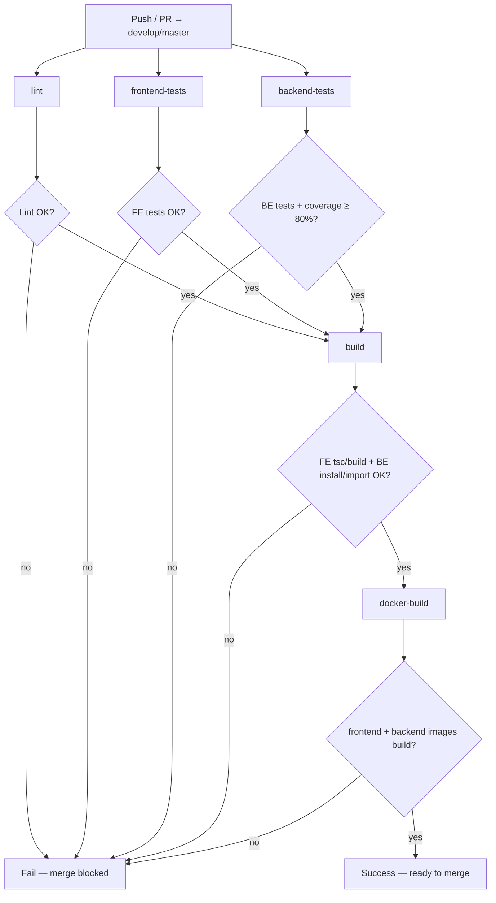

# 7. Качество, Docker, CI

Техническая спецификация процессов качества, контейнеризации и непрерывной интеграции для **Hotel Booking System**.

Связанные артефакты репозитория:

| Артефакт | Назначение |
|----------|------------|
| `frontend/Dockerfile` | Образ SPA (Vite build + static serve) |
| `backend/Dockerfile` | Образ FastAPI + Alembic на старте |
| `docker-compose.yml` | Локальный/стендовый стек: FE + BE + PostgreSQL |
| `.github/workflows/ci.yml` | Pipeline на push/PR в `main` |
| `.env.example` | Шаблон переменных окружения |
| `README.md` | Запуск с нуля, seed, i18n, фото |
| Swagger `/docs` | Интерактивный API-контракт |

---

## 7.1. Стратегия тестирования

### 7.1.1. Пирамида тестов

```
                    ┌─────────────────┐
                    │  E2E / smoke    │  ← минимум: Compose + UC smoke (опционально MVP)
                    │  (ручной / CI)  │
                ┌───┴─────────────────┴───┐
                │  Integration / API      │  ← backend: pytest + httpx + test DB
                │  (контракт, auth, CRUD) │
            ┌───┴─────────────────────────┴───┐
            │  Unit / component               │  ← FE: Vitest + RTL; BE: services/utils
            │  (формы, guards, pure logic)    │
            └─────────────────────────────────┘
```

| Уровень | Backend | Frontend | Цель |
|---------|---------|----------|------|
| **Unit** | Чистые функции сервисов (расчёт `nights`, `total_price`, overlap-предикат), валидаторы MIME/size | Утилиты, маппинг ошибок API → i18n, форматтеры дат/цен | Быстрые, без I/O |
| **Component / API** | `TestClient` / `httpx.AsyncClient` против FastAPI app с изолированной БД | RTL: страницы, формы, guards маршрутов | Поведение контракта и UI |
| **Integration** | Auth + CRUD + overlap в одной транзакции с PostgreSQL (или testcontainers / ephemeral DB) | Axios interceptor refresh-retry с MSW | Сценарии сквозь слои |
| **Smoke / E2E** | `docker compose up --build` + healthchecks | Ручной/скрипт: login → list hotels → book | Acceptance criteria стенда |

**Принцип MVP:** основная ценность — **API integration tests** (backend) и **component + MSW tests** (frontend). Полноценный Playwright/Cypress не обязателен для MVP, если CI зелёный и UC закрываются на Compose-стенде.

### 7.1.2. TDD workflow

Цикл обязателен для новой бизнес-логики (auth, bookings overlap, reviews unique, upload validation, favorites, map payload):

```
1. RED     — написать один падающий тест на одно поведение
2. GREEN   — написать минимальный код, чтобы тест прошёл
3. REFACTOR — упростить / вынести в service/repository без изменения поведения
4. REPEAT
```

Правила:

- **Один тест — одно поведение.** Не смешивать «login успешен» и «refresh ротирует токен» в одном кейсе.
- Имена тестов отражают ожидаемый исход: `test_refresh_revokes_previous_token`, `test_booking_overlap_returns_409`.
- Сначала фиксируется инвариант из спецификации (правила бронирования, auth, отзывов), затем реализация.
- Рефакторинг без зелёных тестов запрещён.

### 7.1.3. Инструменты

| Слой | Стек |
|------|------|
| Backend | pytest, pytest-asyncio, httpx, coverage.py (`pytest-cov`) |
| Frontend | Vitest, React Testing Library, MSW (мок API), мок Leaflet / `react-leaflet` |
| Линтеры | Backend: ruff (lint + format) и/или black + isort; Frontend: ESLint + Prettier |
| Типы | Backend: mypy (рекомендуется); Frontend: `tsc --noEmit` |

### 7.1.4. Изоляция тестовых данных

**Backend:**

- Отдельная test database или схема; фикстура `db_session` с rollback / truncate между тестами.
- Фабрики пользователей: `CLIENT`, `ADMIN` с известными credentials.
- Файлы upload — во временный каталог (`tmp_path` / `UPLOAD_DIR` override), не в volume Compose.
- Параллельные тесты overlap — через уникальные `room_id` или последовательный запуск критичных кейсов.

**Frontend:**

- MSW handlers для `/api/v1/*`; без реального backend в unit/component CI.
- `localStorage` очищается в `beforeEach` (токены, `i18n_lang`).
- Leaflet: stub `MapContainer` / `Marker` или `vi.mock('react-leaflet')`.

---

## 7.2. Матрица тестовых сценариев

### 7.2.1. Backend

Легенда приоритета: **P0** — блокирует merge / acceptance; **P1** — обязательно для coverage ≥ 80%; **P2** — желательно.

#### Auth

| ID | Сценарий | Ожидание | Pri |
|----|----------|----------|-----|
| BE-AUTH-01 | `POST /auth/register` валидные данные | 201/200 + пара токенов, роль `CLIENT` | P0 |
| BE-AUTH-02 | Register: дубликат email | 409 | P0 |
| BE-AUTH-03 | `POST /auth/login` верные credentials | access + refresh + `token_type: bearer` | P0 |
| BE-AUTH-04 | Login неверный пароль / неизвестный email | 401 | P0 |
| BE-AUTH-05 | `POST /auth/refresh` с валидным refresh | новая пара; старый refresh revoked | P0 |
| BE-AUTH-06 | Refresh уже использованного (rotated) токена | 401 | P0 |
| BE-AUTH-07 | Refresh revoked (после logout) | 401 | P0 |
| BE-AUTH-08 | Refresh истёкший (`expires_at` в прошлом) | 401 | P1 |
| BE-AUTH-09 | `POST /auth/logout` | revoke refresh; повторный refresh → 401 | P0 |
| BE-AUTH-10 | `GET /auth/me` с валидным access | профиль текущего пользователя | P1 |
| BE-AUTH-11 | Access без заголовка / битый JWT | 401 | P0 |
| BE-AUTH-12 | В БД хранится hash refresh, не plaintext | assert по модели / репозиторию | P1 |

#### Роли и права доступа

| ID | Сценарий | Ожидание | Pri |
|----|----------|----------|-----|
| BE-RBAC-01 | CLIENT → `POST /hotels` | 403 | P0 |
| BE-RBAC-02 | ADMIN → CRUD hotels/rooms/room-types | 2xx | P0 |
| BE-RBAC-03 | CLIENT видит только свои bookings; ADMIN — все | фильтрация списка | P0 |
| BE-RBAC-04 | CLIENT cancel чужой booking | 403 | P0 |
| BE-RBAC-05 | ADMIN меняет role пользователя | 200 | P1 |
| BE-RBAC-06 | Админ не снимает себе роль / не удаляет единственного ADMIN | 400/409 | P1 |
| BE-RBAC-07 | Upload images без ADMIN | 403 | P0 |
| BE-RBAC-08 | Public GET hotels/rooms/reviews без токена | 200 | P1 |

#### CRUD (отели, типы, номера, пользователи)

| ID | Сценарий | Ожидание | Pri |
|----|----------|----------|-----|
| BE-CRUD-01 | Create/update/delete hotel (ADMIN) | корректные поля, вкл. lat/lng | P0 |
| BE-CRUD-02 | Hotel без lat/lng или вне диапазона | 422 | P1 |
| BE-CRUD-03 | Unique `(hotel_id, number)` для Room | 409 | P1 |
| BE-CRUD-04 | Delete room type при наличии rooms | 400/409 | P2 |
| BE-CRUD-05 | Delete hotel/room с активными `PENDING`/`CONFIRMED` | **409** | P0 |
| BE-CRUD-06 | Delete hotel/room без активных броней | 204/200 + cascade images | P1 |
| BE-CRUD-07 | Пагинация `page`/`size` (max 100) | контракт `{ items, total, page, size }` | P1 |
| BE-CRUD-08 | Фильтры `GET /rooms`: capacity, price, city, dates | только свободные + `AVAILABLE` | P0 |

#### Bookings / overlap

| ID | Сценарий | Ожидание | Pri |
|----|----------|----------|-----|
| BE-BOOK-01 | Валидное бронирование | статус `CONFIRMED`, `total_price = nights * price` | P0 |
| BE-BOOK-02 | `check_out` exclusive: 10–12 → 2 ночи | корректный расчёт | P0 |
| BE-BOOK-03 | `nights < 1` или `> 30` | 400 | P0 |
| BE-BOOK-04 | `check_in` < today (UTC) | 400 | P0 |
| BE-BOOK-05 | Room `MAINTENANCE` | 400 | P1 |
| BE-BOOK-06 | Overlap с `CONFIRMED`/`PENDING` (примеры 12–18, 09–11, 13–14 при 10–15) | 409 | P0 |
| BE-BOOK-07 | Adjacent: 01–09 и 15–20 при существующей 10–15 | 201, разрещено | P0 |
| BE-BOOK-08 | Overlap с `CANCELLED`/`COMPLETED` | разрешено | P0 |
| BE-BOOK-09 | Параллельные два create на один room/даты | ровно одна успех, вторая 409 | P0 |
| BE-BOOK-10 | Cancel своей брони `CONFIRMED`/`PENDING` | → `CANCELLED` | P0 |
| BE-BOOK-11 | Создание в одной транзакции + lock номера | нет двойного бронирования | P0 |

#### Upload validation

| ID | Сценарий | Ожидание | Pri |
|----|----------|----------|-----|
| BE-IMG-01 | JPEG/PNG/WebP ≤ 5 MB, ADMIN | 201 + запись + файл на диске | P0 |
| BE-IMG-02 | Файл > `MAX_UPLOAD_SIZE_MB` | 413 | P0 |
| BE-IMG-03 | Неверный MIME / расширение | 415 | P0 |
| BE-IMG-04 | > 10 фото на сущность | 400 | P1 |
| BE-IMG-05 | DELETE image | запись + файл удалены | P1 |
| BE-IMG-06 | Static mount: URL `/media/...` отдаёт файл | 200 | P1 |
| BE-IMG-07 | `sort_order` PATCH | порядок в ответе hotel/room | P2 |

#### Reviews (unique)

| ID | Сценарий | Ожидание | Pri |
|----|----------|----------|-----|
| BE-REV-01 | Auth user создаёт отзыв | 201; rating 1–5; comment 10–2000 | P0 |
| BE-REV-02 | Второй отзыв того же user на тот же hotel | 409 | P0 |
| BE-REV-03 | `avg_rating` / `reviews_count` в списках и деталях | пересчёт после create/update/delete | P0 |
| BE-REV-04 | Owner PATCH/DELETE свой отзыв | 200 | P1 |
| BE-REV-05 | ADMIN DELETE любой отзыв | 200 | P1 |
| BE-REV-06 | Чужой PATCH | 403 | P1 |
| BE-REV-07 | Аноним POST review | 401 | P0 |

#### Favorites

| ID | Сценарий | Ожидание | Pri |
|----|----------|----------|-----|
| BE-FAV-01 | POST favorite | 201; в `GET /favorites` | P0 |
| BE-FAV-02 | Повторный POST того же hotel | 409 | P0 |
| BE-FAV-03 | DELETE favorite | убран из списка | P0 |
| BE-FAV-04 | `is_favorite` в `GET /hotels` для auth | true/false | P1 |
| BE-FAV-05 | Аноним POST/GET favorites | 401 | P0 |

#### Map payload

| ID | Сценарий | Ожидание | Pri |
|----|----------|----------|-----|
| BE-MAP-01 | `GET /hotels/map` | элементы содержат только: `id`, `name`, `lat`, `lng`, `stars`, `min_price`, `avg_rating` | P0 |
| BE-MAP-02 | Фильтр `city` | только отели города | P1 |
| BE-MAP-03 | Отели без координат не попадают / не создаются (валидация) | согласовано с CRUD | P1 |
| BE-MAP-04 | Публичный доступ без auth | 200 | P1 |

---

### 7.2.2. Frontend

| ID | Область | Сценарий | Ожидание | Pri |
|----|---------|----------|----------|-----|
| FE-PAGE-01 | Home / Hotels | Рендер списка (MSW), поиск по city | карточки: name, city, stars, cover, avg_rating | P0 |
| FE-PAGE-02 | Hotel detail | Галерея, номера, отзывы, CTA «Забронировать» | данные из API | P0 |
| FE-PAGE-03 | Login / Register | Валидация RHF; успех → редирект | токены сохранены | P0 |
| FE-PAGE-04 | Booking form | check_in/out → nights + total | клиентский расчёт согласован с правилами | P0 |
| FE-PAGE-05 | Profile | Профиль + мои бронирования | cancel своей брони | P1 |
| FE-PAGE-06 | Admin CRUD | Формы hotels/rooms + upload | только для ADMIN layout | P1 |
| FE-GUARD-01 | Auth guard | `/favorites`, `/bookings/new`, `/profile` без токена | редирект на `/login` | P0 |
| FE-GUARD-02 | Admin guard | `/admin/*` для CLIENT | 403/редирект | P0 |
| FE-GUARD-03 | Guest routes | `/login` при уже auth | редирект с guest-страниц | P2 |
| FE-AXIOS-01 | Refresh-retry | MSW: access 401 → refresh 200 → retry исходного запроса | один retry, успех | P0 |
| FE-AXIOS-02 | Refresh fail | refresh 401 → logout, очистка токенов | редирект login | P0 |
| FE-AXIOS-03 | Нет бесконечного цикла | второй 401 после retry | logout, не loop | P0 |
| FE-I18N-01 | Переключение RU ↔ EN | Navbar toggle; строки из словарей | UI полностью на выбранном языке | P0 |
| FE-I18N-02 | Persist | `localStorage.i18n_lang` | язык восстанавливается после reload | P0 |
| FE-I18N-03 | Default | нет ключа в storage | `ru` | P1 |
| FE-MAP-01 | `/hotels/map` | мок leaflet; маркеры из map API | клик → `/hotels/:id` | P0 |
| FE-MAP-02 | Мини-карта на detail | точка lat/lng | рендер без реального тайла (мок) | P1 |
| FE-FAV-01 | Toggle избранного | add/remove на карточке | UI + вызов API | P0 |
| FE-FAV-02 | `/favorites` | список избранных | empty state | P1 |
| FE-REV-01 | Форма отзыва | rating + comment | успех / ошибка unique (409) | P0 |
| FE-REV-02 | Список отзывов | пагинация/отображение | avg_rating на карточке | P1 |
| FE-404-01 | Unknown route | страница 404 | — | P2 |

---

## 7.3. Coverage targets и обязательное покрытие

### 7.3.1. Целевые показатели

| Область | Метрика | Порог | Где проверяется |
|---------|---------|-------|-----------------|
| Backend | Line coverage (`pytest --cov`) | **≥ 80%** | CI job `backend-tests`; acceptance |
| Frontend | — | Формального % нет в MVP | Обязательны сценарии FE-* P0; CI `frontend-tests` зелёный |
| Lint/format | Exit code 0 | Обязательно | CI `lint` |
| Typecheck FE | `tsc --noEmit` | 0 ошибок | CI `lint` или `frontend-tests` |

Покрытие backend считается по пакету приложения (`app/`), **исключая** миграции Alembic, одноразовые seed-скрипты и сгенерированные файлы.

Рекомендуемый запуск:

```bash
cd backend
pytest --cov=app --cov-report=term-missing --cov-fail-under=80
```

### 7.3.2. Обязательный минимум backend (нельзя «набрать 80%» на утилитах)

Следующие зоны **должны** иметь осмысленные тесты (см. матрицу P0):

1. **Auth:** login, refresh rotation, logout, revoked/reused refresh.
2. **CRUD** ключевых сущностей + правило удаления при активных бронях (409).
3. **Overlap** бронирований (включая adjacent и параллельный конфликт).
4. **Права ролей** (403 для CLIENT на admin-операции; изоляция bookings).
5. **Upload validation** (413/415/успех).
6. **Reviews unique** `(user_id, hotel_id)` + влияние на `avg_rating`.
7. **Favorites** add/duplicate/remove/list.
8. **Map payload** — упрощённая схема `GET /hotels/map`.

### 7.3.3. Обязательный минимум frontend

1. Ключевые страницы/формы: login, register, hotels list/detail, booking.
2. Route guards (auth / admin).
3. Axios refresh-retry interceptor (мок MSW).
4. i18n переключение + persist.
5. Карта с моком Leaflet.
6. Избранное и отзывы (happy path + ошибка API).

### 7.3.4. Что не входит в обязательный coverage MVP

- Визуальные регрессии скриншотами.
- Нагрузочное тестирование.
- Полный E2E по всем UC в CI (достаточно Compose smoke + ручной чеклист acceptance).
- Покрытие CSS/стилей MUI.

---

## 7.4. Docker Compose

### 7.4.1. Сервисы

Целевая топология (`docker compose up --build`):

| Сервис | Образ / build | Порт (host) | Назначение |
|--------|---------------|-------------|------------|
| `db` | `postgres:16-alpine` (или 15+) | `5432` (опц. только internal) | PostgreSQL |
| `backend` | `backend/Dockerfile` | `${BACKEND_PORT:-8000}` | FastAPI, Alembic migrate on start, `/media` |
| `frontend` | `frontend/Dockerfile` | `${FRONTEND_PORT:-5173}` или `80` | SPA; API через backend URL |

Зависимости:

```
frontend → backend (healthy)
backend  → db (healthy)
```

### 7.4.2. Volumes

| Volume | Mount | Назначение |
|--------|-------|------------|
| `postgres_data` | `/var/lib/postgresql/data` | Персистентность БД |
| `uploads_data` (или bind `./uploads`) | `/app/uploads` в backend | Фото отелей/номеров (`hotels/`, `rooms/`) |

Требования:

- Каталог `uploads/` в git **не** коммитить бинарники (gitignore); volume сохраняет файлы между перезапусками.
- Seed-фото либо копируются в volume при первом запуске, либо используют placeholder URL из static.
- Права записи: пользователь процесса uvicorn должен писать в `UPLOAD_DIR`.

### 7.4.3. Networks

Рекомендуется одна bridge-сеть:

```yaml
networks:
  hotel-net:
    driver: bridge
```

Все сервисы в `hotel-net`. Frontend в браузере пользователя обращается к **публичному** URL backend (например `http://localhost:8000`); внутри Compose backend резолвит `db` по hostname сервиса.

`DATABASE_URL` для backend в Compose:

```text
postgresql+psycopg://USER:PASSWORD@db:5432/DBNAME
```

### 7.4.4. Healthchecks (рекомендации)

| Сервис | Healthcheck | `depends_on` |
|--------|-------------|--------------|
| `db` | `pg_isready -U $POSTGRES_USER -d $POSTGRES_DB` | — |
| `backend` | `curl -f http://localhost:8000/api/v1/health` или `GET /docs` / лёгкий `/healthz` | `db: condition: service_healthy` |
| `frontend` | `wget -qO- http://localhost:80/` (или порт dev-сервера) | `backend: condition: service_healthy` |

Параметры по умолчанию:

```yaml
healthcheck:
  interval: 5s
  timeout: 5s
  retries: 10
  start_period: 20s
```

### 7.4.5. Старт backend и media

Порядок entrypoint backend:

1. Дождаться readiness Postgres.
2. `alembic upgrade head`.
3. (Опционально) seed, если таблица users пуста.
4. Запуск uvicorn (`app.main:app`).

Static/media:

- `StaticFiles` mount: URL вида `http://localhost:8000/media/...`.
- Frontend использует абсолютные или proxied URL с backend origin (не раздаёт uploads сам).
- CORS: `CORS_ORIGINS` включает origin frontend (`http://localhost:5173` или Compose frontend port).

### 7.4.6. Минимальный каркас compose (ориентир)

```yaml
services:
  db:
    image: postgres:16-alpine
    environment:
      POSTGRES_USER: ${POSTGRES_USER}
      POSTGRES_PASSWORD: ${POSTGRES_PASSWORD}
      POSTGRES_DB: ${POSTGRES_DB}
    volumes:
      - postgres_data:/var/lib/postgresql/data
    healthcheck:
      test: ["CMD-SHELL", "pg_isready -U $$POSTGRES_USER -d $$POSTGRES_DB"]
      interval: 5s
      timeout: 5s
      retries: 10
    networks: [hotel-net]

  backend:
    build: ./backend
    env_file: .env
    environment:
      DATABASE_URL: postgresql+psycopg://${POSTGRES_USER}:${POSTGRES_PASSWORD}@db:5432/${POSTGRES_DB}
      UPLOAD_DIR: /app/uploads
    ports:
      - "${BACKEND_PORT:-8000}:8000"
    volumes:
      - uploads_data:/app/uploads
    depends_on:
      db:
        condition: service_healthy
    healthcheck:
      test: ["CMD", "curl", "-f", "http://localhost:8000/healthz"]
      interval: 5s
      timeout: 5s
      retries: 10
      start_period: 30s
    networks: [hotel-net]

  frontend:
    build:
      context: ./frontend
      args:
        VITE_API_BASE_URL: http://localhost:${BACKEND_PORT:-8000}/api/v1
    ports:
      - "${FRONTEND_PORT:-5173}:80"
    depends_on:
      backend:
        condition: service_healthy
    networks: [hotel-net]

volumes:
  postgres_data:
  uploads_data:

networks:
  hotel-net:
    driver: bridge
```

Команда приёмки:

```bash
docker compose up --build
```

---

## 7.5. Dockerfile best practices

### 7.5.1. Общие правила

- Multi-stage builds: отдельно build и runtime.
- Не запускать от root в runtime (user `app` / `uid` non-root), если это не мешает записи в `uploads` (тогда явный writable volume + корректный uid).
- Пиннинг major-версий базовых образов (`node:22-alpine`, `python:3.12-slim`).
- `.dockerignore`: `node_modules`, `.git`, `.venv`, `uploads`, тесты (по необходимости), локальные `.env`.
- Один процесс на контейнер; миграции — в entrypoint script, не в отдельном «вечном» sidecar для MVP.
- Секреты только через env / secrets, **не** `COPY .env`.

### 7.5.2. Frontend (`frontend/Dockerfile`)

Рекомендуемый подход: **build stage (Node) → nginx (или `serve`) stage**.

| Практика | Деталь |
|----------|--------|
| Stage `build` | `npm ci` / `pnpm i --frozen-lockfile` → `npm run build` |
| Build args | `VITE_API_BASE_URL` на этапе сборки |
| Stage `runtime` | `nginx:alpine` + `dist/` в `/usr/share/nginx/html` |
| SPA routing | `try_files $uri /index.html` |
| Кэш зависимостей | Копировать lockfile + package.json до исходников |
| Не включать | Dev-сервер Vite в production-образе |

Альтернатива для локальной разработки: override в `docker-compose.override.yml` с `vite dev` — не смешивать с CI production build.

### 7.5.3. Backend (`backend/Dockerfile`)

| Практика | Деталь |
|----------|--------|
| Base | `python:3.12-slim` |
| Deps | `pip install --no-cache-dir -r requirements.txt` (или Poetry export) |
| System packages | Минимально: для healthcheck `curl`; для psycopg — нужные lib при binary wheels обычно не требуются |
| Entrypoint | `docker-entrypoint.sh`: wait-for-db → `alembic upgrade head` → uvicorn |
| Uploads | `WORKDIR` + `mkdir -p /app/uploads`; volume поверх |
| Workers | Для MVP: `uvicorn app.main:app --host 0.0.0.0 --port 8000` |
| Layers | requirements отдельно от `COPY app/` для кэша |

Не копировать локальный venv и `__pycache__`. Не открывать debug-reload в production-образе.

### 7.5.4. Образы в CI

Job `docker-build` собирает оба Dockerfile **без push** в registry (достаточно `docker build` / `compose build` как quality gate). Push в registry — вне MVP, если не оговорено отдельно.

---

## 7.6. CI pipeline (GitHub Actions)

Триггеры: **push** и **pull_request** в ветки `develop` и `master`.

Файл: `.github/workflows/ci.yml`.

### 7.6.1. Flowchart



Параллельность: `lint`, `frontend-tests`, `backend-tests` стартуют независимо; `build` ждёт всех трёх; `docker-build` ждёт `build` (или всех предыдущих — на усмотрение, но образы не собирают при красных тестах).

### 7.6.2. Jobs

| # | Job ID | Шаги (суть) | Блокирует merge |
|---|--------|-------------|-----------------|
| 1 | `lint` | Checkout → setup Node/Python → ESLint + Prettier check (FE) → ruff/black (BE) → `tsc --noEmit` | Да |
| 2 | `frontend-tests` | `npm ci` → `npm test -- --coverage` (если настроен) / `vitest run` | Да |
| 3 | `backend-tests` | setup Python 3.12 → deps → `pytest --cov-fail-under=80` на изолированной SQLite fixture | Да |
| 4 | `build` | FE: `npm run build`; BE: проверка импорта app / `python -m compileall` | Да |
| 5 | `docker-build` | `docker build -f frontend/Dockerfile` + `docker build -f backend/Dockerfile` (или `docker compose build`) | Да |

### 7.6.3. Рекомендации по окружению CI

**frontend-tests / lint (Node):**

- Node LTS (20 или 22), кэш npm.
- `CI=true`.

**backend-tests:**

- Python 3.12 и зависимости из `backend/requirements.txt`.
- Текущий test-suite подменяет приложение изолированной SQLite fixture в `backend/tests/conftest.py`, поэтому отдельный Postgres service для CI не нужен.
- `SECRET_KEY` тестовый, не production.
- `UPLOAD_DIR` → tmp в runner.

**docker-build:**

- Использовать Docker layer cache GitHub Actions при возможности.
- Не требовать запущенного Compose-стека целиком, если health зависит от сети — достаточно успешной сборки образов.

### 7.6.4. Порядок отказоустойчивости

- Падение любого required job → красный статус PR.
- Flaky tests: запрещены к мержу «как есть»; чинить или помечать skip с issue — не ослаблять `--cov-fail-under`.
- Артефакты (опционально): JUnit XML, HTML coverage report на 7 дней.

---

## 7.7. Quality gates (что блокирует merge)

Merge в `main` разрешён **только** при выполнении всех пунктов:

| Gate | Условие | Источник |
|------|---------|----------|
| G1 | Job `lint` зелёный (format + eslint/ruff + FE types) | CI |
| G2 | Job `frontend-tests` зелёный (все P0 FE-сценарии в наборе тестов) | CI |
| G3 | Job `backend-tests` зелёный | CI |
| G4 | Backend coverage **≥ 80%** (`--cov-fail-under=80`) | CI |
| G5 | Job `build` зелёный (FE production build, BE собираем/импортируем) | CI |
| G6 | Job `docker-build` зелёный (оба Dockerfile) | CI |
| G7 | Нет секретов в диффе (`.env`, ключи) | Review + hooks |
| G8 | Изменения соответствуют разделу спецификации / acceptance | Review |

**Не блокируют merge сами по себе (MVP):**

- Отсутствие E2E Playwright suite.
- Frontend line-coverage ниже произвольного %.
- Push образов в registry.
- Документация вне README / `.env.example` / Swagger (если не ломает запуск).

**Локальный pre-push (рекомендация разработчику):**

```bash
# frontend
npm run lint && npm test && npm run build

# backend
ruff check . && pytest --cov=app --cov-fail-under=80
```

---

## 7.8. Документация для разработчиков (README checklist)

README должен быть достаточен для запуска с нуля. Чеклист содержания:

### 7.8.1. Обязательные разделы README

- [ ] **Краткое описание** продукта и стека (React 19 + TS + Vite; FastAPI + SQLAlchemy 2 + PostgreSQL; Compose; GHA).
- [ ] **Требования:** Docker / Docker Compose; опционально Node 20+, Python 3.12+ для локальной разработки без Docker.
- [ ] **Структура репозитория:** `frontend/`, `backend/`, `uploads/`, `docker-compose.yml`, `.env.example`, `.github/workflows/ci.yml`.
- [ ] **Быстрый старт (Compose):**
  - [ ] `cp .env.example .env` и заполнение секретов.
  - [ ] `docker compose up --build`.
  - [ ] URL frontend, backend, Swagger (`http://localhost:8000/docs`).
- [ ] **Переменные окружения:** таблица из `.env.example` (`POSTGRES_*`, `DATABASE_URL`, `SECRET_KEY`, TTL токенов, `CORS_ORIGINS`, `UPLOAD_DIR`, `MAX_UPLOAD_SIZE_MB`, порты).
- [ ] **Seed-аккаунты:**
  - [ ] ADMIN: `admin@example.com` / `Admin123!`
  - [ ] CLIENT: `client@example.com` / `Client123!`
  - [ ] Что создаётся: ≥2 отеля с lat/lng, room types, rooms, фото, ≥1 отзыв.
- [ ] **Фото / media:** куда заливает админ; лимиты (JPEG/PNG/WebP, 5 MB, max 10); как открыть `/media/...` через backend URL; volume `uploads`.
- [ ] **i18n:** ru/en; переключатель в Navbar; ключ `localStorage` `i18n_lang`; где лежат `locales/ru.json`, `locales/en.json`.
- [ ] **Локальная разработка без полного Compose** (опционально): поднять только `db`, FE `npm run dev`, BE uvicorn + Alembic.
- [ ] **Тесты:** команды backend/frontend и требование coverage ≥ 80%.
- [ ] **CI:** ссылка на workflow, что проверяется на PR.
- [ ] **API:** указать Swagger `/docs` и базовый префикс `/api/v1`.

### 7.8.2. Сопутствующие артефакты

| Файл | Обязателен | Содержание |
|------|------------|------------|
| `.env.example` | Да | Все ключи без секретных значений; комментарии к TTL и upload |
| Swagger `/docs` | Да (runtime) | Актуальные схемы Pydantic; auth Bearer |
| `docs/technical/*.md` | Для спецификации | Детализация разделов (этот документ — §7) |

### 7.8.3. Критерий «документация готова»

Новый разработчик без знания проекта за один проход README:

1. Копирует env.
2. Поднимает `docker compose up --build`.
3. Логинится seed-пользователем.
4. Видит отели на карте и в списке.
5. Понимает, куда смотреть API (`/docs`) и как гонять тесты.

Если любой шаг требует «спросить у автора» — README неполный.

---

## 7.9. Связь с acceptance criteria

| Acceptance (DESC §9) | Закрывается через |
|----------------------|-------------------|
| UC-01…UC-20 на Compose | Ручной/smoke + FE/BE тесты матрицы |
| Access/refresh/logout/revoked | BE-AUTH-* P0 + FE-AXIOS-* |
| Нет double booking / overlap | BE-BOOK-06…11 |
| Upload + 4xx на невалидный файл | BE-IMG-* |
| Один отзыв / avg_rating | BE-REV-* + FE-REV-* |
| Favorites auth-only | BE-FAV-* + FE-FAV-* |
| Карта маркеры → карточка | BE-MAP-* + FE-MAP-* |
| i18n ru/en | FE-I18N-* |
| Изоляция броней CLIENT/ADMIN | BE-RBAC-03 |
| 409 при удалении с активными бронями | BE-CRUD-05 |
| `docker compose up --build` | §7.4 |
| CI зелёный на PR | §7.6–7.7 |
| Backend coverage ≥ 80% | §7.3 |
| README с нуля | §7.8 |

---

*Конец раздела 7. Качество, Docker, CI.*
