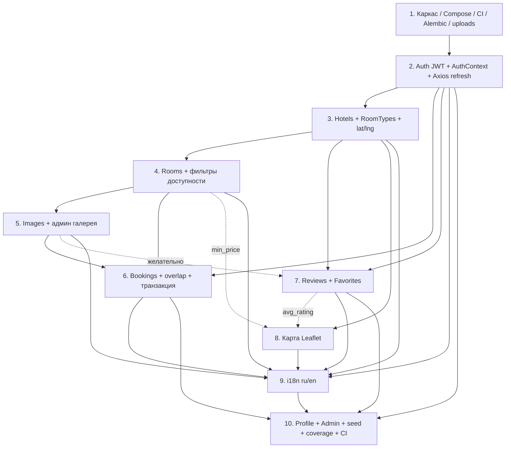

# 8. План поставки

## 8.1. Обзор стратегии поставки

Поставка строится как **инкрементальный MVP**: каждый этап даёт проверяемый вертикальный срез (backend + frontend + infra там, где нужно) и оставляет систему в рабочем состоянии для демо и регрессии.

### Принципы

| Принцип | Как применяется |
|---------|-----------------|
| **Vertical slices** | Этап закрывает сценарий end-to-end, а не «только API» или «только UI» |
| **Стабильный фундамент** | Этап 1 фиксирует репо, Compose, env, CI, миграции, volume — всё остальное опирается на него |
| **Auth early** | Этап 2 открывает защищённые маршруты и роли; без него нельзя безопасно строить админку и бронирования |
| **Domain before polish** | Каталог (отели → номера → фото) → транзакционный booking → отзывы/избранное → карта → i18n → админ/seed/coverage |
| **TDD по контракту** | На каждом этапе: тест → падение → минимальный код → рефакторинг; coverage наращивается, финальный порог ≥ 80% на этапе 10 |
| **Compose как стенд приёмки** | Definition of Done этапа проверяется на `docker compose up --build`, а не только локально |

### Целевое состояние MVP

После этапа 10 система удовлетворяет acceptance criteria из раздела 9 спецификации: UC-01…UC-20 на Compose-стенде, зелёный CI, coverage ≥ 80%, README для запуска с нуля.

### Границы инкрементов

- **Не откладывать** overlap-логику и транзакцию бронирования «на потом» — они входят в этап 6.
- **Карта и i18n** сознательно после доменного ядра: маркеры и словари требуют стабильных сущностей и экранов.
- **Админ-модерация и seed** — финальная сборка MVP, не блокер для клиентских сценариев бронирования.

---

## 8.2. Этапы 1–10

### Этап 1. Каркас репо, Compose, env, CI, Alembic, uploads volume

**Цель этапа**

Поднять воспроизводимый каркас монорепозитория: контейнеры frontend / backend / PostgreSQL, переменные окружения, миграции Alembic, volume для загрузок, скелет CI. После этапа команда может клонировать репо и поднять пустой, но «живой» стенд одной командой.

#### Deliverables

| Слой | Артефакты |
|------|-----------|
| **Infra** | Структура `frontend/`, `backend/`, `uploads/` (gitignore); `docker-compose.yml`; `frontend/Dockerfile`, `backend/Dockerfile`; `.env.example`; volume для `uploads`; healthcheck Postgres |
| **Backend** | FastAPI app skeleton (`app/main.py`, routers/services/repositories stubs); SQLAlchemy 2 session; Alembic init + первая миграция (пустая или baseline); mount StaticFiles `/media` → `UPLOAD_DIR`; `/health` или `/api/v1/health` |
| **Frontend** | Vite + React 19 + TypeScript skeleton; React Router; базовый layout; proxy/baseURL на `/api/v1` |
| **CI** | `.github/workflows/ci.yml`: lint/format, placeholder tests, build frontend & backend, build Docker images (даже если тесты пока минимальны) |
| **Docs** | README: как поднять Compose, список env-переменных |

#### Зависимости

Нет (стартовый этап).

#### Definition of Done

- [ ] `docker compose up --build` поднимает frontend, backend, Postgres без ручных шагов кроме `.env`
- [ ] Alembic применяется на старте backend (entrypoint / command)
- [ ] Volume `uploads` смонтирован; каталог доступен backend
- [ ] `.env.example` содержит все ключи из спецификации (Postgres, `SECRET_KEY`, TTL токенов, CORS, `UPLOAD_DIR`, порты)
- [ ] CI запускается на PR/push и проходит на каркасе
- [ ] Static mount `/media` отвечает (хотя бы 404 на несуществующий файл, не 500)

#### Риски и mitigation

| Риск | Mitigation |
|------|------------|
| Расхождение local vs Compose (пути, `DATABASE_URL`) | Единый `.env.example`; в README явно local vs Compose; healthcheck Postgres в Compose |
| Alembic не применяется / race со стартом API | Entrypoint: wait-for-db → `alembic upgrade head` → uvicorn |
| CI падает из‑за отсутствия секретов/сервисов | Jobs с сервисом Postgres или sqlite-only unit jobs; secrets только mock |
| Volume permissions (UID в контейнере) | Зафиксировать пользователя/права на `UPLOAD_DIR` в Dockerfile |

#### Связанные UC / acceptance criteria

- UC напрямую нет (инфраструктурный этап).
- AC: `docker compose up --build` поднимает frontend, backend, Postgres + uploads; CI на PR зелёный (каркас); README достаточен для запуска каркаса.

---

### Этап 2. User + access/refresh/logout + AuthContext + Axios refresh

**Цель этапа**

Реализовать полный цикл JWT-аутентификации: регистрация, login с парой access/refresh, ротация refresh, logout с revoke, `GET /auth/me`. На фронте — AuthContext, хранение токенов, Axios interceptor с одним retry через refresh.

#### Deliverables

| Слой | Артефакты |
|------|-----------|
| **Backend** | Модели `User`, `RefreshToken`; эндпоинты `POST /auth/register`, `/login`, `/refresh`, `/logout`, `GET /auth/me`; bcrypt; HS256 access; hashed refresh в БД; роли `CLIENT` / `ADMIN`; deps `get_current_user`, `require_admin` |
| **Frontend** | Страницы `/login`, `/register`; `AuthContext`; api/auth; Axios: Bearer + 401 → refresh → retry → logout; route guards (guest / auth) |
| **Infra** | Миграция User + RefreshToken; env TTL уже из этапа 1 |

#### Зависимости

- Этап 1 (БД, Compose, CI, структура app).

#### Definition of Done

- [ ] Register создаёт CLIENT и возвращает пару токенов
- [ ] Login / refresh / logout по правилам auth из спецификации (rotation, revoke → 401)
- [ ] Access истекает по TTL; после refresh выдаётся новая пара; старый refresh недействителен
- [ ] Frontend восстанавливает сессию и обновляет access без ручного re-login в рамках refresh TTL
- [ ] Unit/integration тесты: login, refresh rotation, revoked refresh, logout
- [ ] Защищённый `/auth/me` недоступен без валидного access

#### Риски и mitigation

| Риск | Mitigation |
|------|------------|
| Утечка refresh / XSS при localStorage | Документировать MVP-компромисс; не класть секреты в URL; короткий access TTL (15 мин) |
| Бесконечный retry loop на 401 | Флаг «уже ретраили»; logout при втором 401 |
| Clock skew / timezone в `expires_at` | Хранить UTC; тесты на границы TTL |
| bcrypt / Passlib совместимость | Зафиксировать версии; smoke-тест hash/verify в CI |

#### Связанные UC / acceptance criteria

- **UC-01**, **UC-02**
- AC: Access истекает; refresh выдаёт новую пару; отозванный refresh не работает; logout инвалидирует refresh

---

### Этап 3. Hotels + RoomTypes + lat/lng + публичный список

**Цель этапа**

Появиться каталог отелей и справочник типов номеров: админский CRUD (с обязательными `latitude`/`longitude`), публичный список и карточка отеля (без номеров/фото/отзывов в полном объёме — заглушки допустимы).

#### Deliverables

| Слой | Артефакты |
|------|-----------|
| **Backend** | Модели `Hotel`, `RoomType`; CRUD `/hotels`, `/room-types`; `GET /hotels` с `city`, `stars`, пагинацией, sort; валидация lat (−90…90), lng (−180…180); админ-only мутации |
| **Frontend** | `/`, `/hotels`, `/hotels/:id` (описание, город, звёзды, адрес); `/admin/hotels`, `/admin/room-types`; формы с lat/lng |
| **Infra** | Миграции Hotel, RoomType |

#### Зависимости

- Этап 1 (каркас).
- Этап 2 (роли ADMIN для CRUD; публичные GET без токена).

#### Definition of Done

- [ ] ADMIN создаёт/обновляет/удаляет отель с валидными координатами
- [ ] Невалидные lat/lng → 422
- [ ] Публичный `GET /hotels` фильтрует по `city`, пагинирует
- [ ] `GET /hotels/{id}` отдаёт детали
- [ ] CRUD RoomType; удаление типа без комнат
- [ ] UI списка и карточки отеля; админ-формы работают через API
- [ ] Тесты CRUD и прав доступа (CLIENT не может POST `/hotels`)

#### Риски и mitigation

| Риск | Mitigation |
|------|------------|
| Decimal lat/lng precision / сериализация JSON | Pydantic `Decimal` + явные constrains; фикстуры с Москва/СПб |
| Удаление отеля до появления броней (этап 6) | Пока простой DELETE; правило 409 добавить/усилить на этапе 6 |
| Пустой каталог для демо | Минимальный fixture в тестах; полный seed — этап 10 |

#### Связанные UC / acceptance criteria

- **UC-03**, **UC-04** (частично: описание без полной галереи/номеров/отзывов/карты), **UC-10**, **UC-11**
- AC (частично): публичный список отелей; админ CRUD отелей с lat/lng

---

### Этап 4. Rooms + фильтры доступности

**Цель этапа**

Добавить номера, привязанные к отелю и типу; публичный поиск с фильтрами capacity, price, city и **датовой доступности** (исключая пересечения с `PENDING`/`CONFIRMED` — даже до UI бронирования логика фильтра должна быть готова или согласована с моделью Booking-stub).

#### Deliverables

| Слой | Артефакты |
|------|-----------|
| **Backend** | Модель `Room` (unique `(hotel_id, number)`, status `AVAILABLE`/`MAINTENANCE`); CRUD `/rooms`; `GET /rooms` фильтры: `hotel_id`, `capacity`, `price_from`/`price_to`, `city`, `date_from`/`date_to`; на карточке отеля — список номеров |
| **Frontend** | Фильтры на `/hotels/:id` и/или `/`/`/hotels`; `/admin/rooms` CRUD; отображение цены, вместимости, статуса |
| **Infra** | Миграция Room; при необходимости минимальная таблица Booking для date-фильтра (или отложить date-фильтр до этапа 6 с явной пометкой — **рекомендация: ввести Booking model + overlap query уже здесь**, create/cancel — на этапе 6) |

> **Рекомендация по модели Booking:** для честного `date_from`/`date_to` фильтра завести сущность Booking (или read-model) на этапе 4; эндпоинты create/list/cancel — строго этап 6. Альтернатива: на этапе 4 фильтр по датам возвращает все `AVAILABLE`, а date-availability доводится на этапе 6 — тогда DoD этапа 4 явно фиксирует «date-фильтр = stub / без overlap».

**Выбранный контракт для этого плана:** date-фильтр на этапе 4 реализует overlap-исключение; create booking — этап 6.

#### Зависимости

- Этап 3 (Hotel, RoomType).
- Этап 2 (ADMIN для CRUD).

#### Definition of Done

- [ ] ADMIN CRUD номеров; unique `(hotel_id, number)` → 409/422
- [ ] `GET /rooms` с фильтрами capacity/price/city
- [ ] `date_from`/`date_to`: не отдаёт номера с пересекающимися PENDING/CONFIRMED
- [ ] MAINTENANCE не попадает в доступные для бронирования выборки
- [ ] UI фильтров и админ CRUD
- [ ] Тесты фильтров и уникальности номера

#### Риски и mitigation

| Риск | Mitigation |
|------|------------|
| Дублирование overlap-логики с этапом 6 | Вынести overlap в чистую функцию/repository-метод; этап 6 только вызывает её в транзакции |
| N+1 / медленные date-фильтры | Индексы по `room_id`, `check_in`, `check_out`, `status`; explain в тестах на объёме |
| Exclusive check_out путаница | Зафиксировать правило в тестах примерами из спецификации (10–15 июля) |

#### Связанные UC / acceptance criteria

- **UC-05**, **UC-12**, **UC-15** (частично — запрет удаления при активных бронях полностью на этапе 6)
- AC (частично): фильтры номеров; CRUD номеров админом

---

### Этап 5. Images upload/static + админ UI галереи

**Цель этапа**

Загрузка, сортировка, удаление фото отелей и номеров; отдача через `/media`; галерея в карточке отеля/номера и админ UI.

#### Deliverables

| Слой | Артефакты |
|------|-----------|
| **Backend** | Модель `Image` (entity_type `HOTEL`/`ROOM`); `POST /hotels/{id}/images`, `POST /rooms/{id}/images`; `PATCH /images/{id}` (sort_order); `DELETE /images/{id}`; валидация MIME (JPEG/PNG/WebP), max 5 MB, max 10 на сущность; cascade при удалении сущности; `images[]` в ответах Hotel/Room |
| **Frontend** | Галерея на `/hotels/:id`; админ загрузка/удаление/сортировка в `/admin/hotels`, `/admin/rooms`; cover в списке отелей |
| **Infra** | Запись в `UPLOAD_DIR` (`uploads/hotels/`, `uploads/rooms/`); volume уже с этапа 1; при необходимости nginx — не обязателен, достаточно StaticFiles |

#### Зависимости

- Этап 1 (volume, StaticFiles).
- Этап 3–4 (Hotel, Room существуют).
- Этап 2 (ADMIN).

#### Definition of Done

- [ ] ADMIN загружает фото; файл на диске; URL в API
- [ ] Невалидный MIME → 415; oversized → 413; >10 фото → 400/409
- [ ] DELETE удаляет запись и файл
- [ ] Публичная карточка показывает галерею; список — cover
- [ ] Cascade: удаление отеля/номера чистит Image + файлы
- [ ] Тесты upload validation и прав

#### Риски и mitigation

| Риск | Mitigation |
|------|------------|
| Path traversal в имени файла | Генерировать UUID-имя; не доверять client filename |
| Orphan files при сбое транзакции | Сначала commit метаданных после успешной записи, или cleanup job; в MVP — try/except + удаление файла при rollback |
| CORS / абсолютные URL media | Единый backend origin; относительные `/media/...` |
| Большие файлы в CI | Фикстуры маленьких WebP; не коммитить бинарники в git |

#### Связанные UC / acceptance criteria

- **UC-04** (фото), **UC-19**
- AC: Админ загружает фото отеля/номера; они видны в UI; невалидный файл → 4xx

---

### Этап 6. Bookings: create / list / cancel + overlap + транзакция

**Цель этапа**

Закрыть ядро продукта: создание бронирования с расчётом `total_price`, проверкой overlap в **одной транзакции** с `SELECT … FOR UPDATE`, список своих броней, отмена; админский просмотр/смена статуса может быть минимальным (полный admin UI — этап 10).

#### Deliverables

| Слой | Артефакты |
|------|-----------|
| **Backend** | Модель `Booking` (если не введена на этапе 4); `POST /bookings`, `GET /bookings`, `GET /bookings/{id}`, `PATCH …/cancel`, `PATCH /bookings/{id}` (ADMIN status); правила 1–11 спецификации; 409 при удалении Hotel/Room с активными бронями |
| **Frontend** | `/bookings/new` (даты → nights + total); список броней в профиле или отдельном блоке; отмена; обработка 409 overlap |
| **Infra** | Миграция Booking (если ещё нет); индексы под overlap |

#### Зависимости

- Этап 2 (auth).
- Этап 4 (Room + availability).
- Этап 3 (Hotel для контекста UI).

#### Definition of Done

- [ ] Create: nights 1–30, check_in ≥ today UTC, room AVAILABLE, status CONFIRMED, total = nights × price
- [ ] Overlap с PENDING/CONFIRMED → 409; CANCELLED/COMPLETED не блокируют
- [ ] Параллельные create на один номер: один успех, второй конфликт (тест с concurrency / FOR UPDATE)
- [ ] Клиент видит только свои брони; cancel своей PENDING/CONFIRMED
- [ ] Удаление Hotel/Room с активными бронями → 409
- [ ] Тесты на примеры дат из спецификации
- [ ] UI создания/списка/отмены

#### Риски и mitigation

| Риск | Mitigation |
|------|------------|
| Race double-booking | Транзакция + `FOR UPDATE` на Room (или advisory lock); интеграционный concurrency-тест |
| Timezone «сегодня» | Явно UTC date; тесты с freezegun/time-machine |
| Расхождение фильтра этапа 4 и create | Общий overlap helper |
| Админ status machine неполная | Ограничить допустимые переходы; задокументировать в OpenAPI |

#### Связанные UC / acceptance criteria

- **UC-06**, **UC-07**, **UC-08**, **UC-14** (API; полный UI — этап 10), **UC-15**
- AC: Двойное бронирование пересекающихся дат невозможно (в т.ч. параллельно); клиент видит только свои брони; удаление с активными бронями → 409

---

### Этап 7. Reviews + avg_rating; Favorites

**Цель этапа**

Отзывы с уникальностью `(user_id, hotel_id)`, средний рейтинг в списках/карточке; избранное add/remove/list и флаг `is_favorite` для авторизованных.

#### Deliverables

| Слой | Артефакты |
|------|-----------|
| **Backend** | Модели `Review`, `Favorite`; CRUD отзывов по контракту; `avg_rating`, `reviews_count` в `GET /hotels` и `GET /hotels/{id}`; `/favorites`; `is_favorite` при auth |
| **Frontend** | Блок отзывов на `/hotels/:id`; форма рейтинга; `/favorites`; кнопка избранного в списке/карточке |
| **Infra** | Миграции Review, Favorite; unique constraints |

#### Зависимости

- Этап 2 (auth).
- Этап 3 (Hotel).
- Желательно этап 5 (карточка визуально полная), не жёсткий блокер.

#### Definition of Done

- [ ] Один отзыв на отель на пользователя; повторный POST → 409
- [ ] Owner PATCH/DELETE; публичный GET reviews с пагинацией
- [ ] `avg_rating` / `reviews_count` корректны после create/update/delete
- [ ] Favorites: POST/DELETE/GET; повторный POST → 409
- [ ] `is_favorite` только для auth
- [ ] UI отзывов и избранного
- [ ] Тесты unique review, favorites, агрегатов

#### Риски и mitigation

| Риск | Mitigation |
|------|------------|
| Дрейф avg_rating (кэш vs SQL AVG) | Считать AVG в запросе списка; без денормализованного поля в MVP (или обновлять в той же транзакции) |
| N+1 is_favorite | LEFT JOIN / subquery batched по page items |
| Пустые отзывы / короткий comment | Pydantic min_length 10 |

#### Связанные UC / acceptance criteria

- **UC-16**, **UC-17**; **UC-20** (API delete any — UI модерации на этапе 10)
- AC: Клиент оставляет один отзыв на отель; avg_rating в списках; избранное только для auth

---

### Этап 8. Карта (`/hotels/map` + мини-карта) на Leaflet

**Цель этапа**

Публичная карта отелей и мини-карта на карточке: `GET /hotels/map`, страница `/hotels/map`, react-leaflet маркеры, клик → `/hotels/:id`.

#### Deliverables

| Слой | Артефакты |
|------|-----------|
| **Backend** | `GET /hotels/map`: `id`, `name`, `lat`, `lng`, `stars`, `min_price`, `avg_rating`; фильтр `city` |
| **Frontend** | `/hotels/map`; мини-карта на `/hotels/:id`; превью/ссылка с Home; моки Leaflet в Vitest |
| **Infra** | Нет новых сервисов (без API-ключа) |

#### Зависимости

- Этап 3 (lat/lng обязательны).
- Этап 4 желателен (`min_price` из Room).
- Этап 7 желателен (`avg_rating` в map payload); иначе временно `null` и добить после 7.

**Рекомендуемый порядок в плане:** после этапа 7, чтобы map payload был полным.

#### Definition of Done

- [ ] `GET /hotels/map` отдаёт упрощённый payload; фильтр city
- [ ] Маркеры на карте соответствуют данным
- [ ] Клик по маркеру ведёт на `/hotels/:id`
- [ ] Мини-карта показывает точку отеля
- [ ] Отели без валидных координат не попадают в выборку (или не создаются — invariant этапа 3)
- [ ] Тесты map payload; frontend с моком leaflet

#### Риски и mitigation

| Риск | Mitigation |
|------|------------|
| SSR/jsdom падения Leaflet | Динамический import; мок в Vitest |
| Скученность маркеров в одном городе | MVP: без кластеризации; zoom на bounds |
| CRS / порядок lat-lng | Единый контракт API `lat`/`lng`; не путать с GeoJSON |

#### Связанные UC / acceptance criteria

- **UC-04** (карта на карточке), маршрут `/hotels/map`
- AC: Карта показывает маркеры отелей; клик ведёт на карточку

---

### Этап 9. i18n ru/en на всём UI

**Цель этапа**

Полная локализация UI: i18next, словари `ru`/`en`, переключатель в Navbar, сохранение в `localStorage` (`i18n_lang`), маппинг известных API `detail` на ключи i18n.

#### Deliverables

| Слой | Артефакты |
|------|-----------|
| **Backend** | Без смены языка ответов API (MVP); стабильные `detail` строки для маппинга |
| **Frontend** | `i18n/index.ts`, `locales/ru.json`, `locales/en.json`; все пользовательские строки экранов этапов 2–8; переключатель RU \| EN; default `ru` |
| **Infra** | Нет |

#### Зависимости

- Этапы 2–8 желательны (чтобы не переводить дважды). Допустимо вводить i18n каркас раньше (после этапа 2) и наращивать ключи — **финальная полнота** фиксируется здесь.

#### Definition of Done

- [ ] Нет «захардкоженных» пользовательских строк вне словарей на основных экранах
- [ ] Переключение ru↔en мгновенно меняет UI; язык переживает reload
- [ ] Известные ошибки API локализованы; неизвестные показываются as-is
- [ ] Тест переключения языка
- [ ] Админ-экраны этапа 10 тоже заводятся на ключах (или добираются в этапе 10 с тем же словарём)

#### Риски и mitigation

| Риск | Mitigation |
|------|------------|
| Пропущенные ключи / fallback на key path | CI/скрипт проверки отсутствующих ключей; fallback `en` |
| Плюрализация nights/reviews | i18next plural forms для ru/en |
| Перевод админки отложен | Чеклист экранов из раздела 6 UI |

#### Связанные UC / acceptance criteria

- **UC-18**
- AC: UI полностью переключается между `ru` и `en`

---

### Этап 10. Profile + admin users/bookings/reviews; seed; coverage; зелёный CI

**Цель этапа**

Довести MVP до приёмки: профиль клиента, полная админ-панель (users, bookings, reviews moderation), seed-данные, coverage ≥ 80%, зелёный CI, README end-to-end.

#### Deliverables

| Слой | Артефакты |
|------|-----------|
| **Backend** | `GET/PATCH` users/me и admin users; admin bookings status; admin delete review; seed script/command: ADMIN/CLIENT, ≥2 отеля с lat/lng, RoomTypes, ≥3 номера, ≥1 фото, ≥1 отзыв; запрет снятия роли единственному админу |
| **Frontend** | `/profile`; `/admin`, `/admin/users`, `/admin/bookings`, `/admin/reviews`; добор i18n ключей; guards ADMIN |
| **Infra** | Seed на старте (идемпотентный) или documented one-shot; CI: lint, frontend tests, backend tests (≥80%), build, Docker images — всё зелёное |
| **Docs** | README: Compose, seed credentials, загрузка фото, i18n |

#### Зависимости

- Все этапы 1–9 (собирает и закрывает пробелы).
- Жёстко: 2 (users), 6 (bookings), 7 (reviews).

#### Definition of Done

- [ ] UC-09: просмотр/редактирование name, phone
- [ ] UC-13: список пользователей, смена роли (с защитой последнего админа)
- [ ] UC-14 UI: все бронирования, смена статуса
- [ ] UC-20 UI: модерация отзывов
- [ ] Seed воспроизводим на чистом Compose
- [ ] Backend coverage ≥ 80%
- [ ] CI зелёный на PR
- [ ] Все AC раздела 9 отмечены выполненными на стенде
- [ ] Swagger `/docs` актуален

#### Риски и mitigation

| Риск | Mitigation |
|------|------------|
| Coverage gap в overlap/upload/auth edge cases | Начать закрывать gaps с этапов 2/5/6; этап 10 — добор, не «писать все тесты с нуля» |
| Неидемпотентный seed ломает re-run | Upsert по email/unique keys |
| Scope creep админки | Только экраны из спецификации; без аналитики/экспорта |
| Регрессии после i18n | Smoke e2e checklist UC-01…UC-20 на Compose |

#### Связанные UC / acceptance criteria

- **UC-09**, **UC-13**, **UC-14**, **UC-20**; финализация **UC-01…UC-20**
- AC: полный чеклист раздела 9 (Compose, CI, coverage ≥ 80%, README, все бизнес-правила)

---

## 8.3. Рекомендуемый порядок и parallelization

### Линейный порядок (default)

```
1 → 2 → 3 → 4 → 5 → 6 → 7 → 8 → 9 → 10
```

Это критический путь для одного разработчика / одного агента.

### Где можно параллелить

| После готовности | Параллельные потоки | Условие |
|------------------|---------------------|---------|
| Этап 1 | Bootstrap frontend shell ∥ backend shell ∥ CI yaml | Один владелец compose-контракта |
| Этап 2 | Backend auth API ∥ Frontend AuthContext + interceptor (контракт OpenAPI/моки) | Зафиксировать JSON login/refresh заранее |
| Этап 3 | Hotels API ∥ RoomTypes API ∥ публичный UI списка | Общие схемы Hotel |
| Этап 4 + подготовка 5 | Rooms/filters ∥ дизайн админ-галереи (UI без upload) | Upload API — только после Room/Hotel IDs |
| Этап 5 и черновик 7 | Images ∥ Reviews/Favorites **модели** (если хватает людей) | UI отзывов лучше после галереи карточки |
| Этап 6 | Backend booking+overlap ∥ Frontend booking form (MSW) | Не мёржить UI create до зелёных overlap-тестов |
| Этап 8 ∥ добор тестов 6–7 | Карта ∥ coverage auth/booking | Map не блокирует booking |
| Этап 9 | Вынести раньше как «i18n skeleton» после этапа 2; этап 9 = audit полноты | Иначе большой diff в конце |
| Этап 10 | Seed ∥ admin screens ∥ coverage chase | После стабилизации API 6–7 |

### Что не параллелить

- Этап 6 create booking **до** стабильного overlap helper и Room lock.
- Этап 8 map payload **до** обязательных lat/lng (этап 3).
- Финальный «зелёный CI + coverage 80%» **до** завершения фич 2–9 (иначе ложные зелёные на пустом коде).

### Рекомендация по i18n

Ввести **каркас i18n (этап 9a)** сразу после этапа 2 (провайдер + переключатель + 2 файла словарей), а этап 9 оставить **аудитом полноты**. Это снижает риск большого локализационного долга.

---

## 8.4. Диаграмма этапов

### Gantt (относительные слоты)

```mermaid
gantt
    title Hotel Booking System — план поставки MVP
    dateFormat X
    axisFormat %s

    section Infra
    Этап 1 Каркас Compose CI Alembic     :e1, 0, 2

    section Auth
    Этап 2 User JWT refresh AuthContext  :e2, after e1, 2

    section Catalog
    Этап 3 Hotels RoomTypes latlng       :e3, after e2, 2
    Этап 4 Rooms availability filters    :e4, after e3, 2
    Этап 5 Images upload gallery         :e5, after e4, 2

    section Core booking
    Этап 6 Bookings overlap transaction  :e6, after e5, 3

    section Engagement
    Этап 7 Reviews Favorites avg_rating  :e7, after e6, 2
    Этап 8 Leaflet map                   :e8, after e7, 1

    section Polish gate
    Этап 9 i18n ru en                    :e9, after e8, 2
    Этап 10 Admin seed coverage CI       :e10, after e9, 3
```



### Flowchart зависимостей



---

## 8.5. Критический путь

Критический путь — минимальная цепочка, без которой нельзя закрыть MVP-приёмку:

```
1 → 2 → 3 → 4 → 6 → 7 → 9 → 10
```

### Пояснения

| Узел | Почему на критическом пути |
|------|----------------------------|
| **1** | Нет стенда и миграций — нет поставки |
| **2** | Все защищённые UC и роли |
| **3** | Каталог — вход в продукт |
| **4** | Без Room нельзя бронировать и фильтровать |
| **6** | Ядро бизнеса (бронь + overlap + транзакция) — главный AC |
| **7** | Отзывы/избранное в In scope MVP |
| **9** | i18n — явный In scope и AC |
| **10** | Seed, admin, coverage, CI — ворота приёмки |

### Вне критического пути (но обязательны к релизу MVP)

| Этап | Почему можно сдвигать относительно CP | Риск сдвига |
|------|----------------------------------------|-------------|
| **5 Images** | Бронирование формально возможно без фото | Сильная деградация UX и AC по фото — **не вырезать**, лишь узкое окно после 4 до/параллельно с подготовкой 6 |
| **8 Map** | Не блокирует booking | Нужен до этапа 10; параллелится с добором тестов |

### Укороченный «демо-срез» (не полный MVP)

Для промежуточного демо заказчику достаточно пути `1→2→3→4→6` (+ опционально 5). Полный MVP = критический путь + этапы **5** и **8**.

### Контрольные ворота качества

| Ворота | После этапа | Критерий |
|--------|-------------|----------|
| G0 | 1 | Compose up, CI skeleton green |
| G1 | 2 | Auth AC (refresh/logout) |
| G2 | 4 | Публичный поиск номеров с датами |
| G3 | 6 | Overlap + concurrent booking AC |
| G4 | 8 | Фото + отзывы/избранное + карта на стенде |
| G5 | 10 | UC-01…UC-20, coverage ≥ 80%, CI green, README |

---

## 8.6. Сводная матрица этап → UC

| Этап | UC (основные) |
|------|----------------|
| 1 | — (infra) |
| 2 | UC-01, UC-02 |
| 3 | UC-03, UC-04 (частично), UC-10, UC-11 |
| 4 | UC-05, UC-12 |
| 5 | UC-04 (фото), UC-19 |
| 6 | UC-06, UC-07, UC-08, UC-14 (API), UC-15 |
| 7 | UC-16, UC-17, UC-20 (API) |
| 8 | UC-04 (карта), `/hotels/map` |
| 9 | UC-18 |
| 10 | UC-09, UC-13, UC-14 (UI), UC-20 (UI); закрытие всех AC §9 |
